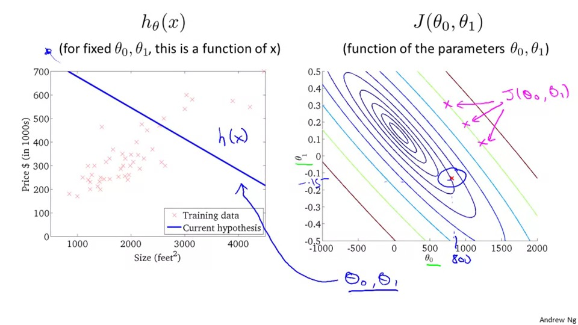

## 线性回归

### cost function

主要是为了在某种度量下，标识模型与实际的相差，而目标是修改模型的参数，以达到相差最小。

##### contour plots 轮廓图

这里介绍了一种关于描述三维cost曲线的二维拟合。

比如这是三维：

然后右边这个是个轮廓图：

每个圈都代表了，这个圈上的点，值是相同的。

很容易想象到，中间的那个点就是最小点。

左边呢，就是，比如这个蓝色的参数点，放到模型中的样子。

### 梯度下降

