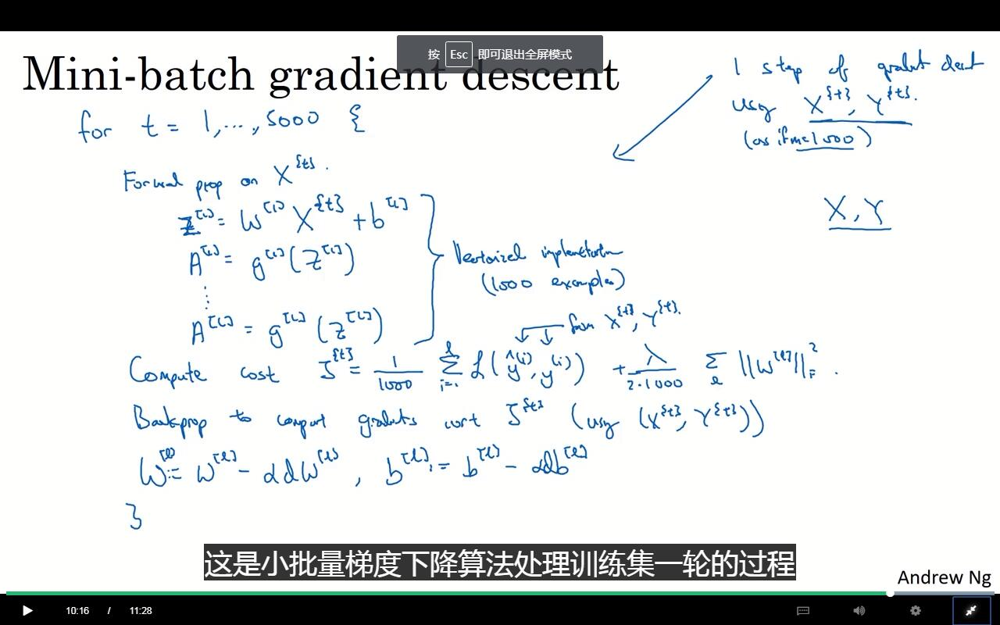

虽然这是一个很好的算法，但运算速度还是不够快。

## 小批量梯度下降

矢量化运算，将分开的向量，合并到一个超大的矩阵。这样在一定程度上可以加快速度。

但如果整个m过大的话，那么每次运算就会变得很慢很慢，那么是不是有一些在运算完整个模型以前就可以有那么一些成效的方法呢？

$m=5,000,000​$

先将训练集拆分为小的训练集：称为(mini-batch)，比如一个微训练集m为1000。

那么
$$
X=[X^{[1]}X^{[2]}...X^{[t=5000]}]
$$
看起来这个过程并不怎么难理解。

**这么来说，可以通过小批量梯度下降，来进行任务分发！并行！**

但这个只是正向的。。。哦，逆向好像不太需要那么多运算量哦。

> **那么问题来了，使用小批量梯度下降，是否会与直接运行整个有所不同？**
>
> 并不会，只是计算J，这还是一个原子操作。

> 关于符号表示
>
> $x^{(i)}​$表示训练集的第i个样例
>
> $z^{[l]}$表示第l层
>
> $x^{\{t\}},y^{\{t\}}​$第t个小批量组

## 深入理解这玩意

mini-batch的大小。

但其等于m的时候，就相当于对整个数据集进行计算，批量梯度下降法。

这玩意有点事效果好，但太大的话也会有问题。

但如果等于1的时候，那就好玩了，这时候会得到一个叫做随机梯度下降的算法。正如其名字一样，每次下降都是一个不可预测的随机行为。

**于是这个算法，没计算完一个mini-batch后都进行一次下降啊。0.0**

注意，mini-batch的结果需要可以放进你的CPU/GPU的内存里面。

## 指数加权平均(指数加权滑动平均)

<!--算是一种预处理？-->

比如计算温度趋势的时候，使用$V_i=0.9*V_{i-1}+0.1*\theta_i$，这样就能得到一个比较好的曲线喽。

当然，随着比率$\beta​$的增大，曲线会向右移动，并且会变得更加的平滑，新的数据对其的影响会变得很小。

将这个式子展开以后会得到：
$$
V_m=0.1*\sum^{m}_{i=0}0.9^i\theta_i
$$
那么对于之前的数据影响，就是一个指数下降函数。

回忆下关于e的定义式子
$$
e^x = \lim_{n\rightarrow \infty}(1+\frac{x}{n})^n
$$
这里取，$x=-1$。

<!--这玩意扩展下就是卷积？-->

> ## 马尔可夫链
>
> 提了一嘴马尔可夫链，但在对这玩意的理解不是特别的清晰，所以再深入研究下。
>
> #### 马尔可夫链的含义——存在先验估计
>
> > https://zh.wikipedia.org/wiki/%E9%A9%AC%E5%B0%94%E5%8F%AF%E5%A4%AB%E9%93%BE
> >
> > 为[状态空间](https://zh.wikipedia.org/wiki/%E7%8B%80%E6%85%8B%E7%A9%BA%E9%96%93_(%E8%A8%88%E7%AE%97%E6%A9%9F%E7%A7%91%E5%AD%B8))中经过从一个状态到另一个状态的转换的[随机过程](https://zh.wikipedia.org/wiki/%E9%9A%8F%E6%9C%BA%E8%BF%87%E7%A8%8B)。
>
> 首先要求，对于状态转移是无记忆性的。
>
> > [随机漫步](https://zh.wikipedia.org/wiki/%E9%9A%8F%E6%9C%BA%E6%BC%AB%E6%AD%A5)就是马尔可夫链的例子。随机漫步中每一步的状态是在图形中的点，每一步可以移动到任何一个相邻的点，在这里移动到每一个点的概率都是相同的（无论之前漫步路径是如何的）。
>
> 对于形式化定义而言，则是：
>
> 满足马尔可夫性质的[随机变量](https://zh.wikipedia.org/wiki/%E9%9A%8F%E6%9C%BA%E5%8F%98%E9%87%8F)序列$X1$, $X2$, $X3$, ...，即给出当前状态，将来状态和过去状态是相互独立的。从形式上看，
>
> ​				如果两边的条件分布有定义（即如果$\Pr(X_{1}=x_{1},...,X_{n}=x_{n})>0$)，则：
> $$
> \Pr(X_{{n+1}}=x\mid X_{1}=x_{1},X_{2}=x_{2},\ldots ,X_{n}=x_{n})\\=\ \ \Pr(X_{{n+1}}=x\mid X_{n}=x_{n})
> $$
>
> #### 对于有限空间的马尔可夫过程的分析
>
> 若状态空间是[有限](https://zh.wikipedia.org/wiki/%E6%9C%89%E9%99%90)的，则转移概率分布可以[矩阵](https://zh.wikipedia.org/wiki/%E7%9F%A9%E9%98%B5)表示，该矩阵称为转移矩阵，记为$P$。其中处于$\displaystyle (i,j)$的元素等于
> $$
> p_{{ij}}=\Pr(X_{{n+1}}=j\mid X_{n}=i).\,
> $$
> 由于$P$的每一行各元素之和为1，且$P$中所有的元素都是非负的，因此$P$是一个[右随机矩阵](https://zh.wikipedia.org/wiki/%E9%9A%8F%E6%9C%BA%E7%9F%A9%E9%98%B5)。
>
> 则对于稳定态（无限重复实验）,可以通过
> $$
> \lim_{n\rightarrow \infty} P^n
> $$
> 来进行计算。
>
> #### 有限状态空间内的时齐马尔可夫链
>
> 对于一个离散状态空间，${\displaystyle k}$步转移概率的积分即为求和，可以对转移矩阵求$\displaystyle k$次幂来求得。就是说，如果${\displaystyle \mathbf {P} }$是一步转移矩阵，${\displaystyle \mathbf {P} ^{k}}$就是${\displaystyle k}$步转移后的转移矩阵。
>
> 如果转移矩阵${\displaystyle \mathbf {P} }$不可约，并且是非周期的，并且，
> $$
> \lim _{{k\rightarrow \infty }}{\mathbf  {P}}^{k}=\pi ^{*},
> $$
> ，则${\displaystyle \mathbf {P} ^{k}}$收敛到一个每一列都是不同的平稳分布${\displaystyle \pi ^{*}}$，独立于初始分布${\displaystyle \pi }$，(既与初始分布无关)。
>
> <!--这个π应该不是单纯的π吧0.0-->
>
> > https://www.cnblogs.com/pinard/p/6632399.html
> >
> > 马尔科夫链模型的状态转移矩阵收敛到的稳定概率分布与我们的初始状态概率分布无关。这是一个非常好的性质，也就是说，如果我们得到了这个稳定概率分布对应的马尔科夫链模型的状态转移矩阵，则我们可以用任意的概率分布样本开始，带入马尔科夫链模型的状态转移矩阵，这样经过一些序列的转换，最终就可以得到符合对应稳定概率分布的样本。
> >
> > π通常称为马尔科夫链的平稳分布。
>
> #### 对于捡最大的麦橞的研究——无先验估计时的抉择
>
> > https://www.zhihu.com/question/66465943
> >
> > 最佳策略为拒掉前 $r-1$个, 其中分数最高的记为 $\text{Max}$ ,然后从第 $r$ 个开始如果遇到评分高于 $\text{Max}$ 的就选中.
> >
> > 如果$i$号是最佳选择且被选中,那么其他 $i-1$ 个次佳的都在前 $r - 1​$ 个被拒者中.
> >
> > 然后根据条件概率展开可得:
> > $$
> > \begin{aligned} P_n(r)&= \sum_{i=1}^{n}P\left(i\ 号被选择\biggl| i\ 是最佳选择 \right) \times P\left(i\ 是最佳选择\right)\\ &= \left( \sum_{i=1}^{r-1} 0 \times \frac{1}{n} \right) + \left( \sum_{i=r}^{n} P\left( 最好的前 i-1 名在前 r-1 号中\biggl | i 是最佳选择\right) \times \frac{1}{n} \right) \\ &=\sum_{i=r}^{n} \frac{r-1}{i-1} \times \frac{1}{n} =\frac{r-1}{n} \sum_{i=r}^{n} \frac{1}{i-1} =\frac{r}{n}\left(H_{n-1}-H_r\right)+\frac{1}{n} \end{aligned}
> > $$
> > 
> >
> > 我们的目标是使得这个概率最大化,也就是 $\max P_n(r)$ ,先来估计近似解:
> >
> > 令$n$趋近无穷大, 把 $x$ 表示为 !$r/n$ 的极限, 令 $t$ 为 $i/n$ , 则 $\mathrm{d}t$ 为 $1/n$ , 原式可以近似为如下积分:
> > $$
> > P(x)\sim x \int_{x}^{1}\frac{1}{t}\,dt = -x \ln x
> > $$
> > 
> >
> > 求导易得  $\displaystyle x=\frac{1}{e}$  时取得最大值.

### 偏差修正

对于此函数的起始信息，会比较低的问题，所以需要对此进行修正。

对其做一个参数的修正$\frac{V_t}{1-\beta^t}​$，这样就能得到一个正确的平均值了。

## 动量(momentum)梯度下降

emm,也就是对每次的梯度值做一个指数加权平均？

这样可以避免太大的震荡，也就变现地加快了迭代的速度。

$V_{d w}=\beta V_{d w}+(1-\beta )d w$。

可以想象成给梯度下降增加了一个加速度？哈哈哈，有意思的解释。

这里一般去0.9。

同时对于偏差修正，实际上就是对$\alpha​$，($W=W-\alpha V_{dW}​$)，的修正，实际上没啥区别。因为本来就是个需要调整的超参。

## RMSprop（root mean square prop均方根传递）

目的是减少对参数$b$的修正。引入以下公式,这里的平方是逐方向平方。
$$
S_{dw}=\beta S_{dw}+(1-\beta)dw^2 \\
S_{db}=\beta S_{db}+(1-\beta)db^2 \\
w:=w-\alpha \frac{dw}{\sqrt{S_{dw}+\epsilon}}\\
b:=b-\alpha \frac{db}{\sqrt{S_{db}}}
$$
同时为了防止除0的问题，因此在有一个小的epsilon。

## Adam优化算法

本质上是将动量与RMSprop组合起来。

使用mini-batch计算，

$V_{dw}、V_{db}$代表动量梯度下降,$S_{dw}、S_{db}​$代表RMSprop的部分。
$$
V_{dw} = \beta_1 v_{dw}+(1-\beta_1)dw\\
V_{db} = \beta_1 v_{db}+(1-\beta_1)db\\
S_{dw}=\beta_2 S_{dw}+(1-\beta_2)dw^2\\
S_{db}=\beta_2 S_{db}+(1-\beta_2)db^2\\
V^{corrected}_{dw}=\frac{V_{dw}}{1-\beta_1^t}\\
...\\
S^{corrected}_{dw}=\frac{S_{dw}}{1-\beta_2^t}\\
...\\
W:=W-\alpha\frac{V^{corrected}_{dw}}{\sqrt{S^{corrected}_{dw}}+\epsilon}\\
....
$$
PS:习题中得知，这个t是固定值？！！！诶诶诶诶？！！

一般而言，$\beta_1=0.9,\beta_2=0.999,\epsilon=10^{-8}$。

Adam来源于，自适应矩估计（adaptive moment estimatio）。$\beta$被称为一/二阶动量衰减系数。

> [Adam paper](https://arxiv.org/pdf/1412.6980.pdf)
>
> adam法的论文

> https://cloud.tencent.com/developer/article/1341446
>
> 估计过程，RMSprop 则对应于有偏二阶矩估计。在日常使用中，往往采用默认学习率 0.001 就可以取得不错的结果。
>
> Adam 计算效率高，适用于稀疏数据&大规模数据场景，更新的步长能够被限制在合理的范围内，并且参数的更新不受梯度的伸缩变换影响。但它可能导致不收敛，或者收敛局部最优点。
>
> 由于 Adam 可能导致不收敛，或者收敛局部最优点，因此谷歌在 ICLR 2018 提出了 **AMSGrad**，该论文中提到这样一个问题：
>
> > 对于 SGD 和 AdaGrad 可以保证学习率总是衰减的, 而基于滑动平均的方法则未必。实际上，以 Adam 为代表的自适应算法存在两个主要问题: 
>
> - 可能不收敛
> - 可能收敛于局部最优点

## 学习效率减少法

哦，就是调整参数$\alpha$...很好理解的吧。

我记得最速下降法中就有关于这个的调整，emm，是一个$\alpha_i=\alpha(y_{i-1}-y_{i-2})$来的。

当然，这里更粗暴点
$$
\alpha_i = \frac{1}{1+rate*i}\alpha_0
$$
当然方法还很多，这个就随意了。

这个参数更主要是

## 局部最优

实际上对于多维而言，鞍点的情况远远多于局部最优。所以只需要解决掉鞍点，就可以说基本解决了局部最优问题。

比如对于20000维度的来说，emmm。。。$2^{-20000}$。。。

真正的问题是在鞍点处的停滞区域。会长时间在停滞区里面找点，然后才能从这里面出去。

## 访谈，林元庆

- 深度学习技术及应用国家工程实验室

  说是提供paddlepaddle框架，以及大量计算资源

  希望可以解决很多的重复性成本问题。

  是一个使用serverless概念，使用jupyter netebook作为环境，PaddlePaddle Cloud与k8s作为集群任务调度。

  **上次维护GitHub是18年6月。。。**

  