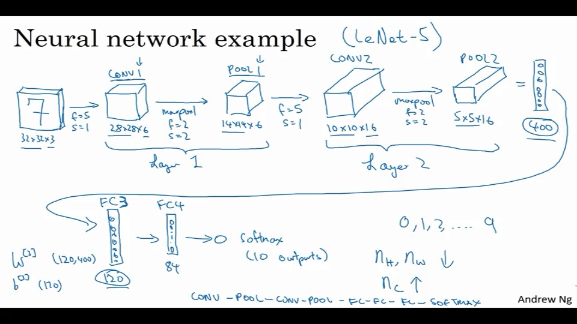

# 卷积神经网络

# 计算机视觉

来看看一些常见的应用：

- 熟悉的分猫器
- 物体标识
- 风格化图片

视觉处理中的问题是，输入可以无限大。

参数数量的计算：

图像所有信息，比如1000x1000x3，

## 卷积的例子

边缘检测

垂直检测、水平检测。

对于一个6x6的图片，有一个3x3的过滤器（filter），也有被称为核(kernel)

比如这里有一个3x3的过滤器：
$$
\left[
 \begin{matrix}
   1 & 0 & -1 \\
   1 & 0 & -1 \\
   1 & 0 & -1 \\
  \end{matrix}
  \right]
$$
对6x6的矩阵做卷积，使用$*$，这个符号。

输出的是一个4x4的矩阵。


一般来说每个框架都由对应的卷积算法。

比如有图片有如下形式：


这就相当于检测出了垂直的中间图像。

## 如何用他们

正边缘、负边缘。


这样可以检测出从亮到暗、从暗到亮的过度。

以及各个学界也有对于使用什么filter有不同的见解。


通过过滤器，可以发现深度学习可以学习很多底层特性。

将这九个数当成参数去学习。

## padding 填充

比如，一个$n\times n$的矩阵，使用$f\times f$的过滤器，会得到一个$(n-f+1)\times (n-f+1)$的结果图像。

这样会造成图片的缩小。

同时边界上的像素，实际上被用到的次数很少，会减少边界的信息。

解决方法是在使用卷积前，先填充一次图片，使其变成$(n+2p-f+1)\times (n+2p-f+1)$大小的。

valid就是不填充的，same就是填充，使其输出等于输入。

当然注意，过滤器最好是奇数。

## strided（带步长） 卷积


就是如图所示，带着一定步长进行遍历。

向下移动也是一样的。

所以，一个$(n\times n) *(f\times f)$使用padding($p$),步长($s$)，这样可以得到一个$[\frac{n+2p-f}{s}+1]\times [\frac{n+2p-f}{s}+1]$的矩阵。

## 多维的卷积

比如对于三位，RGB三维。


注意，这里也不一定只有一个过滤器。

## 单层卷积网络

假定网络中有10个3,3,3过滤器，那么这一层有多少参数。

每个过滤器都由27个参数。还有一个b。就是28个。

这里使用，当标识$l$层是一个卷积层，那么$f^{[l]}$标识这一层的过滤器大小。

$p^{[l]}$标识这一层的填充，$s^{[l]}$表示步长。

Input：$n_h^{[l-1]}\times n_w^{[l-1]}\times n_c^{[l-1]}$。

Output：$n_h^{[l]}\times n_w^{[l]}\times n_c^{[l]}$

其中：$n^{[l]}=\lfloor \frac{n^{[l-1]}+2*p^{[l]}-f^{[l]}}{s^{[l]}}+1 \rfloor$,w或者h。

## 一个简单的例子


对于一般的卷积来说，有三层：

- 卷积层 convolution(conv)
- 池化层pooling(pool)
- 全连接层 fully connected(FC)

## 池化层

比如对于max pooling：


就是拆分，取每块最大值。

当然也可以用类似卷积层一样的移动框框的方式来搞。


还有平均值池化（这个不也是个卷积？）

以及这一层是不需要学习的。

## CNN示例

对于一个32x32x3的图片，需要识别其中的数字。

这里注意，这里会将卷积层与池化层化作一层。因为一般来说，称带有权重、参数的层才能成为一层。

经过多次卷积、池化后的的第一个标准神经网络层，被称为全连接层(FC,Full connect)。



## CNN的优势

- 全连接会造成，存在很多很多的W参数需要学习。比如一个1000×1000的图片，那么会有一个很大很大的数量级，这个并不适合于深度学习。

- <!--同时还能降不同的图片给归一化-->

- 参数共享：在特征检测中，图像的一部分是有用的，那么另外一部分也是有用的。(意味着一定程度上的连续性。)

- 避免了很多稀疏矩阵。

  可以帮助神经网络更好地辨别平移不变性等。

## 题目：

1. 垂直检测
2. 300x300RGB，100个神经元，全连接，参数数量：270...01【错】，27000100
3. 300x300RGB，100个5x5滤波，参数数量：2501【错】，25x100+100？【错】
4. 63x63x16,32个7x7过滤，2s,0p。输出：29，29，32
5. 15x15x8，pad2.:输出19,19,8
6. 63,63,16,32个7x7滤波，1s，相同的卷积，使用：3p
7. 池化32x32x16,max,2s,2x2。输出：16,16,16
8. 否
9. 选，减少参数和多个特征检测器
10. 链接的稀疏性，仅依赖于前一层的少量

## program-step by step

### `np.pad`函数：

> <https://blog.csdn.net/zenghaitao0128/article/details/78713663>

```python
pad(array, pad_width, mode, **kwargs)
```

array——表示需要填充的数组；

pad_width——表示每个轴（axis）边缘需要填充的数值数目。 
参数输入方式为：（(before_1, after_1), … (before_N, after_N)），其中(before_1, after_1)表示第1轴两边缘分别填充before_1个和after_1个数值。取值为：{sequence, array_like, int}

mode——表示填充的方式（取值：str字符串或用户提供的函数）,总共有11种填充模式；

<!--感觉这个函数不清不楚的。。。虽然功能貌似挺多的。-->

总之，以下方式可以实现在边框添加(0,0)

```
X_pad = np.pad(X, ((0,0),(pad,pad),(pad,pad),(0,0)), 'constant')
```

#### 以及，我擦！卷积和池化也要逆向过去？0.0

说真的，感觉这次的step by step写的很不好。

> 然后，我们再来考虑下卷积神经网络的逆向。
>
> > https://www.cnblogs.com/pinard/p/6494810.html
> >
> > 这里，稍微叙说了下，何如进行梯度下降
>
> 卷积实际上是一个大号的矩阵。而这个矩阵，实际上属于线性矩阵，求逆还是比较简单的。
>
> 虽然是一筐一筐的，
>
> 但也可以将其理解为：
>
> 对于二阶过滤器：
> $$
> W = \left[
>  \begin{matrix}
>    1 & 0 & -1 \\
>    1 & 0 & -1 \\
>    1 & 0 & -1 \\
>   \end{matrix}
>   \right]
> \\
> Z_{i,j} = w_{i-1,j-1}*a_{i-1,j-1}+...+w_{i+1,j+1}*a_{i+1,j+1}
> $$
> 实际上还是很简单的。
>
> 而对于max和average池化层，average比较简单。max的话，需要记录最大值。
>
> 对于2×2的步长为2的池化层：
>
> 如果其结果为：
> $$
> \left( \begin{array}{ccc} 0&0&0&0 \\ 0&2& 8&0 \\ 0&4&6&0 \\ 0&0&0&0 \end{array} \right)
> $$
> 那么对于max的W矩阵可以看成如下形式。
> $$
> \left( \begin{array}{ccc} 1&0&0&0 \\ 0&0& 0&1 \\ 0&1&0&0 \\ 0&0&1&0 \end{array} \right)
> $$
> 这样就可以在任何层中都加入卷积层了。

上述中的max掩码可以这么算：

```python
mask = x == np.max(x)
```

> 总觉得A.shape应该可以是函数A.shape()。0.0,因为这里是希望获取他的大小。
>
> 并且如果A.shape后期会拓展为不定大小的对象的话，应该使用A.shape()返回他的大小。

<!--对，我一直对于这里一直将一个mini-batch写成一个函数感觉非常困惑。有必要一个mini-batch一起处理么？好吧。有。。但有的话又为什么要搞成forforfor的形式？-->

## TensorFlow

然后是复习TF的时间。

中间隔了两周，Orz。发现基本不会用了。

## 复习下

参数占位：

```python
Y = tf.placeholder(tf.float32,shape=(None, n_y),name="X")
```

创建通道，并查看某些参数。

```python
with tf.Session() as sess:
	# Run session and call the output "result"
    result = sess.run(sigmoid,feed_dict={x: z})
```

## 新的：

```python
# 实现权重初始化
initializer = tf.contrib.layers.xavier_initializer(seed = 0)
# 获取具有这些参数的现有变量或创建一个新变量。
W2 = tf.get_variable("W2", [2, 2, 8, 16],initializer=initializer)
```

> 别问，我也不懂为啥要用这个？

```python
tf.global_variables_initializer()
```

???

```python
# 2D的卷积，strides为每次移动的步长，与X相同
tf.nn.conv2d(X,W1, strides = [1,s,s,1], padding = 'SAME')
# 最大池化
tf.nn.max_pool(A, ksize = [1,f,f,1], strides = [1,s,s,1], padding = 'SAME')
tf.nn.relu(Z1)
# 在保持batch_size的同时展平输入。（flatten）
tf.contrib.layers.flatten(P)
# 添加完全连接的图层。
tf.contrib.layers.fully_connected(F, num_outputs)
```

<!--我擦，全连接层都不要定义了。。。Orz-->

```python
# 优化器，这里使用亚当优化器
optimizer = tf.train.AdamOptimizer(learning_rate=learning_rate).minimize(cost)    
with tf.Session() as sess:
    _ , temp_cost = sess.run([optimizer, cost], feed_dict={X:minibatch_X, Y:minibatch_Y})
```

## 采访 Yann LeCun

Yann LeCun是纽约大学终身教授，现任Facebook人工智能实验室负责人。为了表彰他在深度学习领域里的成就，IEEE计算机学会给他颁发了著名的“神经网络先锋奖”。

<!--来头真大！-->

### 感知器模型

> <http://www.cnblogs.com/OldPanda/archive/2013/04/12/3017100.html>
>
> 所谓感知机，就是二类分类的线性分类模型，其输入为样本的特征向量，输出为样本的类别，取+1和-1二值，即通过某样本的特征，就可以准确判断该样本属于哪一类。顾名思义，感知机能够解决的问题首先要求**特征空间是线性可分**的，再者是二类分类，即将样本分为{+1, -1}两类。从比较学术的层面来说，由输入空间到输出空间的函数：
> $$
> f(x)=sign(w·x+b)\\
> sign(x)=\left\{
> \begin{array}
> \\+1,x\geq0
> \\-1,x<0
> \end{array}
> 
> \right.
> $$
> 这里标尺用的是$L_2$范数。
>
> 最优化的方法是随机梯度下降法，同时其具有原始形式与对偶形式。
>
> 并且可以证明，训练集线性可分时，算法的收敛性。

### 卷积网络的历史

哇！07年以前卷积神经网络竟然是有专利的？0.0

然后这家伙去了Facebook。

