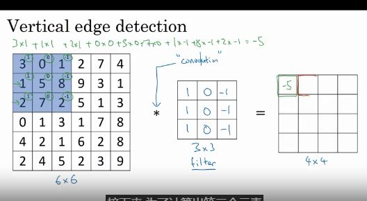
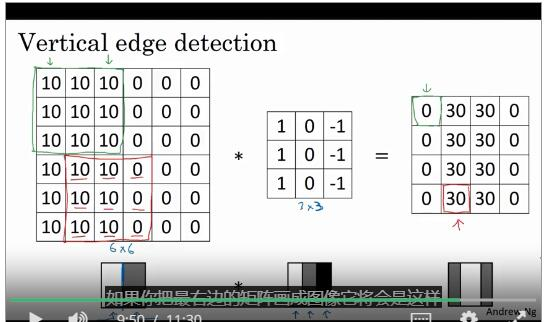
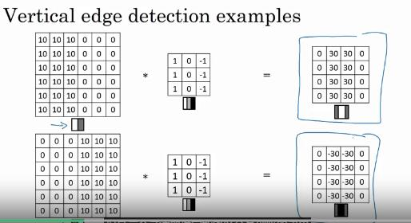
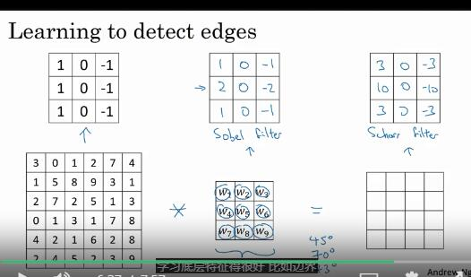
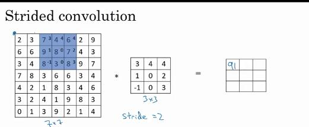
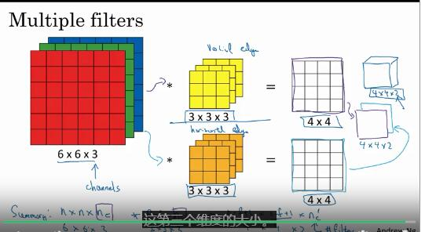
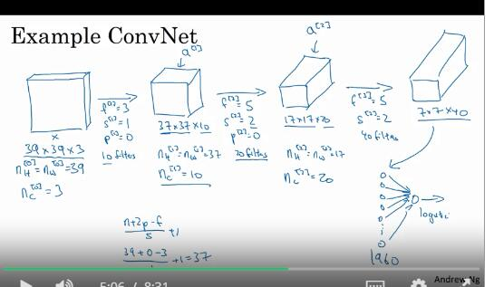
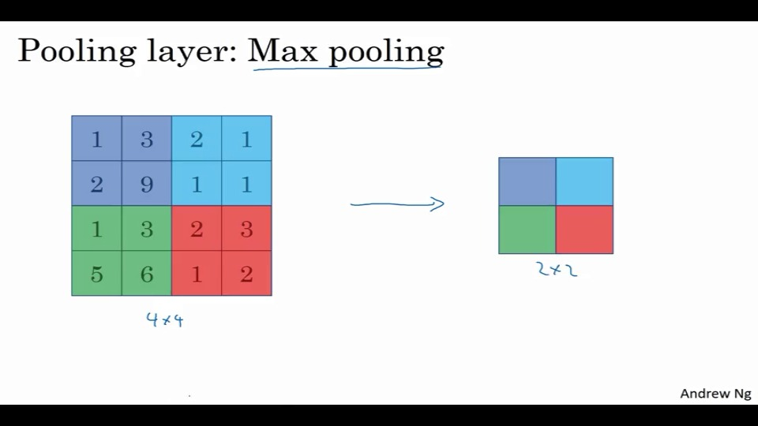
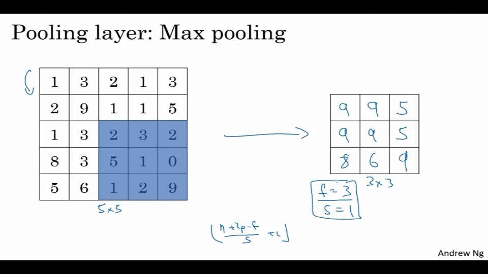

# 卷积神经网络

# 计算机视觉

来看看一些常见的应用：

- 熟悉的分猫器
- 物体标识
- 风格化图片

视觉处理中的问题是，输入可以无限大。

## 卷积的例子

边缘检测

垂直检测、水平检测。

对于一个6x6的图片，有一个3x3的过滤器（filter），也有被称为核(kernel)

比如这里有一个3x3的过滤器：
$$
 \left[
 \begin{matrix}
   1 & 0 & -1 \\
   1 & 0 & -1 \\
   1 & 0 & -1 \\
  \end{matrix}
  \right] 
$$
对6x6的矩阵做卷积，使用$*$，这个符号。

输出的是一个4x4的矩阵。

一般来说每个框架都由对应的卷积算法。

比如有图片有如下形式：

这就相当于检测出了垂直的中间图像。

## 如何用他们

正边缘、负边缘。

这样可以检测出从亮到暗、从暗到亮的过度。

以及各个学界也有对于使用什么filter有不同的见解。

通过过滤器，可以发现深度学习可以学习很多底层特性。

将这九个数当成参数去学习。

## padding 填充

比如，一个$n\times n$的矩阵，使用$f\times f$的过滤器，会得到一个$(n-f+1)\times (n-f+1)$的结果图像。

这样会造成图片的缩小。

同时边界上的像素，实际上被用到的次数很少，会减少边界的信息。

解决方法是在使用卷积前，先填充一次图片，使其变成$(n+2p-f+1)\times (n+2p-f+1)$大小的。

valid就是不填充的，same就是填充，使其输出等于输入。

当然注意，过滤器最好是奇数。

## strided（带步长） 卷积

就是如图所示，带着一定步长进行遍历。

向下移动也是一样的。

所以，一个$(n\times n) *(f\times f)$使用padding($p$),步长($s$)，这样可以得到一个$[\frac{n+2p-f}{s}+1]\times [\frac{n+2p-f}{s}+1]$的矩阵。

## 多维的卷积

比如对于三位，RGB三维。

注意，这里也不一定只有一个过滤器。

## 单层卷积网络

假定网络中有10个3,3,3过滤器，那么这一层有多少参数。

每个过滤器都由27个参数。还有一个b。就是28个。

这里使用，当标识$l$层是一个卷积层，那么$f^{[l]}$标识这一层的过滤器数量。

$p^{[l]}$标识这一层的填充，$s^{[l]}$表示步长。

Input：$n_h^{[l-1]}\times n_w^{[l-1]}\times n_c^{[l-1]}$。

Output：$n_h^{[l]}\times n_w^{[l]}\times n_c^{[l]}$

其中：$n^{[l]}=\lfloor \frac{n^{[l-1]}+2*p^{[l]}-f^{[l]}}{s^{[l]}}+1 \rfloor$,w或者h。

## 一个简单的例子

对于一般的卷积来说，有三层：

- 卷积层 convolution(conv)
- 池化层pooling(pool)
- 全连接层 fully connected(FC)

## 池化层

比如对于max pooling：

就是拆分，取每块最大值。

当然也可以用类似卷积层一样的移动框框的方式来搞。

还有平均值池化（这个不也是个卷积？）

以及这一层是不需要学习的。