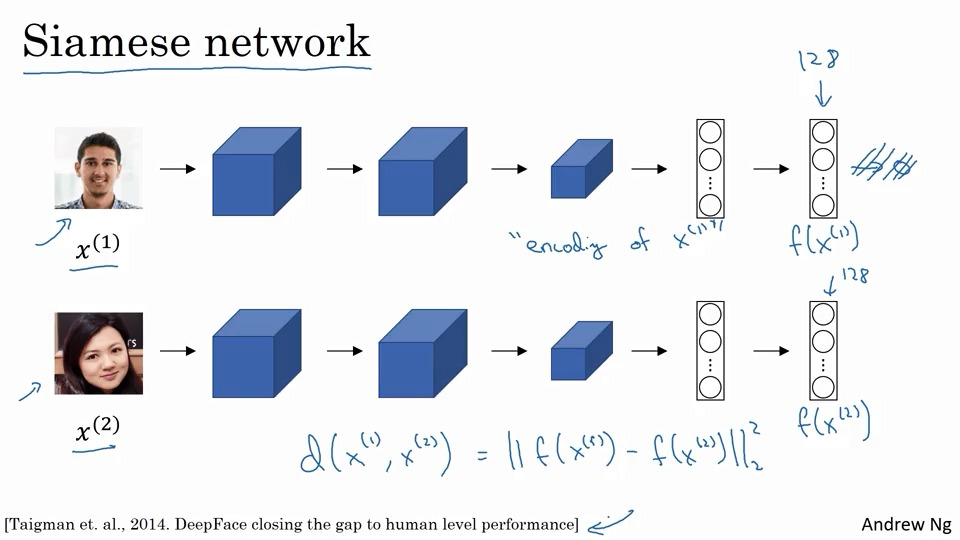
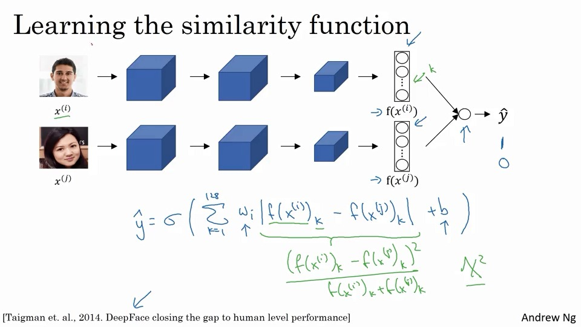
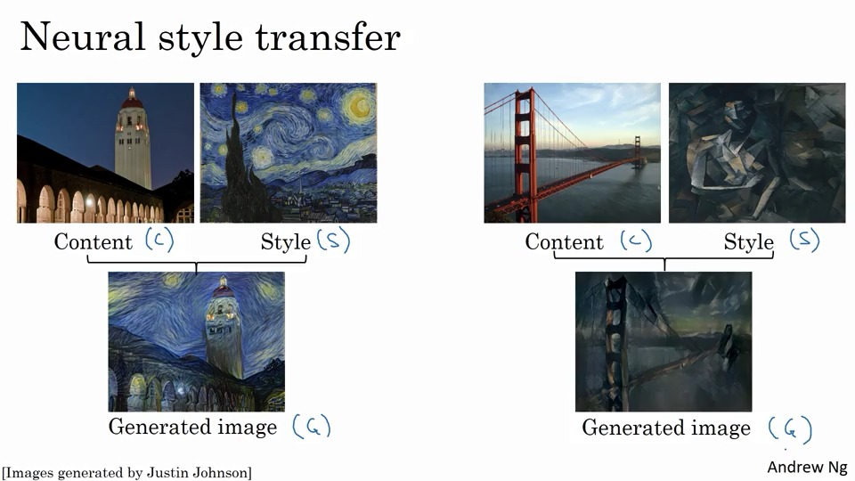
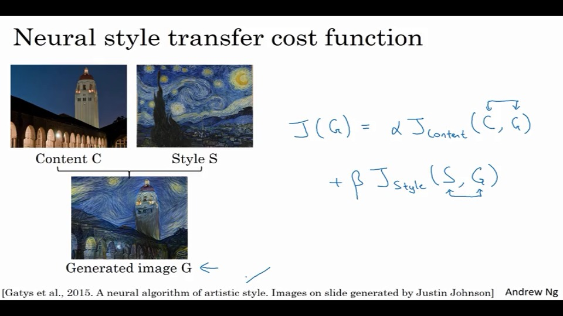
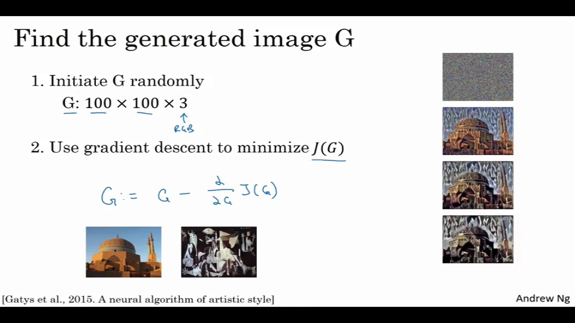
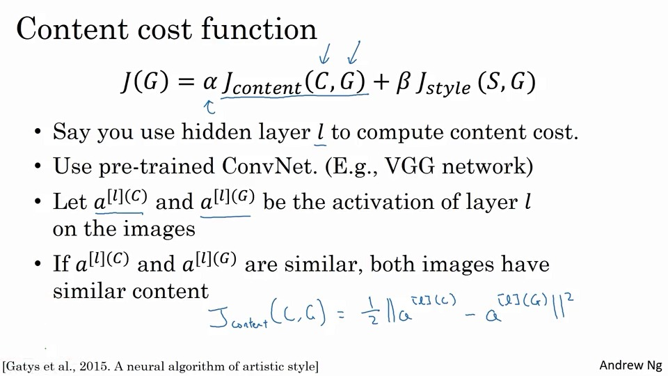
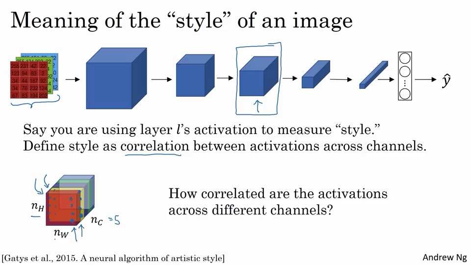
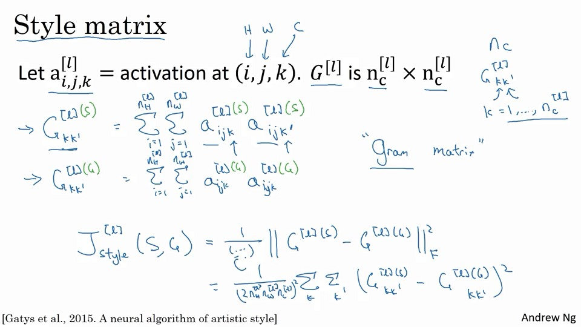

# 人脸识别

- 人脸识别
- 活体识别

这里只说人脸识别部分。主要有两种步骤

- 人脸校验

  只检测，人脸是不是其所称的人。是一个1:1问题。假设只需要99%的正确率。

- 人脸识别

  需要从K人中检测，如果K=100，那么就相当于其1:1的准确率就得提高一个量级了。

## 单样本问题

需要解决只有一个样本的学习问题。

只通过一张照片的前提下，认出一个人。

一般而言，只有一个样本的学习效果不会太好。

按照以前的想法，直接softmax出K个对象的概率的方式，就不会太好了。

这里最常用的是训练一个相似函数（$d(img1,img2) >?<degree$），查看两个图片是否是一个人。

## Siamese网络

把图片$x^{(i)}$，经过一个神经网络，进行编码，得到一个$f(x^{(i)})$，比如将其重新表达为一个128维的。

对另外一张图片进行类似的编码。



然后就可以定义$d(x^{(1)},x^{(2)})$，比如是其二范数。这时候就可以判断了。

那么问题就转变为创造一个网络，使其对同一个人能生成同样的encode。

## 三元组损失函数

一个损失函数，需要同时观察3个照片（这个三元的意思）：

1. 锚照片，ancher，A
2. 正例，positive，P
3. 反例，negative，N

那么对于损失函数有如下性质：
$$
\|f(A)-f(P)\|\leq \|f(A)-f(N)\| \\
\|f(A)-f(P)\|- \|f(A)-f(N)\|+\alpha \leq 0
$$

> 以上任务，有个很简单的学习方式，就是将任何图片的输出都变成0，那么0-0自然满足条件，所以这里需要做一个修改，增加一个$\alpha$(也被称为margin)，使其不能一直为0。
>

同时我们还希望$d(A,P)$远小于$d(A,N)$，那么这个margin就得大一些。

于是这个alpha就是个很好的超参数。
$$
\mathscr{L}(A,P,N)=max(\|f(A)-f(P)\|- \|f(A)-f(N)\|+\alpha,0)
$$
当然也需要很多同一个人，不同的照片，比如1w张1k人的照片，每个人10张。

当然，在训练的过程中，因为照片是随机选取的，所以约束条件比较容易满足，也就代表没法学到什么，于是需要一组学起来比较难的三元组。

## 面部验证与二进制分类



## 神经风格转移(neural style transfer)



就是干这个的。

## 深度卷积网络实际上在学些啥？

使用可视化方法，把训练到的中间层展现出来。

## 风格转移的cost函数





首先制作一个噪点图，然后使用迭代的方式，向content和style之间进行梯度下降即可。

## content的cost函数



- 一般来说，这个l不会太少，也不会太多
- 使用预训练神经网络
- 让$a^{[l](C)}$和$a^{[l](G)}$是他连的激活层
- 如果他两相似，就说明是类似的图片。

## style的const 函数

首先要定义出图像的style。什么是style？



这里，定义的style是通道(channels)间的关联性。

比如有5个通道，那么就是看前面的红通道和黄通道之间的相关性。

遍历所有的通道，得到对应位置的数据的不同通道的相关性，这个可以代表style。

那么为什么？
> 比如两个通道之间，某个元素高度相关，那么就说明他两之间有微秒的联系，比如有这种竖线，那么就会有对应的另外一种颜色。不相关的时候，就代表着有这种竖线的地方很少会有这种颜色。



$n_c^{[l]}$是通道数，那么$G^{[l]}\ is\ n_c^{[l]}\times n_c^{[l]}$。

这里用到的公式是相关系数矩阵的一种变形，未标准化的互协方差。

## 1D与3D数据

基本也能按照同样的方法来搞。

比如对于心电图，也能做类似的东西。

比如有一组数据，使用过滤器，

## 习题

1. 面部验证与面部识别：true
2. 选，一次检验、可以识别新人，人物图片很少【错误】
3. 10w人10w图，不合理
4. 看讲义
5. 不同图像，但有相同参数，true
6. 复杂的东西在比较深的层
7. 风格转移被训练为监督学习，输入两个图像，输出一个，true【错误】
8. G矩阵，是看同层相关性，rue
9. 生成图像
10. 30x30x30x32

## 编程

首先是计算context与噪点图的cost函数：

$$J_{content}(C,G) =  \frac{1}{4 \times n_H \times n_W \times n_C}\sum _{ \text{all entries}} (a^{(C)} - a^{(G)})^2\tag{1} $$

同时，为了只计算通道之间的关系，则需要进行reshape：

```python
def compute_content_cost(a_C, a_G):
    # Retrieve dimensions from a_G (≈1 line)
    m, n_H, n_W, n_C = a_G.get_shape().as_list()
    
    # Reshape a_C and a_G (≈2 lines)
    a_C_unrolled = tf.reshape(a_C,(n_H*n_W,n_C))
    a_G_unrolled = tf.reshape(a_G,(n_H*n_W,n_C))
    
    # compute the cost with tensorflow (≈1 line)
    J_content = tf.reduce_sum(tf.square(a_C_unrolled-a_G_unrolled))/(4*n_H* n_W* n_C)
    return J_content
```

下一步是计算风格化照片与噪点图的cost函数：

> The style matrix is also called a "Gram matrix."

首先，对图片，得到他的Gram 矩阵。

```python
def gram_matrix(A):
	GA = tf.matmul(A,tf.transpose(A))
	return GA
```

然后计算其cost函数

$$J_{style}^{[l]}(S,G) = \frac{1}{4 \times {n_C}^2 \times (n_H \times n_W)^2} \sum _{i=1}^{n_C}\sum_{j=1}^{n_C}(G^{(S)}_{ij} - G^{(G)}_{ij})^2\tag{2} $$

然后再符合几个层的样式：

$$J_{style}(S,G) = \sum_{l} \lambda^{[l]} J^{[l]}_{style}(S,G)$$

遍历之前的`compute_layer_style_cost(a_S, a_G)`函数，把多层的按照比例加起来。

> You've previously implemented the overall cost J(G)J(G). We'll now set up TensorFlow to optimize this with respect to GG. To do so, your program has to reset the graph and use an "[Interactive Session](https://www.tensorflow.org/api_docs/python/tf/InteractiveSession)". Unlike a regular session, the "Interactive Session" installs itself as the default session to build a graph. This allows you to run variables without constantly needing to refer to the session object, which simplifies the code.
>
> 啥意思？。。。与常规的唯一区别`Session`是，`InteractiveSession` 将自身安装为构造时的默认会话。这些方法[`tf.Tensor.eval`](https://www.tensorflow.org/api_docs/python/tf/Tensor#eval) 和[`tf.Operation.run`](https://www.tensorflow.org/api_docs/python/tf/Operation#run) 将使用该会话运行，欢声笑语。
>
> 这在交互式shell和[IPython笔记本中](http://ipython.org/)很方便，因为它避免了必须传递显式`Session`对象来运行ops。

1. 创建交互式会话
2. 加载内容图像
3. 加载样式图像
4. 随机初始化要生成的图像
5. 加载VGG16型号
6. 构建TensorFlow图：
      - 通过VGG16模型运行内容映像并计算内容成本
      - 通过VGG16模型运行样式图像并计算样式成本
      - 计算总成本
      - 定义优化器和学习速率
7. 初始化TensorFlow图并运行它进行大量迭代，每步更新生成的图像。