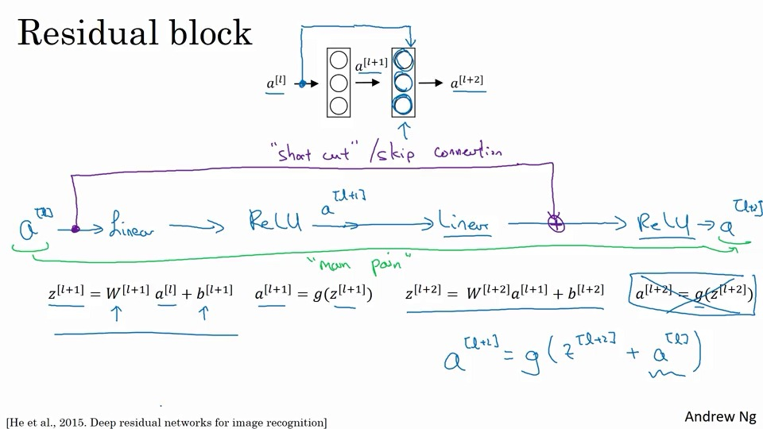
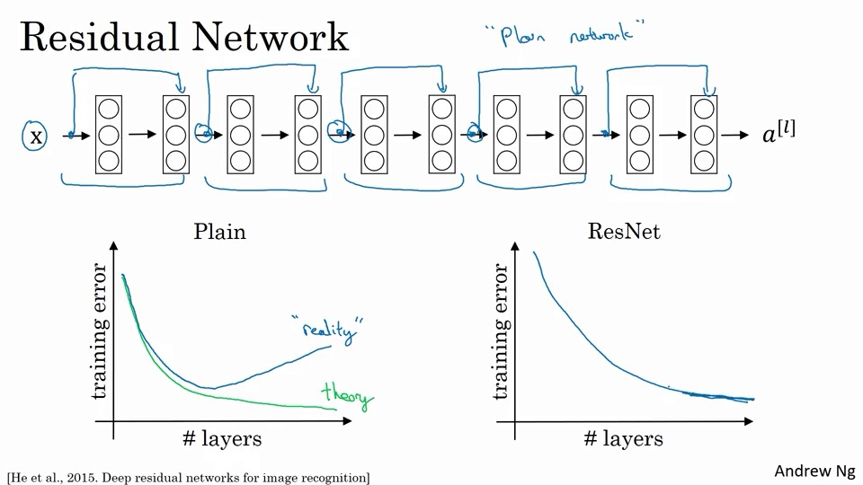
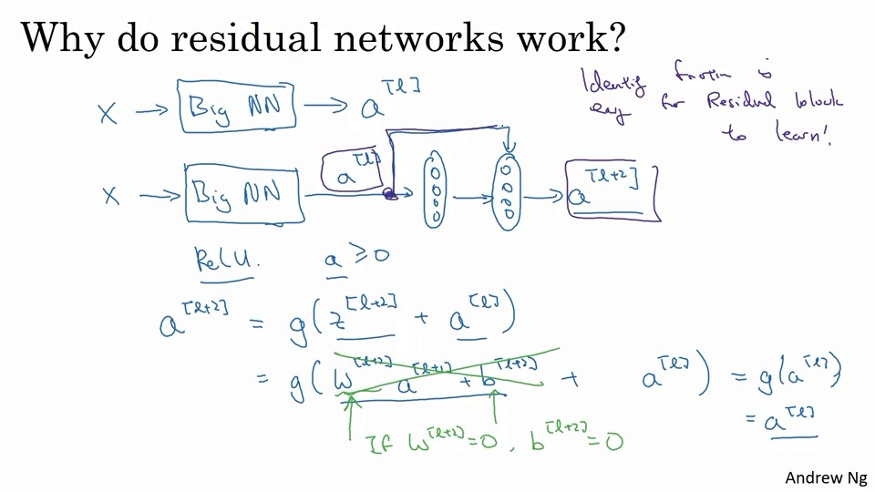
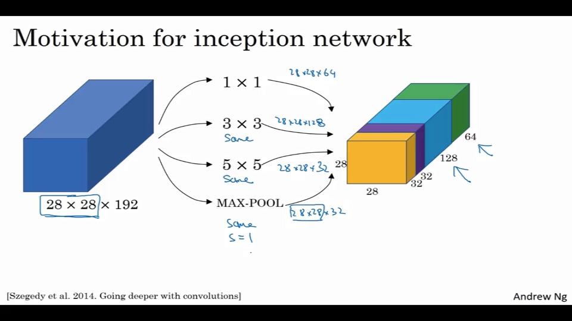
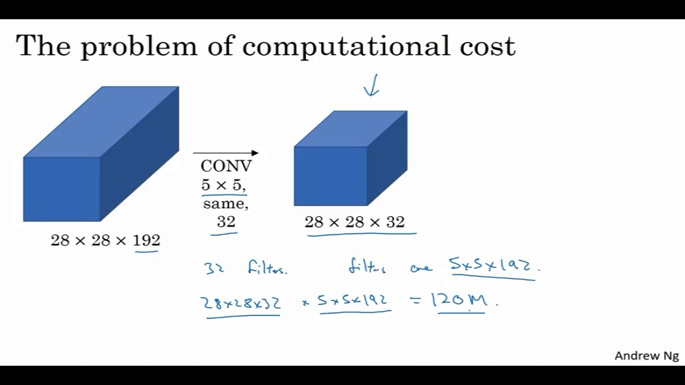
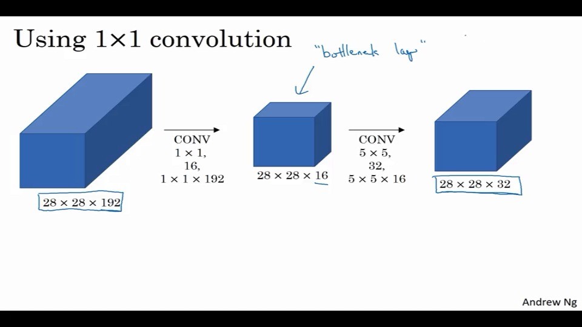
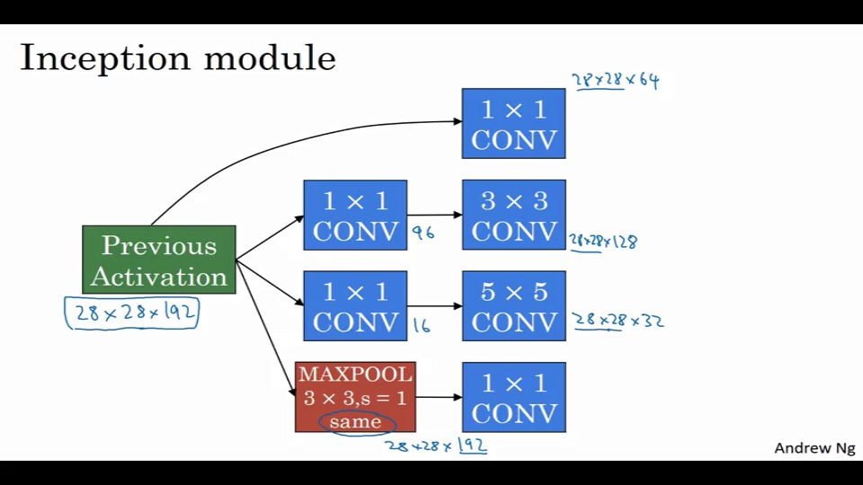
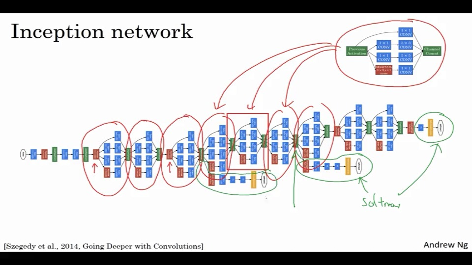

# 目录

#### 经典的network

- LeNet-5
- AlexNet
- VGG

#### 残差网络(ResNet)

#### 初始神经网络实例

# 经典网络

## LeNet-5

这个是在灰度图像上识别数字的网络。

当然，当年没有pad

32x32x1--【5x5,s=1的6个过滤器】-->28x28x6---【均值f=2，s=2，pool】---->14x14x6---【5x5，s=1的16 filter】---->10x10x16---【均值f=2，s=2，pool】---->5x5x16=400---【FCN】--->120---->84------>$\hat y$    (10个值)。

当年为了节约计算量，不同滤波器会处理输入块的不同通道。

## AlexNet

- Relu激活函数的使用
- 在GPU上的尝试，但实现挺复杂的
- 局部归一响应(LRN,Local Response Normalization)

> <https://blog.csdn.net/yangdashi888/article/details/77918311>
>
> AlexNet将LeNet的思想发扬光大，把CNN的基本原理应用到了很深很宽的网络中。AlexNet主要使用到的新技术点如下。
>
> （1）成功使用ReLU作为CNN的激活函数，并验证其效果在较深的网络超过了Sigmoid，成功解决了Sigmoid在网络较深时的梯度弥散问题。虽然ReLU激活函数在很久之前就被提出了，但是直到AlexNet的出现才将其发扬光大。
>
> （2）训练时使用Dropout随机忽略一部分神经元，以避免模型过拟合。Dropout虽有单独的论文论述，但是AlexNet将其实用化，通过实践证实了它的效果。在AlexNet中主要是最后几个全连接层使用了Dropout。
>
> （3）在CNN中使用重叠的最大池化。此前CNN中普遍使用平均池化，AlexNet全部使用最大池化，避免平均池化的模糊化效果。并且AlexNet中提出让步长比池化核的尺寸小，这样池化层的输出之间会有重叠和覆盖，提升了特征的丰富性。
>
> （4）提出了LRN层，对局部神经元的活动创建竞争机制，使得其中响应比较大的值变得相对更大，并抑制其他反馈较小的神经元，增强了模型的泛化能力。
>
> 其中LRN的详细介绍如下：   [tensorflow下的局部响应归一化函数tf.nn.lrn](http://m.blog.csdn.net/sinat_21585785/article/details/75087768)

## VGG-16

> <https://zhuanlan.zhihu.com/p/41423739>
>
> 

- 具有非常美的简洁性（简单粗暴）
- 深度优先

~138M的内存。

当然还有VGG-19。

## ResNets

太深的神经网络，容易梯度消失或者爆炸这类问题。

这里使用了一种 **跳跃链接(skip connection)**的机制。

**残差结构：**

这里通过一个捷径(short cut/skip connection)，将$a^{[l]}$的结果，直接加到$a^{[l+2]}$的g函数中。

比如将这样一个10层的原始网络(plain network)，改造成5个残差块。

### why有效？

- 更深的网络会使训练能力下降，res可以避免。
- 其优势在于处理恒等式(identiy function)上。当l+2层的w,z,b算出来为0，这里也不会直接舍弃g的值，而是忽略了这一层，继续对$a^{[l]}$进行优化。
- 可以保证更深的网络不会影响性能，甚至还能提升。

如果维度不一样，可以增加一个$W_s \ a^{[l]}$,来保证维度。

### 1x1过滤器

可以改变输出层过滤器的数量。

比如减少输入层的过滤器。

参数数量：与输入层的filter相同。1x1x输入层filte

### 初始动机网络(Inception Network Motivation)

像这样，一次性做出多个过滤。

如果直接做5x5卷积的话，会有比较大的运算量。比如这里有12亿次

使用1x1过滤器，做一个**瓶颈层(bottleneck)**，这样会极大较少需要的计算。

然后再来看计算成本：240w+1kw=1.24kw。

###  初始网络(inception network)

几个分支，是分出来做预测使用的。

## 使用开源网络

因为很多网络，有超级多的调参，正则化，实际上是很难复现的。

所以可以考虑使用开源的网络

关于如何使用GitHub

### 迁移网络

如何使用迁移网络。

可以考虑freeze前面的几层网络，只训练最后的softmax层。

这样可以在很小的设备中，也能训练神经网络。

很多框架都支持这类型的freeze。

### 数据扩充

- 线性变换：旋转、剪裁、扭曲等等
- 颜色干扰：RGB加点，减点。
  - PCA，颜色干扰技术，PCA色彩增强。

### 对于基准模型的建议

- 集成

  独立训练多个模型，平均他们的输出

- 多重切割

  使用多种切割方式，并进行训练

### 题目

1. 深度增加，h、w减少，c增加
2. conv后加pool，最后是FC【？？？】
3. pool缩小体积的高宽，卷积与pad一起使用。对【错误】false
4. 更深可以适应更负责的功能，以及更低的训练错误【错误】false
5. a^l和0
6. 残差网络，可以学习恒等映射，可以传递给更深的网络【错误】identity和help deeper
7. 1【错误】17？
8. 池化减少 h、w、c，1x1减少c【错误】pool不能n_c?
9. 单个块使用各种组合，使网络更深，使用1x1叫上输入量大小【错误】不选更深。
10. 开源：all【错误】不选计算机竞赛【？？？】

算了过了。。。

## 编程

## keras

