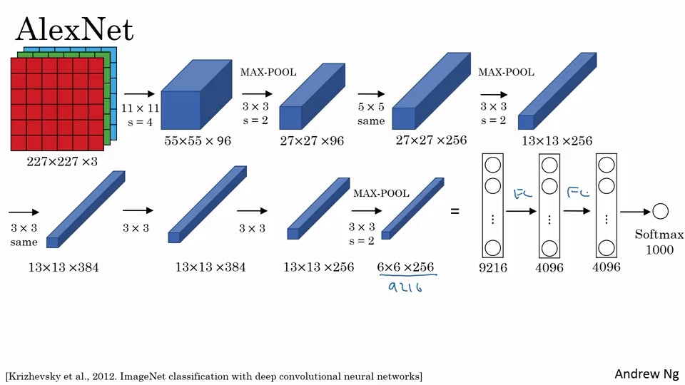

# 目录

#### 经典的network

- LeNet-5
- AlexNet
- VGG

#### 残差网络(ResNet)

#### 初始神经网络实例

# 经典网络

## LeNet-5

这个是在灰度图像上识别数字的网络。

当然，当年没有pad

32x32x1--【5x5,s=1的6个过滤器】-->28x28x6---【均值f=2，s=2，pool】---->14x14x6---【5x5，s=1的16 filter】---->10x10x16---【均值f=2，s=2，pool】---->5x5x16=400---【FCN】--->120---->84------>$\hat y$    (10个值)。

当年为了节约计算量，不同滤波器会处理输入块的不同通道。

## AlexNet

- Relu激活函数的使用
- 在GPU上的尝试，但实现挺复杂的
- 局部归一响应(LRN,Local Response Normalization)

> <https://blog.csdn.net/yangdashi888/article/details/77918311>
>
> AlexNet将LeNet的思想发扬光大，把CNN的基本原理应用到了很深很宽的网络中。AlexNet主要使用到的新技术点如下。
>
> （1）成功使用ReLU作为CNN的激活函数，并验证其效果在较深的网络超过了Sigmoid，成功解决了Sigmoid在网络较深时的梯度弥散问题。虽然ReLU激活函数在很久之前就被提出了，但是直到AlexNet的出现才将其发扬光大。
>
> （2）训练时使用Dropout随机忽略一部分神经元，以避免模型过拟合。Dropout虽有单独的论文论述，但是AlexNet将其实用化，通过实践证实了它的效果。在AlexNet中主要是最后几个全连接层使用了Dropout。
>
> （3）在CNN中使用重叠的最大池化。此前CNN中普遍使用平均池化，AlexNet全部使用最大池化，避免平均池化的模糊化效果。并且AlexNet中提出让步长比池化核的尺寸小，这样池化层的输出之间会有重叠和覆盖，提升了特征的丰富性。
>
> （4）提出了LRN层，对局部神经元的活动创建竞争机制，使得其中响应比较大的值变得相对更大，并抑制其他反馈较小的神经元，增强了模型的泛化能力。
>
> 其中LRN的详细介绍如下：   [tensorflow下的局部响应归一化函数tf.nn.lrn](http://m.blog.csdn.net/sinat_21585785/article/details/75087768)

## VGG-16

> <https://zhuanlan.zhihu.com/p/41423739>
>
> 

- 具有非常美的简洁性（简单粗暴）
- 深度优先

~138M的内存。

当然还有VGG-19。

