# 对象定位

可以把问题拆分为两个：

- 分类
- 并画出个框，定位

可能有一个或者多个对象。

再细化点需要识别的不止是对象，还需要有边界框的参数。

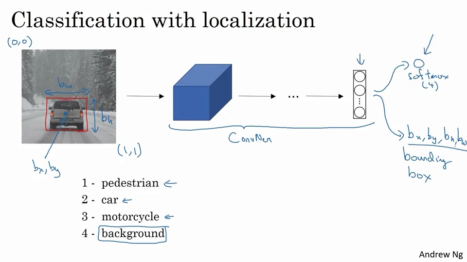

那么结果就可以拆分了，就如这样构建：

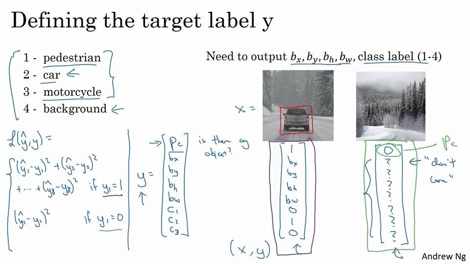

PS：这里有个拆分，如果不是对象的话，那么就没有必要分析其他东西了。

## 地标检测

比如检测脸部的一些关键点。

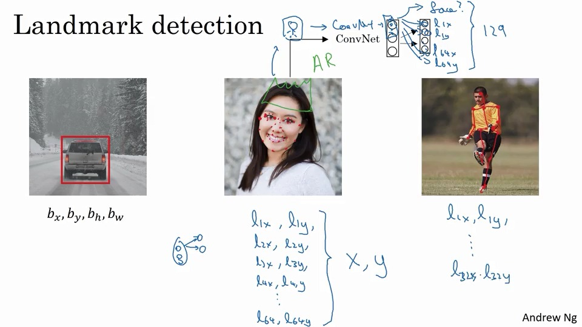

比如需要检测脸部的126个关键点。

识别这些点，也是AR之类的实现依据。

也可以使用同样的的方式来做。

[^]: 当然这里，有一些简单的方式来进行点的标准。比如给人脸贴上，然后再拍连续的照片，然后消去这些点。但需要注意的是，这个方法不一定好，还是需要比较大的人工标识数据集。

## 对象检测的一些方法

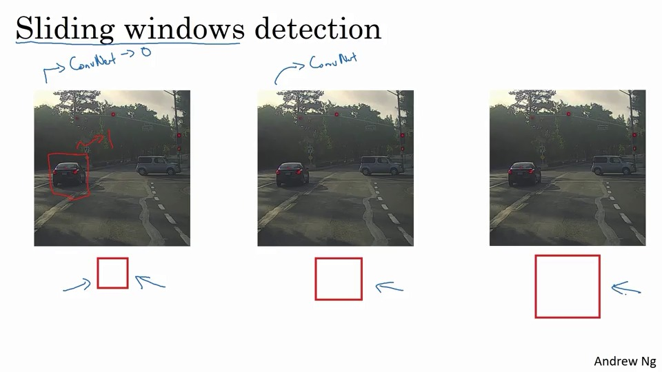

比如做一个小的卷积网络，判断是否有object。

但，这玩意的运算量很大，有很高的成本。

以前因为检测是线性检测，所以这个滑动窗口效果还行，但现在，神经网络的运算成本那么大，这就不行了。

## 使用卷积的形式，完成 滑动窗口

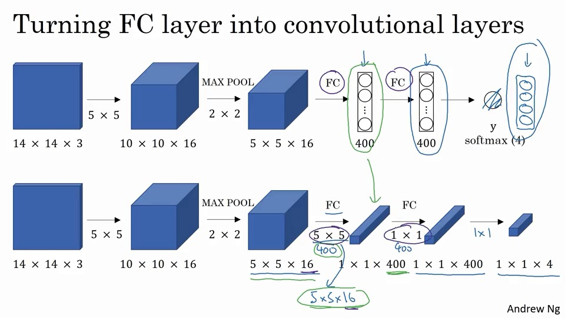

首先把原来的FC层，使用卷积的形式来实现，这样就可以一直使用CNN神经网络了。

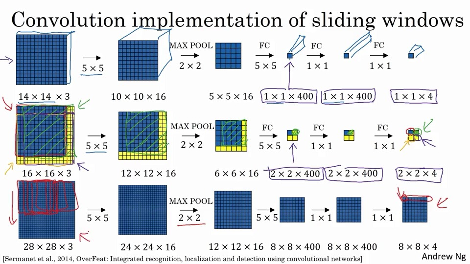

使用CNN最大的原因是为了共享已经计算过的向前传播信息，减少信息的浪费。

比如，原始的网络是第一行的网络。已经进行过CNN的向前计算了。

那么在其滑动时，这一部分就不需要计算了。

## 预测边界框

虽然上述过程减少了难度，但依然存在问题，就是不好精准地预测出边界框的情况。


比如，上面的这图中，没有任何一个框框，恰好框柱了汽车，这时候就不是很好判断汽车的边界框了。

那么是否有可以精准输出的算法么？<!--用框框去算概率？-->

### `YOLO`算法

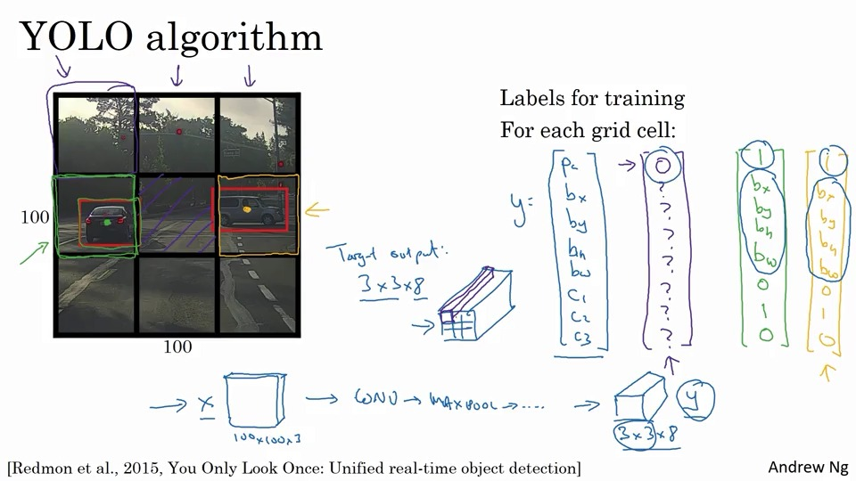

紫色的是上面几个的结果。绿色是左边那个。

- 和识别、定位算法很相似。

- 通过卷积实现，不需要重复运算多个滑动窗口，而是使用一个卷积网络实现

  <!--不是，没觉得这个卷积网络与滑动窗口有太多区别啊。本质是一个东西啊，但不能否认是个好想法就是了-->

一个示例，关于如何界定边界框：

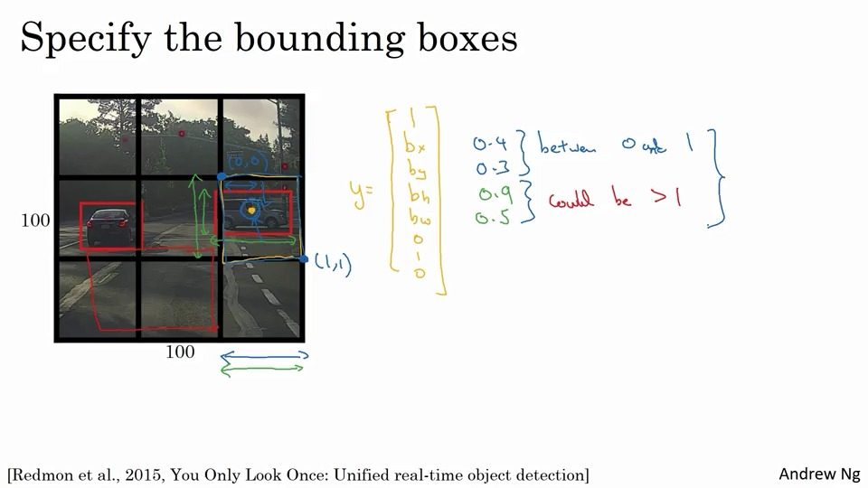

一般来说，这种比较好，当然其论文里面也有更详细的方法。

<!--以及YOLO的paper，他说是最难度的论文之一。-->

## 检测算法有效性：交并比(intersection over union)

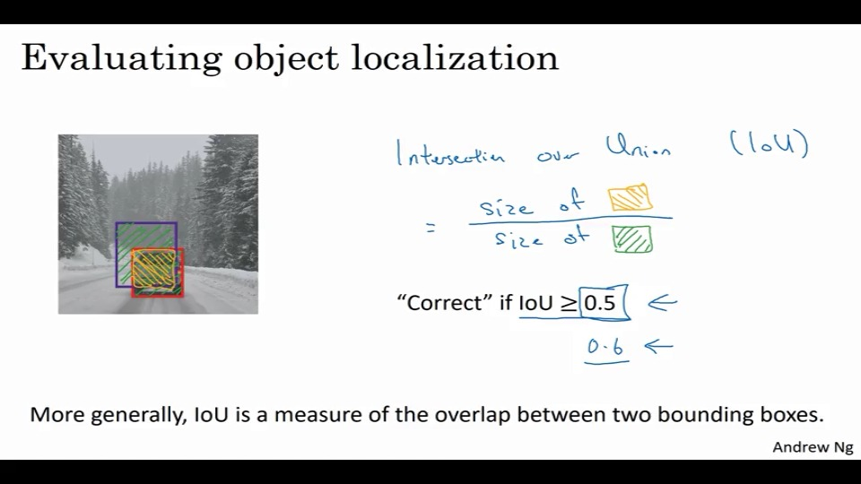

交并比算法，就是检测实际与检测出来的相符程度。
$$
IoU=\frac{交集}{总体的集合}
$$
一般来说大于0.5就不错了。

当然，这个看个人了。

## 非极大值抑制(Non-max Suppression)

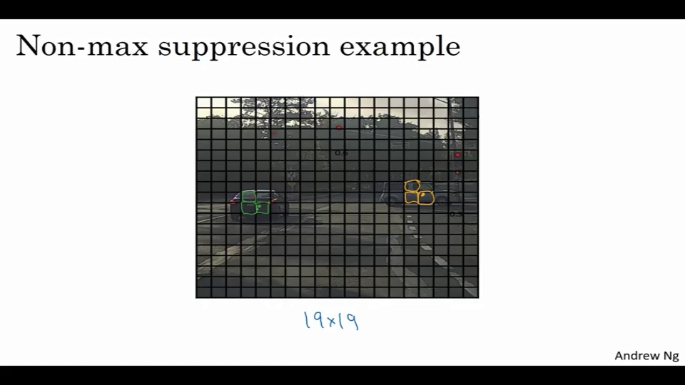

会出现这种情况，明明只有一个点，但却在很多图中都能检测到存在。

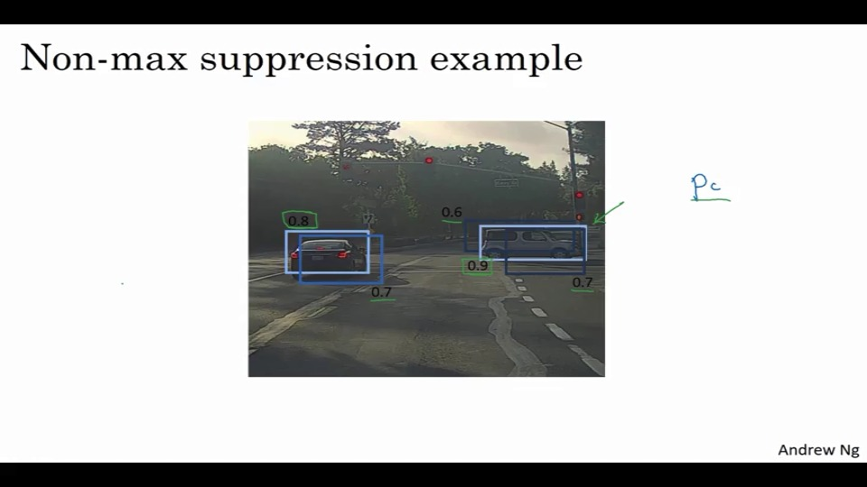

结果就会变成这样，Pc是检测到可能性的概率。首先找出Pc最高的那个，然后对于其有重叠的部分，就调低其亮度，以达到抑制的效果。

具体做法是：

- 首先丢掉所有Pc小于0.6的
- 对于没有丢弃的
  - 先找到一个Pc最大的
  - 对于有高IoU的，丢弃或者调暗。

对于有多个的情况，可以多次运行Non-max。

## 多个对象检测：锚箱(anchor boxes)

就是重复多个box：

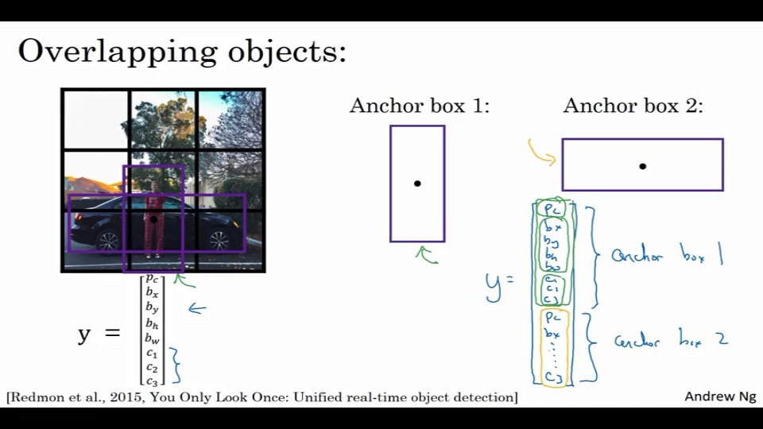

之前是使用适应IoU的方式。

使用锚箱的话，是每个对象都要检测多个锚箱，并且通过IoU判定归属。

比如之前是3x3x8，使用锚箱就变成了3x3x2x8。

当然，如果一样框的话，锚箱就不能用了。

## 结合YOLO

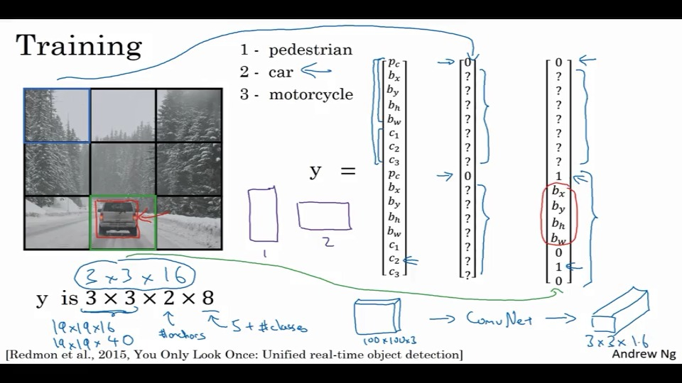

- 输出如上图所示

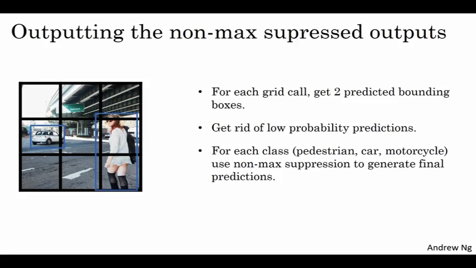

- 如果运用了锚箱，那么每个框，都会出现两个箱，虽然大部分Pc都不一定高。

- 此时去掉低Pc
- 对每个观测点都执行非极大值抑制，去掉最低的。

## 候选区域

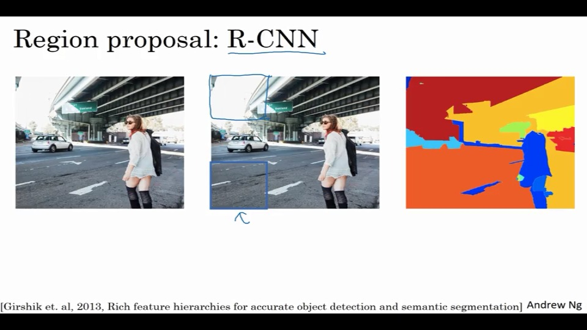

首先，在滑动过程中，有很多部分是不会感兴趣，所以需要有一个算法，可以识别出，什么部分最有可能是目标。

比如使用RNN的思想，使用聚类算法，把相似的标记出来，那么这里变化最大的地方，就能去进行滑动了。

相对于在每个框都滑动来说是挺快的了。


当然，他的缺陷是：

的确挺慢的。虽然近年有改进，但可能还不够。


## 测试

1. [1,0.3,0.7,0.3,0.3,0,1,0]
2. 不关心的话，[0,????????]
3. 饮料罐，单位，x，y
4. 平面人脸N个单位，输出2N数据
5. 要提供训练的边框，假
6. ？增加步幅怎么就提高准确性了？假
7. yolo中有多个检测对象，box【真】
8. 1/9
9. 5
10. 19x19x5x20【】

## 编程

#### 编写一个过滤器。

box_confidence（19x19,5,1）：对于这个每个盒子中存在对象的概率。

boxes：（19x19,5,4）5个盒子的位置、长宽

box_class_probs：每一类的检测概率

1. 需要做的是，算出最大盒子分数、得到对应盒子得分。

2. 使用阈值编码，过滤低概率

3. 过滤掉不需要的子集

   这里，使用

   ```
   tf.boolean_mask(
       tensor,
       mask,
       name='boolean_mask',
       axis=None
   )
   ```

   将bool值应用到张量

### 使用非最大抑制(NMS)

#### 实现IoU

1. 这里，使用左上与右下两个点定义长宽高
2. 计算面积
3. 计算交叉

#### 实现NMS

1. 选择最高分
2. 计算重叠并删除重叠的框
3. 返回1迭代

使用

> <https://www.tensorflow.org/api_docs/python/tf/gather>

```
tf.gather(
    params,
    indices,
    validate_indices=None,
    name=None,
    axis=0
)
```

> <https://www.tensorflow.org/api_docs/python/tf/image/non_max_suppression>

```
tf.image.non_max_suppression(
    boxes,
    scores,
    max_output_size,
    iou_threshold=0.5,
    score_threshold=float('-inf'),
    name=None
)
```

感觉这里karas和tf混着来啊。

<!--感觉开始有点看不太懂，这个编程了。Orz-->