# NLP 自然语言处理

## 序列模型

```
Harry Potter and Hermione Granger invented a new spell. 
```

以上述这个句子作为例子，这个是模型的输入X。

这是以个姓名识别任务，识别出句子中的人名、企业名、时间、地点、国家、货币等等。

然后输出一个Y： 1 1 0 1 1 0 0 0 0，1代表，这个词是人名。

使用上标的方式，进行表示，这是第几个词$x^{<i>}、y^{<i>}$。

使用$T_y、T_x$代表输入输出的数量。

$y^{(i)<t>}$，代表第 $i$ 个训练样例的第 $t$ 个元素。

## 表示单词

准备好一个词汇表。以方便程序对这些词汇进行表示。

一般商用的词汇表，大约是3~5w。这里使用1w个。

one-hot编码：对每个单词，使用一个长达1w维的向量表示这个元素是哪个。。。???

## 学习一个X到Y的神经网络

如果使用一般的神经网络，那么会产生很多问题。

- 每个句子的长度不定，所以可能需要扩充至最大长度。
- 不会共享那些从不同位置中学到的特征。
- one-hot编码是一个非常非常大的输入数据

## 循环神经网络（RNN）

对$x^{<i>}$的学习结果，会传递一定数量的激活参数$a^{<i>}$，给$x^{<i+1>}$。

在0时的时候，可以人为创造一些参数。


这里也有缺点，他只使用了先前信息进行预测。

后面还有双向循环神经网络(BRNN)之类的。

比如可以像这样构造：


这里可以做这种方式的简写。

把$W_{aa}、W_{ax}$合并成一个更宽的矩阵，直接与$[a^{<t-1>},x^{<t>}]$进行相乘。


## 反向传播

首先来看正向传播，

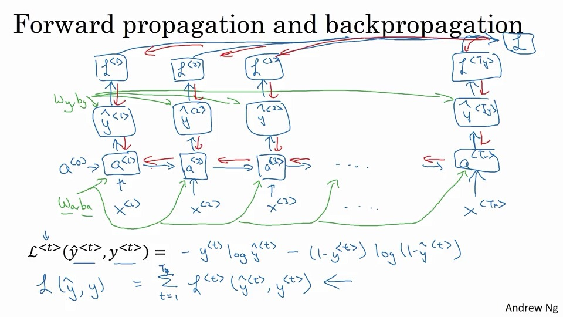

## 其他类型的RNN

有many-to-many与one-to-one的区别。这一般用来做many-to-many的操作。

之前来说，输入与输出的数量是一致的，但在翻译问题上，输入与输出的数量差距还是很大的。

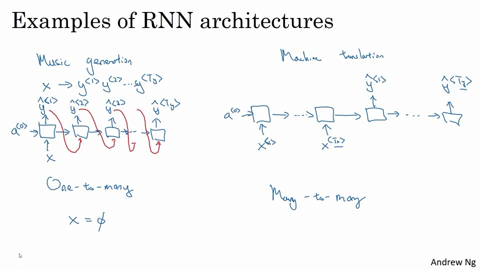

这样就分为两个部分，一个是encoder部分，与decode部分。

<!--那么encoder部分输出啥啊，还是啥都无所谓？-->

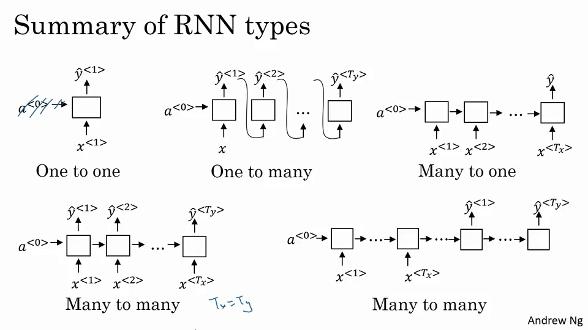

这样我们就总结出好几种RNN模式。

## 使用RNN构造一个语言序列模型

语言模型，就会对句子进行识别，得到它是我刚才说的是啥的概率：

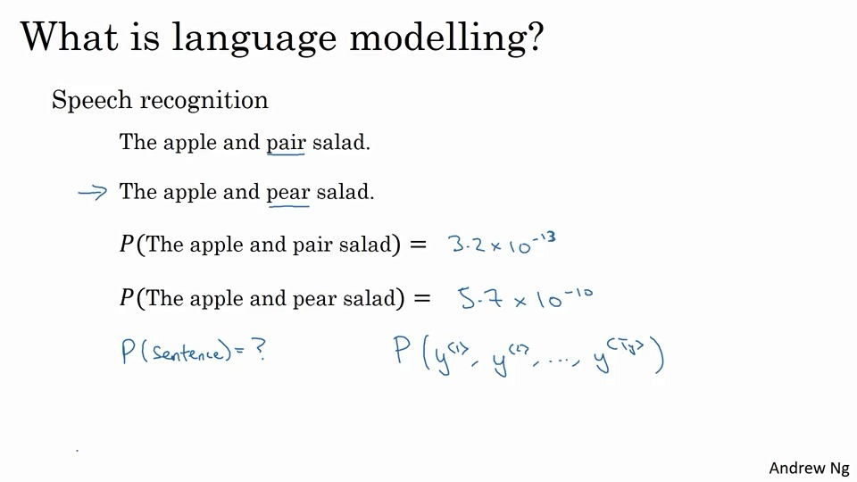

比如我先说了一句"The apple and pear salad was delicious"，这时候需要判断出，我前面说的是啥的概率。是pear还是pair。

### 如何做

需要一个大文集。

对句子先进行，句子标记化(tokenize)，从而得到一个之前见过的单词表，然后将单词映射到一个one-hot-verctor。

通常还会增加一个表示结尾的`<EOS>`标记。

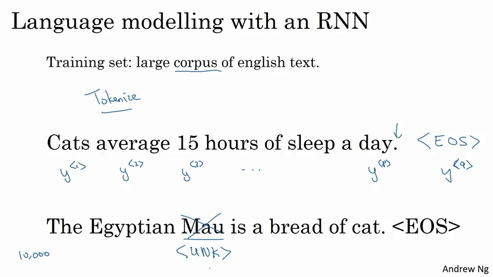

如果有不再表中的词，就哟你`<UNK>`来进行标记。

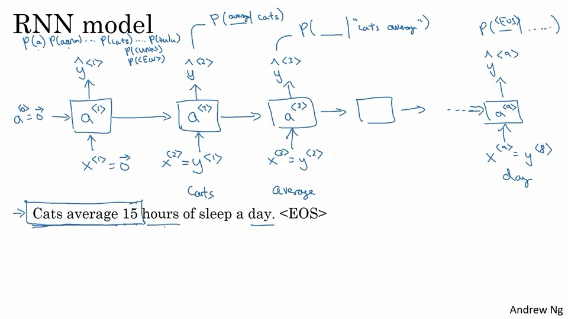

- 首先，对输入的词进行预测，判断其实字典中某个词的概率。

  比如我们使用1w的单词表，那就是1w的通道，得到是这个词的概率。

- 然后依次对每词都这么进行操作。

## 对新序列进行采样

通过是使用`np.random.choice`得到每个的概率。

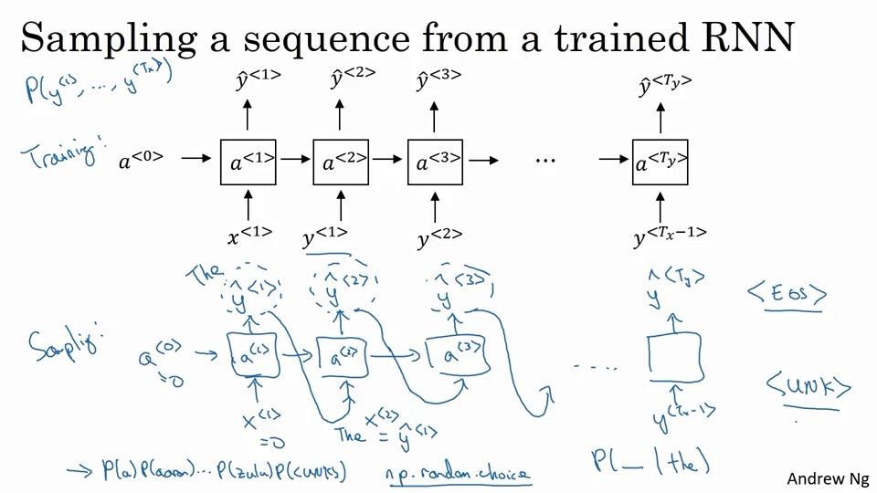

**注意，这里采样用的事随机采样**

这样就建立了一个以单词为单位的RNN神经网络。

如果不是词汇级别的，那也可能是字符级别的。

字符级的模型，会导致序列更长，同时更难训练。

比如，这里使用的例子就是，讲一个新闻句子组，转变成为莎士比亚感觉的字段。

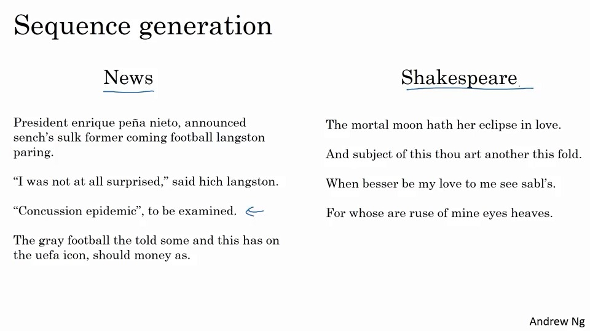


## 解决RNN的梯度消失问题

关于长期依赖的例子：

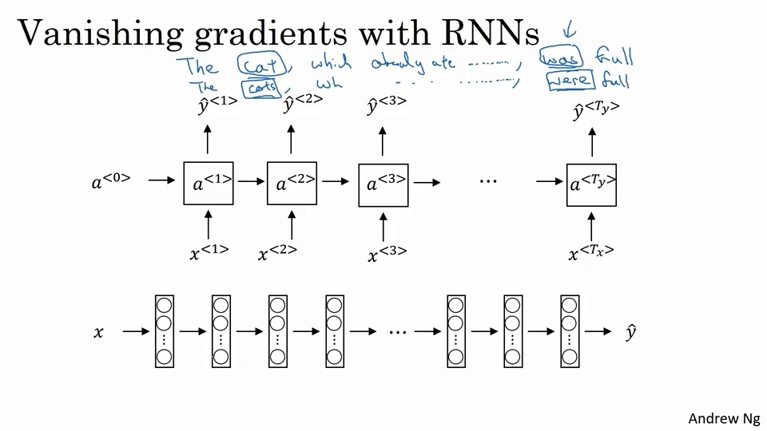

比如这个，这个cat与后面的was、were有关。

比如这里就很难记住，之前的某个词，是否是单复数问题。

同事RNN有很强的邻近影响。

相比于梯度爆炸，梯度消失更麻烦。爆炸的话会出现很多的NaN，但消失的话，就很难判断了。

如果爆炸了，那么使用gradient clipping，就是观测到爆炸，则缩放某些梯度向量。

> <https://docs.scipy.org/doc/numpy-1.13.0/reference/generated/numpy.clip.html>
>
> `numpy.clip(a, a_min, a_max, out=None)`

## GRU，gated recurrent unit

处理梯度消失的一个算法。

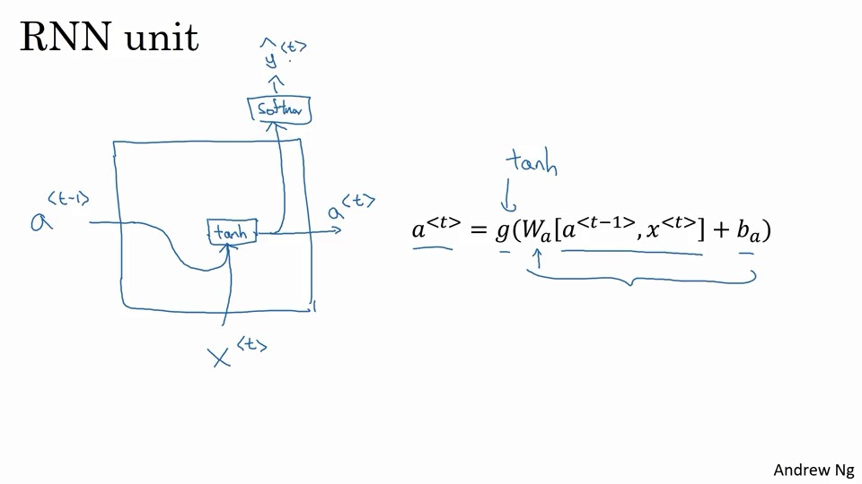

首先回顾下我们是怎么做RNN的。

然后来看一个简单的例子：

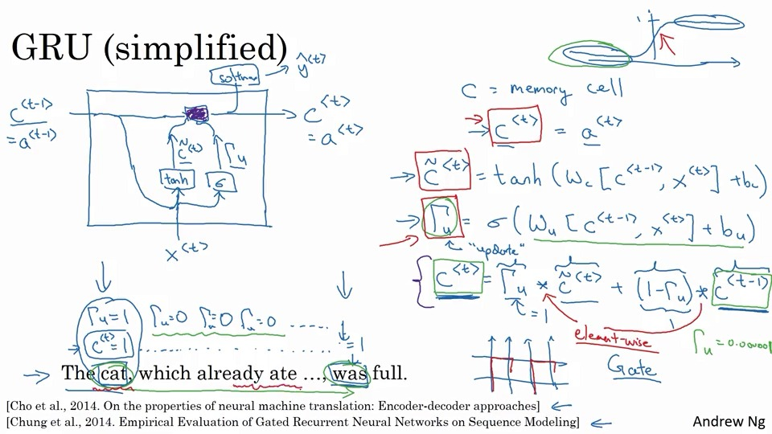

这里提供了一个c的记忆单元的，提供一些内存来记东西，比如单词的单复数等。

这使用一个阀门$\Gamma_u=\sigma(W_u[c^{<t-1>,x^{<t>}}]+b_u)$。

这里使用$c$去更新$\hat{c}$，同时，通过$\Gamma $来控制。

$c^{<t>}$一直记录了，主句的单复数形式，然后使用$\Gamma$来确定，何时是否更新。
$$
c^{<t>}=\Gamma_u*\hat{c}^{<t>} + (1-\Gamma_u)*c^{<t-1>}
$$
这就是GRU单元。

使用$\Gamma$可以控制何时进行更新。

这些c、$\Gamma$可以是一个比较大维度的向量，比如有100个隐藏层，那么就可以设置100维，主要看需要使用多少。

比如使用其中一维记忆单复数，使用一维记忆是否吃饭了。

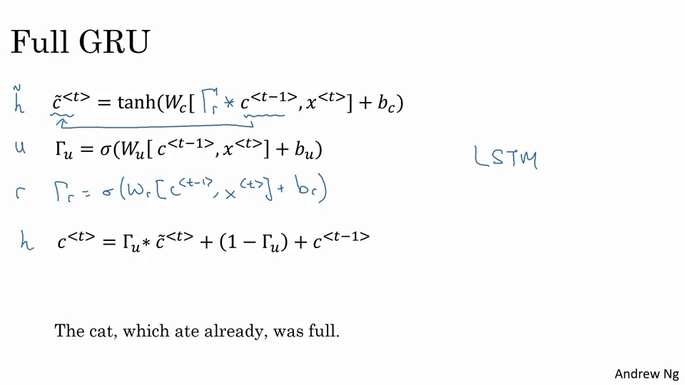

## LSTM，也是一种长期记忆的方法

这里对GRU中的$a^{<t>}=c^{<t>}$等式，进行了优化，同时使用两个阀门，对遗忘使用$\Gamma_f$，对选择使用$\Gamma _u$。

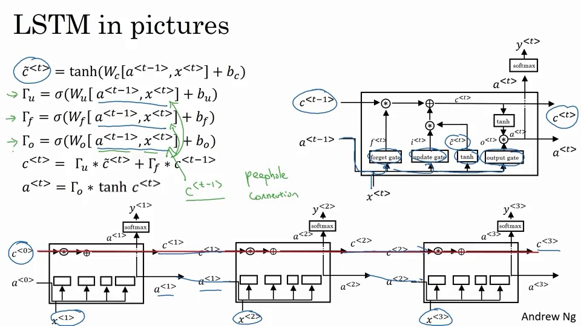

## 双向RNN

比如识别某个单词，不但需要使用前文的内容，同时也需要后文的内容。

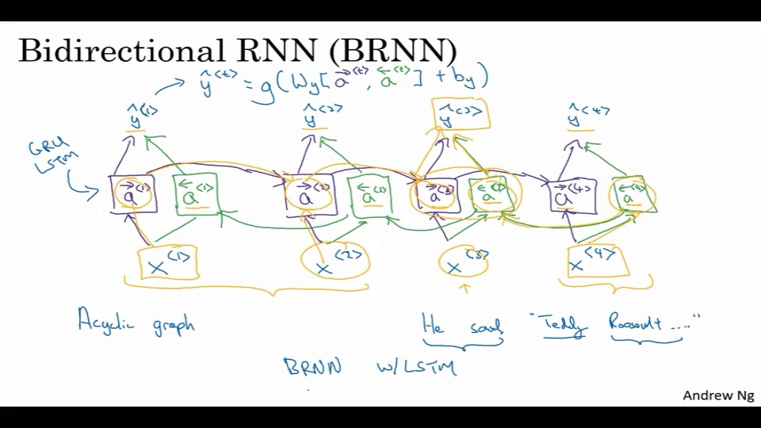

就这样，如图所示，将后续文本的内容，也作为数据判断的一部分，交由RNN进行判断。

缺点就是，需要整个句子的数据，才可以得到结果。

对于实时翻译，实际上还有更多的模块。

## 深度RNNs

对于处理复杂的问题，把很多RNN叠在一起，会有不错的效果。

<!--所以叫RNNs？！！！-->

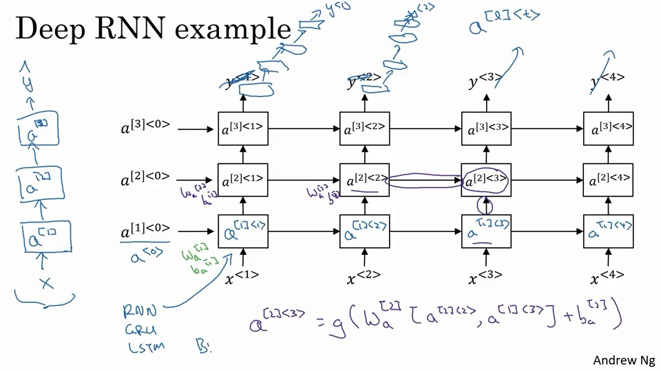

## 习题

1. x^i<j>
2. Tx=Ty
3. 性别识别、情绪分类
4. 第t步的时候，在干嘛。1~t-1的条件概率
5. 选概率最高，传递所选单词。【错误，RNN的输出概率，不用于选择最高概率】
6. 爆炸
7. 100，与a^t相同
8. 删除$\Gamma _r$，因为u约为0
9. u和1-u
10. 单项，

## 编程

