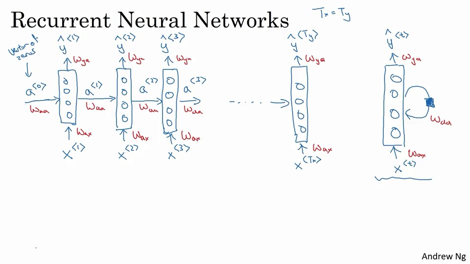
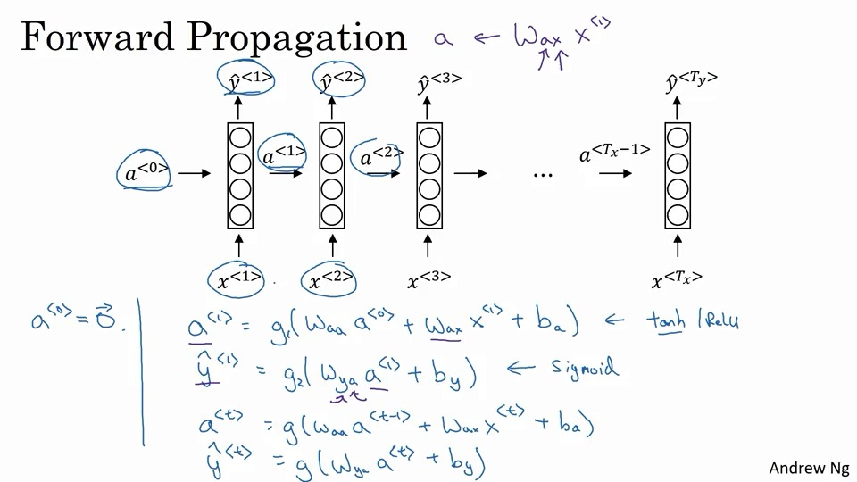
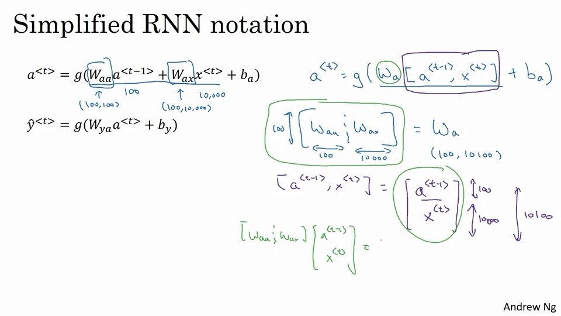

# NLP 自然语言处理

## 序列模型

```
Harry Potter and Hermione Granger invented a new spell. 
```

以上述这个句子作为例子，这个是模型的输入X。

这是以个姓名识别任务，识别出句子中的人名、企业名、时间、地点、国家、货币等等。

然后输出一个Y： 1 1 0 1 1 0 0 0 0，1代表，这个词是人名。

使用上标的方式，进行表示，这是第几个词$x^{<i>}、y^{<i>}$。

使用$T_y、T_x$代表输入输出的数量。

$y^{(i)<t>}$，代表第 $i$ 个训练样例的第 $t$ 个元素。

## 表示单词

准备好一个词汇表。以方便程序对这些词汇进行表示。

一般商用的词汇表，大约是3~5w。这里使用1w个。

one-hot编码：对每个单词，使用一个长达1w维的向量表示这个元素是哪个。。。???

## 学习一个X到Y的神经网络

如果使用一般的神经网络，那么会产生很多问题。

- 每个句子的长度不定，所以可能需要扩充至最大长度。
- 不会共享那些从不同位置中学到的特征。
- one-hot编码是一个非常非常大的输入数据

## 循环神经网络（RNN）

对$x^{<i>}$的学习结果，会传递一定数量的激活参数$a^{<i>}$，给$x^{<i+1>}$。

在0时的时候，可以人为创造一些参数。



这里也有缺点，他只使用了先前信息进行预测。

后面还有双向循环神经网络(BRNN)之类的。

比如可以像这样构造：



这里可以做这种方式的简写。

把$W_{aa}、W_{ax}$合并成一个更宽的矩阵，直接与$[a^{<t-1>},x^{<t>}]$进行相乘。



