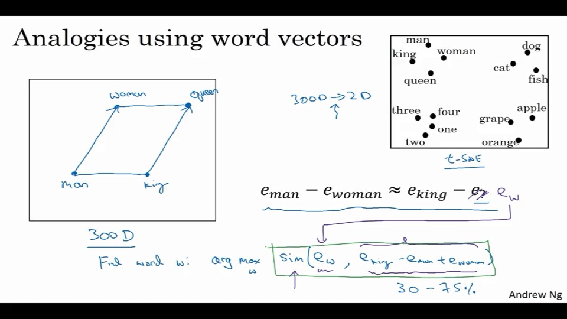

## 在NLP中运用这些知识

### 通过词嵌入、正确修正词嵌入。

使用one-hot来表示词语。这个有个缺点，只考虑了单个词在向量中的作用，没有词与词之间的关系。

比如很难得到orange juice和Apple juice实际上是一个东西。

这种源于one-hot的沉积为0。

我们可以用这些词的一种特征化表示，来改进这个问题。

比如用来表示，词与词之间的联系，这样就把one-hot所消耗的空间，变得有意义了。

使用比如$e_{9852}$表示与9852这个词（women）与目标之间的联系。

这样增强了词与词之间的泛化能力。

这里比较出名的算法是：t-SNE。

把3000个词变为2D关系。

## 使用词嵌入

以人名识别为例。

具体操作

1. 从大量的文本语料库学习单词嵌入, 

   或者可以从网上下载已经训练好的单词嵌入。

2. 然后你可以把这些单词嵌入迁移 

   到有着更小的已标记训练集的任务上。 

   然后用这个300维的词嵌入,来代表单词。

   使用300维度向量表示。

3. （可选）继续微调数据集

<!--？？？？-->

实际上比较像之前的人脸识别。embedding和encoding，实际上是一个很相似的动作。

虽然我们的目标没有人脸识别那么明确罢了。

## 类比推理

我们继续使用

这里两列相减，可以得到一些有意思的东西。

这样就可以回答，比如，男对应女，那么国王应该对应什么的问题了。

<!--贼形象的一种比较方式，但这两个是否是相减的步骤，依然需要再考虑-->

<!--感觉就像是再公务员考试一样，A对应B，但这个对应，实际上是几种对应关系中，找出最大的那个，然后对应起来。-->

哈哈，这里也用图给表明出来另外一种思考方式。

就是在图里面使用向量进行表示。

右上这个图是，使用t-sne算法，将3000维，映射到2D。

### 余弦相似映射

$$
sim(e_w,e_{king}-e_{man}+e_{woman})\\
sim(u,v)=\frac{u^tv}{\|u\|_2\|v\|_2}
$$

也就是当年算cos的方程啦。

或者也可以使用$\|u-v\|^2$。

## 嵌入矩阵

这里使用$O_{6257}$表示一个1w维的one-hot向量。

$E$表示300,1w维的嵌入矩阵。

$E O_{6257}=e_{6257}$就是选出6257的嵌入向量。

当然，这里的矩阵乘法是非常浪费资源的，虽然数学上比较简单，但还是思考其他的方式。

## 深度网络的语言模型

比如填词游戏：

先计算出他们的嵌入向量，$e_j$。

然后经过一个softmax，这时候就得到结果。

比如这里是6个词，就是乘以一个(6,300)，所以输入是1800维的向量。

或者这里只记录4个词。就是乘以（4，300）。

重复对你的模型进行训练，通过记录4个词，然后输出结果。

还有其他类型的上下文、标签。

- 最后四个词。
- 前后四个词（共计8个）。
- 最后一个词。
- 相邻的1个词（比如glass of xxx，选取glass）。**skip gram模型**

## Word2Vec

将语言识别转化为一个确定的模型：

一个句子，随机选择一个词作为context，然后选择一个词为Target。

然后去预测在一个随机的窗口里面的词会是什么？
$$
softmax:P(t|c) = \frac{e^{\theta_t^Te_c}}{\sum^{10000}_{j=1}e^{\theta_j^Te_c}}
$$
$\theta_t$是一个关于t的参数，表示这个单词t，有可能成为目标target的概率。

损失函数就是常见的`softmax`的损失函数了。

### 树状分类器

这里每次都需要对$\sum^{10000}_{j=1}e^{\theta_j^Te_c}$这个项进行求和，实际上这玩意挺慢的。

这里使用分类器的概念，将其变成一个树，按照树的形式来进行判断这个词属于哪？这就是分层`softmax`分类器。

这里还有一个关于如何选取目标词的问题。

一般不会使用随机平均取样的方式来进行，而是可以通过启发式算法，来进行取样，以平衡常见词与罕见词。

这个softmax最大的问题就是，计算softmax层会消耗很多计算量，会很慢。

## 定义一种新的监督学习

### 负采样法

生成数据集的方法：

- （从句子中）选择一个上下文词语
- （从句子中）选取目标词语，这就是正样本
- 从字典中选取k个词，标记为负样本。
  - 小样本k是5~20.
  - 大样本可以使用2~5

然后这里的公式是：
$$
P(y=1|c,t)=\sigma(\theta_t^Te_c)
$$
然后就可以得到1w个二元分类器。

虽然只需要训练k个。

这里对于负样本的采样，最好与正常使用词频有联系，并且不要有太多高频词（比如the，is，etc...）
$$
P(w_i)=\frac{f(w_i)^{\frac{3}{4}}}{\sum f(w_j)^{\frac{3}{4}}}
$$
使用这种启发式方法，似乎效果不错。

## GloVe word vector

虽然应用不是很广泛。

$x_{i,j}$是在上下文j中，出现的次数i。

一般而言，$x_{i,j}=x_{j,i}$。

$x_{i,j}$表示词语i,j同事出现或者说彼此接近的程度。

就变成了如下优化问题：
$$
minimize：\\
\sum_{i=1}^{10000}\sum_{j=1}^{10000}f(x_{ij})(\theta^T_ie_j-logX_{ij})^2
$$
$f(x_{ij})$是权重项,且$f(x_{ij})=0,if\ x_{ij}=0$。并且这里$0log0=0$.

权重因子可以依照词汇的使用率增加权重。

注意如下：

## 情绪分类

> 情感分类的挑战之一是你可能缺乏一个特别大的标签训练集。
>
> 不过，使用词嵌入（word embedding）后依靠一个中等大小的标签训练集，你也可以构建出一个很好的情感分类器

比如对于，评论与评分之间的对应关系。

先来一个简单的模型，直接将他们变为e情感元素，然后暴力地求和，然后经过softmax训练，就得到结果。

当然也有负面的影响，他们会对下面那个good出现很多次的差评论，评价为好评论。

比如再复杂点，让他成为一个RNN网络。

## 消除偏见

这里的bias不是数据的偏差，而是指的是性别、种族、性取向等等问题上的偏差。

<!--从输入数据来的吧-->

比如可以通过操作，让感情机器做到：

男对应程序员，女对应家庭主妇。这种看起还不错，但是个不正确的性别歧视问题。

如图，横坐标是bias的程度，纵坐标是需要定义non-bias的程度

1. 确定消除歧视的方向。

   对于性别而言，我们可以记录下，$e_{he}-e_{she}...$之类的向量，作为一个性别偏差，保存下来。

   实际上这里会用到SVU算法（singular value decomposition），比较类似于主成分分析。

2. 对需要去bias的词汇，加以定位

   有些词汇本来就是有性别属性，比如祖父祖母之类，而有的词又不希望出现，比如doctor。

3. 平均化

   将成对词，比如祖父祖母，平均化，使其具有相似性，有相同的距离。

4. 如何确定这些词需要进行中性化

   作者试着训练一个分类器来解决这个问题。结论是大部分都需要中性化，也就是说大部分性别词，都是不需要定义的，就像是boy-girl。

## 测试

1. 1w个词，那么向量应为1w维。真（错误，单词相邻维度小于词汇表，一般是50~400）（word和words....）
2. t-sne，非线性降维技术
3. 就算训练集中没有出现的词汇，RNN也能很好的判断，真
4. 哪些方程被用于嵌入。。。常识题吧
5. 为什么不直接算$E∗o_{1234}$,浪费
6. P(t|c)，副产品重要？
7. 最好的是相邻的
8. softmax，1w维，如果是同样的词，那应该靠近（使用words向量的500维，以及使用优化算法）
9. 不选初始化0
10. 新的比较大（m_1>>m_2）

