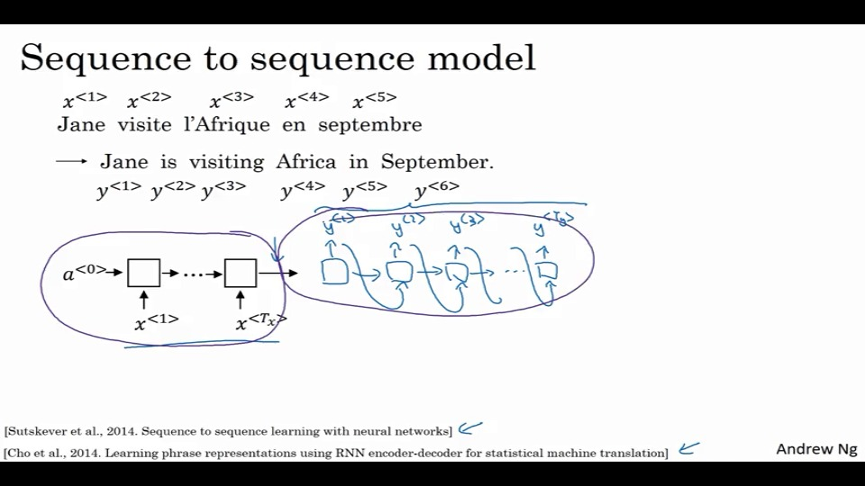
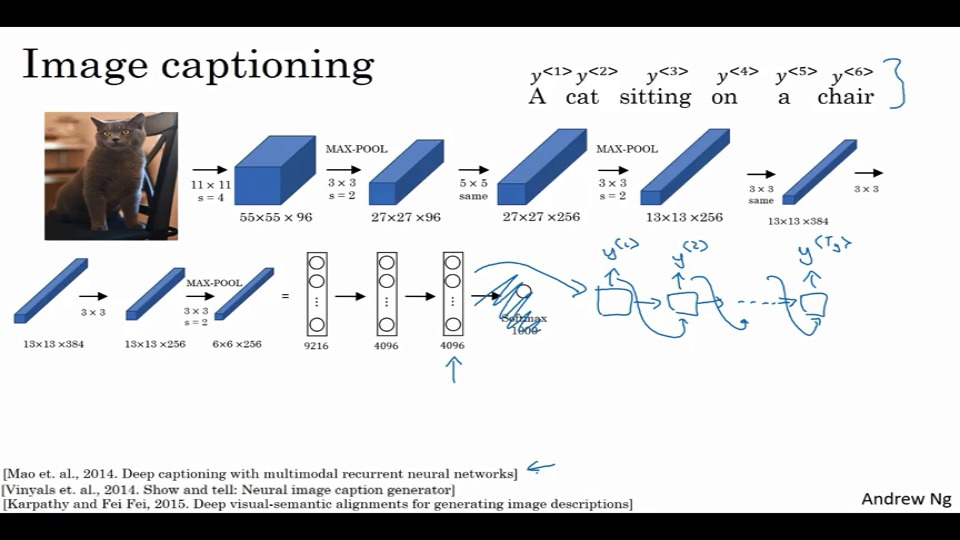
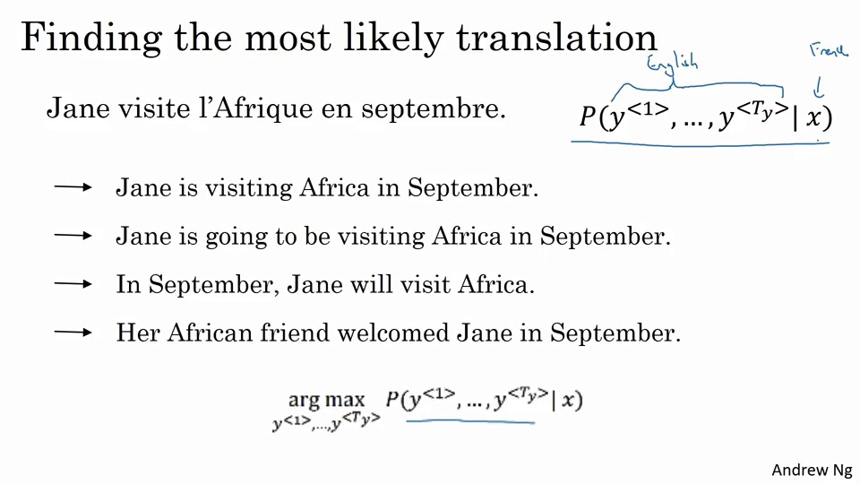

## Seq2Seq模型

比如讲法语翻译到英语。

比如一个之前说过的RNN模型。

仅仅使用一个编码器网络的模型，在有大量的场景下，实际上效果还不错。

甚至还能由图片转换到句子：

实际上与语言模型合成的翻译还是有那么一些区别的：

你不希望输出一个随意的翻译、一个随意的图片标识，而是希望输出一个最好的翻译与结果。

## 选择最像的句子

因为实际上与语言模型很相似，只是增加了一堆译码器。

这里，他称机械翻译为有条件的语言模型。

一般会产生好几个结果，这里要做的是找到一个概率最大的，而不是随机找一个。

<!--这有什么难的？好吧，这里指的是在y_i的选词方式。-->

这里需要找到一个算法，在这把其最大化。常用方法为beam search（定向搜索）。

#### 那为何不用greedy search（贪婪搜索）？

PS：在这就是，对第一个词，找最大可能性，第二个词找最大可能性。

当然把句子看做一个整体的话，贪婪搜索不会好使。

<!--梯度下降法用的也是贪婪搜索，但这个是因为其维度很多（>100），存在极值点概率低，所以无所谓。但丢这，到处都是极值点。-->

当然，对于所有句子可能性进行评估，也是不可能的，因为有10k^10的数量级，所以使用的都是近似搜索算法。

