## Seq2Seq模型

比如讲法语翻译到英语。

比如一个之前说过的RNN模型。

仅仅使用一个编码器网络的模型，在有大量的场景下，实际上效果还不错。


甚至还能由图片转换到句子：


实际上与语言模型合成的翻译还是有那么一些区别的：

你不希望输出一个随意的翻译、一个随意的图片标识，而是希望输出一个最好的翻译与结果。

## 选择最像的句子

因为实际上与语言模型很相似，只是增加了一堆译码器。

这里，他称机械翻译为有条件的语言模型。


一般会产生好几个结果，这里要做的是找到一个概率最大的，而不是随机找一个。

<!--这有什么难的？好吧，这里指的是在y_i的选词方式。-->

这里需要找到一个算法，在这把其最大化。常用方法为beam search（定向搜索）。

#### 那为何不用greedy search（贪婪搜索）？

PS：在这就是，对第一个词，找最大可能性，第二个词找最大可能性。

当然把句子看做一个整体的话，贪婪搜索不会好使。

<!--梯度下降法用的也是贪婪搜索，但这个是因为其维度很多（>100），存在极值点概率低，所以无所谓。但丢这，到处都是极值点。-->

当然，对于所有句子可能性进行评估，也是不可能的，因为有10k^10的数量级，所以使用的都是近似搜索算法。

## beam search 集束搜索

这个算法有个参数: B，代表集束宽度，与贪婪算法不同的是，它每次都会搜索概率最高的B个结果，保存作为结果。同时作为后续的参考。
$$
chose\ max\ B\ of\ P(y^{<1>}|x)
$$
然后这里
$$
chose\ max\ B\ of\ P(y^{<2>}|x,y^{<1>})
$$
....

如果你$B=3$，那么beam search每一步都保存着3个第一个词不同的副本。

然后在3*10k=3w中搜索出最有可能的3个。

## 改进

### 长度规范化(length normalization)

这里有个一个公式的定义：（与一般的不太一样）

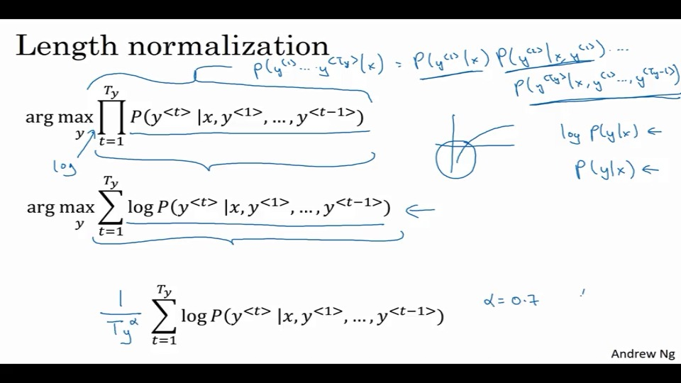

如果这玩意长度过长，同时每项又小于1，那么就会造成数值下溢的问题。$P(Y)\rightarrow0$。

实践中，这里取对数log。可以获得一个较好的数值稳定性。

同时，因为无法规范不同长度的句子，那么会造成更倾向于翻译成较短的句子。

所以还需要做一个修正。除以一个$T_y^\alpha$长度的$\alpha$幂的值。

<!--但这里还是存在，前3的某个组合比另外的一些前2的组合好，但会被前2的高概率给覆盖了的问题。-->

## 何如快速找到错误

<!--我更好奇，应该怎么判断翻译质量？总不能人工吧0.0-->

<!--不是人工，就得引入对抗训练？比如翻译到A，然后还需要翻译回去。做成一个双向映射？-->

<!--那还是不好判断翻译质量啊Orz-->

比如还是对那个句子来做例子。

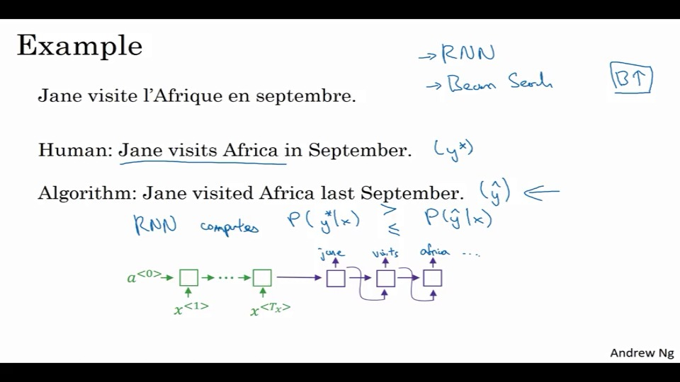

$y^*$是人翻译的，很好。

$\hat{y}$是算法的，但他改变了含义，不好。

如果我们有一个比较的方法，可以用来计算比较$P(y^*|x)$和$P(\hat{y}|x)$，那这个问题就简单了。

如果这里是RNN模型的结果。

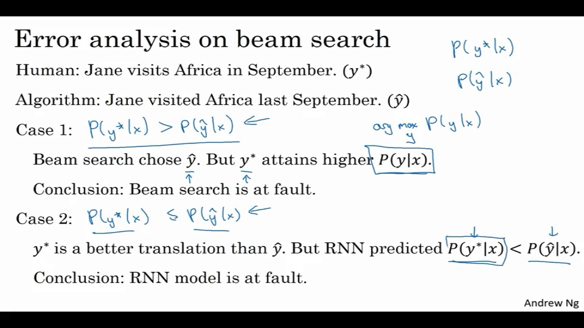

## Bleu 指数

对于翻译，可能会有很多个结果，并且这些结果还都是好的。

那么如何在这样的情况下评判，到底翻译得如何呢？

传统方法是用Bleu指数。

> 直觉来讲，只要机器翻译的结果 与任何一个人类翻译的参照结果比较相近的话 那么就会有一个高BLEU分数

BLEU是一个bilingual evaluation understudy（双语评估替补）的。

> 在话剧届，替补演员会向资深的演员学习剧中角色，来在必要的时候替补资深演员。
>
> 而BLEU的提出动机是，在任何需要人类来评估机器翻译系统的地方，BLEU能给出一个人类评估结果的替补

先来介绍一种通俗意义上的方法：

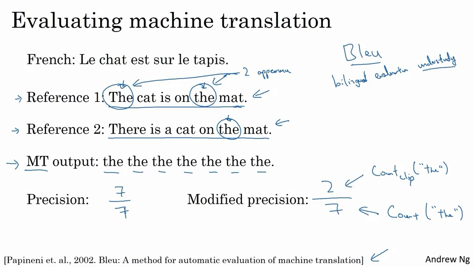

我们按照输出中的每个词语与人类翻译结果比较，有出现就记一份。

那么这样的MT输出，就会得到7分。显然很糟糕。

那么改进一下，变成与至多做比较，那么结果就是2分。

显然要好点，但还不够。

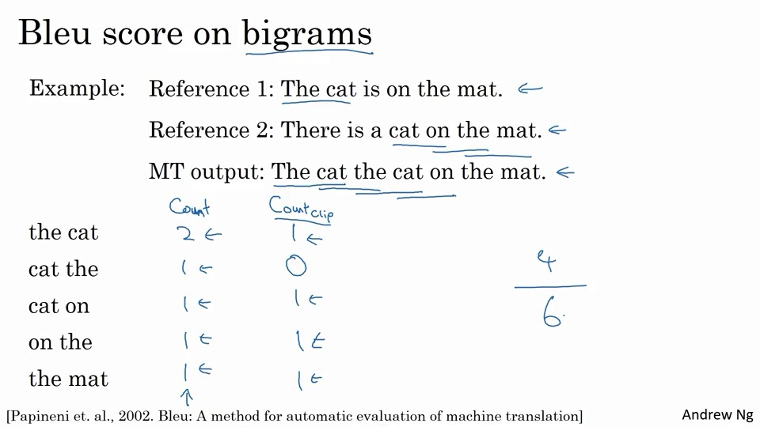

然后再优化下，这里我们使用双词组的方式来进行评价。

- 先统计下，各个双词组，再MT中输出几次：count

- 然后统计截断字数，假定算法只计数到最大次数：count clip

  the cat再reference中，只出现一次。所以这里只记一份。

- 然后，将count clip求和，然后除以总的双词组总数。得到4/6分。

形式化就是：
$$
P_1=\frac{\sum_{uni\_grams\in \hat{y}}Count\_clip(uni\_grams)}{\sum_{uni\_grams\in \hat{y}}Count(uni\_grams)}
$$
$P_1$,这里的1，指的是uni-grams中的1.

如果是$P_n$的话，这就是n元分析了。

#### 组合成BLEU

$P_n$: 指Bleu指数是几元的分数。

然后把他们组合起来:  $exp(\frac{1}{4}\sum_{n=1}^{4}P_n)$。

然后再乘以一个$BP$（brevity penalty）惩罚系数：大致就是希望限制输出长度，长度越短，就更好。当然，这里就只是一个可调整系数罢了。

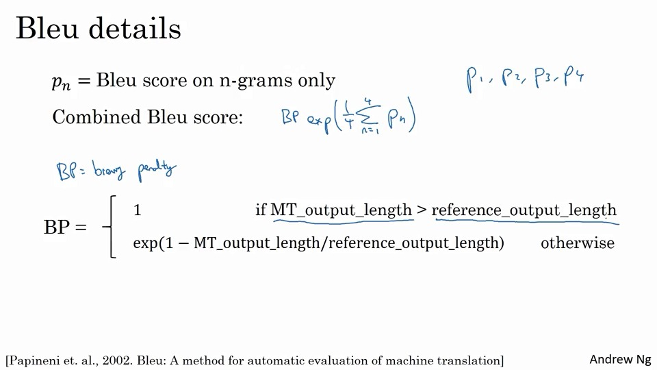

## Attention 模型

从人的翻译来看，并不会先看完一整个句子，然后记下来，再翻译。因为这样做对记忆力要求太高了。

实际上实行的是一部分一部分地翻译。

使用$\alpha ^{<t,t^`>}$，表示再判断第$t$个的结果$y^{<t>}$时候，对第$t^`$个词所贡献的关注程度。

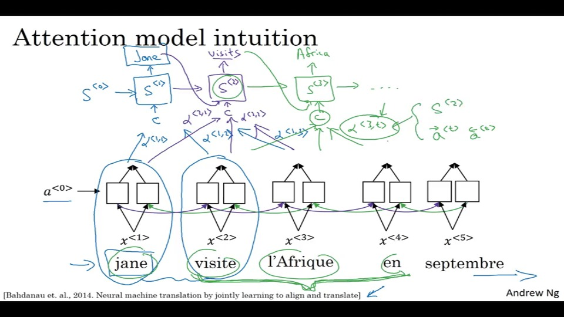

而这个$\alpha$又受到，向后激活值$\vec{a}^{t}$,向前激活值$ \stackrel{\leftarrow}{a^{t}}$，还有前一步状态$S^{<i-1>}$。

### 细节

前面说过得GRUs、LSTMs也被常用于这里。

$a^{<t>}$在这里指的是一个关于时间步长得特征向量。

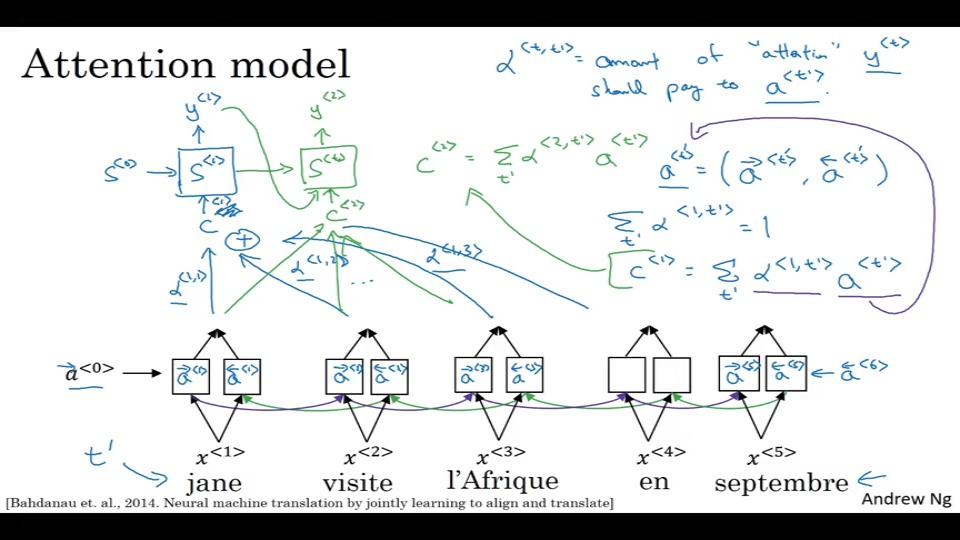

关于$\alpha$得取值问题，使用如下公式：

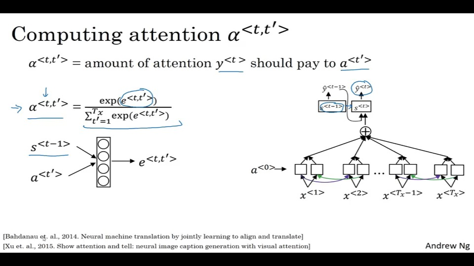

实际上这里有一个小小的神经网络。

> 如果你有 tx 个输入词和ty个输出那么注意力参数总数 ，将是 tx 乘以 ty。 因此,该算法以二次成本运行。 。虽然在机器翻译应用中输入和输出语句都不长，所以也许二次成本实际上是可接受的。 

## 语音识别

语言识别，一般是先用音频，预处理生成一个频谱图。

以前语音识别是基于音素的。他们认为用音素，这个声音的基本单元表示音频，是语言识别的最佳方式。

一般使用end2end需要3000h的音频数据，这个是研究种。

商业系统中，一般使用100k甚至更大的数据集。

一般中，使用CTC cost函数用来进行输出质量的评判。

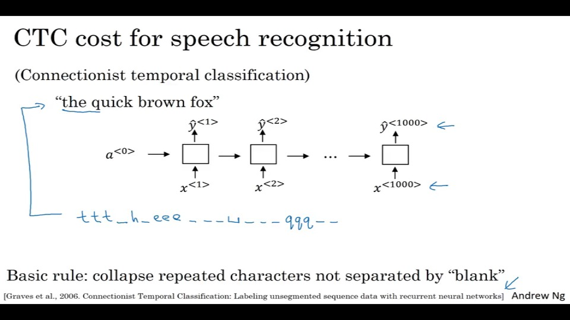

语音识别中，像下面那种输出，可以被视为`the q`的正确输出。所以i，CTC是为了折叠那些相同字符的内容。这样可以使，就算网络输出是1k长度，也能折叠成短内容。

## 关键字识别，唤醒

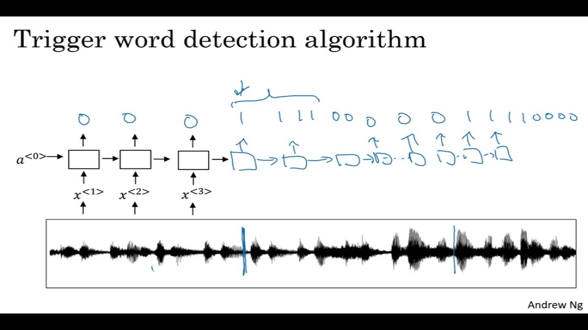

使用RNN输出，输出标记为0、1。

当然这样会造成数据集不平衡，所以需要使用一些技巧。

## 作业

1. 条件概率，建模？true【错误】
2. 不选更少步骤收敛
3. 不归一，则更短
4. 归因于RNN问题
5. 改进算法
6. a_t\`,yt。t\`
7. yes
8. 长
9. cokbok...【应该是cook boook】
10. 频谱图

## 编程

```
keras.layers.Bidirectional(layer, merge_mode='concat', weights=None)
```

RNN的双向包装器。

