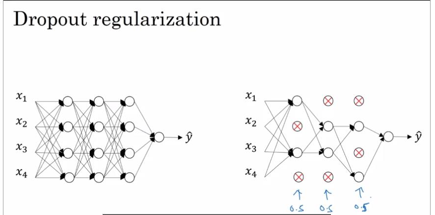
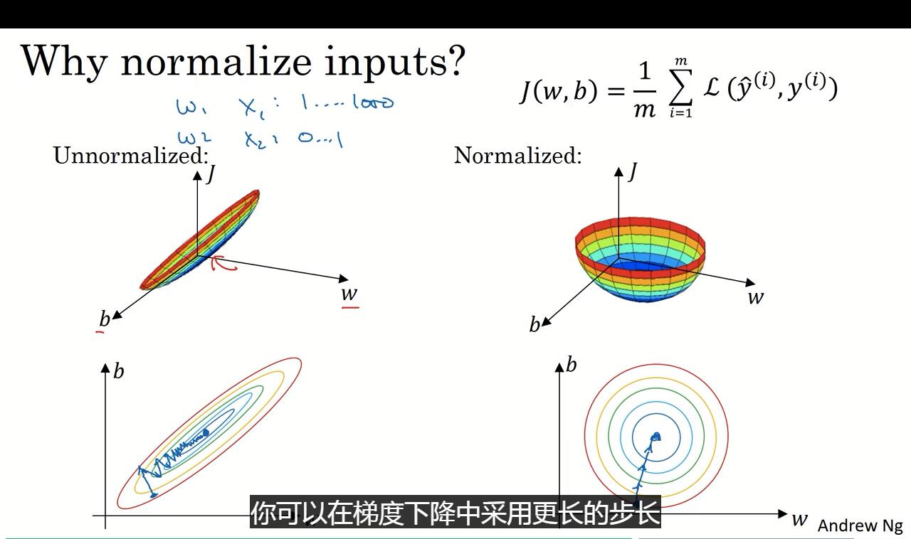
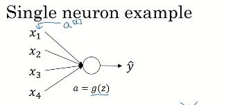
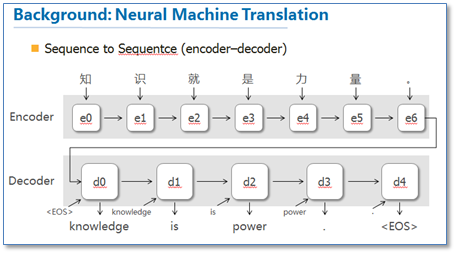
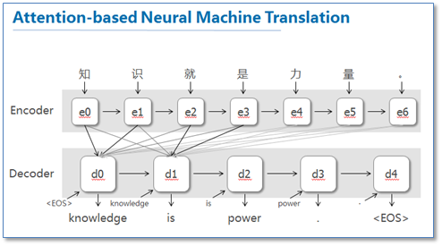

# 关于训练集train、开发集dev、测试集test

取得参数的最快的方式，毫无疑问是多次进行训练。

数据会被分为三部分，使用开发集优化参数(事前评估)，最后用测试集进行评估。

按照7/3,6/2/2的比例进行。

当然如果数量足够多的话，也不一定按照上面的比例。比如100w/1w/1w。


同时需要考虑到数据集的不同，确保数据集的相似性。

使用爬虫技术，来获取一个足够大的数据集。

## 偏差bias、方差variance

- 0<error(train)<<error(dev) ：high variance
- 0<<error(train)≈error(dev) ：high bias
- 0<<error(train)<<error(dev)：high bias & high variance
- 0<error(train)≈error(dev)：low bias & low variance

这里需要考虑贝叶斯error，如果对于人类的判断也不高，那么可能第二个的分类器效果就是不错的。这里需要出去这个影响。(人类的判断)

偏差-方差困境。

> http://liuchengxu.org/blog-cn/posts/bias-variance/
>
>  偏差与方差构成了学习器误差的主要成分,偏差小的模型往往方差较大,而方差小的模型往往偏差较大，对模型选择形成两难。

~~即1-范数与2-范数无法兼得？~~

<!--（小孩才做选择，我选择两个都要？归一加参数，优化代价函数！）-->

偏差低=》欠拟合

偏差高=》过拟合


偏差是对训练集而言的。

方差是对测试集而言的。

当然还需要考虑到在训练集和测试集之间的准确。

## 一些比较基本的原则

- 是否有较高的偏差？
  - 如果连training都不能很好的拟合

    考虑换个神经网络，

    - 更多的隐藏层
    - 更多的隐藏单元
    - 延长训练时间

  - 更高级的优化算法

  - (更适合的深度学习结构)

    与下面的那个相同

  - 人能否很好地判断？
- 高variance？
  - 更多的数据

  - 尝试正则化

  - 更好的神经网络（这里的更好指得更适合的深度学习的结构）

    可能会运用到更多的方法，比如卷积神经网络啊等等，但也不一定好用。

- 对于无法同时实现两个bias and variance的争论，这个在机械学习的前期是存在的。

  - 但现在基本上来说，扩大数据，扩大层级，可以两者一同降低。（恰当的正则化）

## 什么是神奇的正则化？

有助于降低过拟合。
$$
aim:\ \ \ \min_{w,b}\ J(w,b)
$$
此时$J(w,b)=\frac{1}{m}\sum\limits_{i=1}^{m}l(\hat{y}^{(i)},y^{(i)})​$。

此时只需要向$J​$加入正则化参数即可。
$$
regularization\ = \ \frac{\lambda}{2m}\|w\|^2_2
$$
此时使用的是L-2范数。

以及为啥只对W进行L-2范数，因为在求导的时候，b没啥意义。以及
$$
\|w\|^2\ =\ \sum\limits_{j=1}^{n_x}w_j^2 = w^T w
$$
当然也有对应的L-1正则化：
$$
regularization\ = \ \frac{\lambda}{m}\|w\|_1 
$$
使用L-1，会导致矩阵变得稀疏，变得包含很多0。

> 那么问题来了，L-2范数实际上指代的是啥子玩意？换成矩阵来看，这个实际上是。。F-范数？(2范数是$A^TA$的最大特征值)
>
> 好吧，实际上1、2、3都属于p范数中的一种，
> $$
> \left\|A\right\|_{p}=\max \limits _{{x\neq 0}}{\frac  {\left\|Ax\right\|_{p}}{\left\|x\right\|_{p}}}=\max \limits _{{x\neq 0}}{\frac  {\left(\sum _{{i=1}}^{n}|\sum _{{j=1}}^{m}A_{{ij}}x_{j}|^{p}\right)^{{1/p}}}{\left(\sum _{{i=1}}^{m}|x_{i}|^{p}\right)^{{1/p}}}}
> $$
> 对于1和$\infty$而言，有：
> $$
>  \begin{align}
> & \left \| A \right \| _1 = \max \limits _{1 \leq j \leq n} \sum _{i=1} ^m | a_{ij} | \\
> & \left \| A \right \| _\infty = \max \limits _{1 \leq i \leq m} \sum _{j=1} ^n | a_{ij} | 
> \end{align} 
> $$
> 对于2范数而言：
> $$
> \left \| A \right \| _2=\sqrt{\lambda_{\text{max}}(A^* A)}
> $$
> $\lambda_{\text{max}}$代表最大特征值。
>
> 同时，任意p范数，都小于谱半径：
> $$
> \rho(A) = \max \left \{ |\lambda_1|, \cdots, |\lambda_n| \right \}\\
>  \left \| A \right \| \ge \rho(A)
>  \\可证：\ \ \ \lim _{{r\rightarrow \infty }}\|A^{r}\|^{{1/r}}=\rho (A)
> $$
> 看到这里，问题又来了，为什么(最大)特征值越小越好？
>
> 想想特征值是干嘛的$Ax=\lambda x$,同时任意向量可以表示为不同特征值的和（如果秩比较合适的话）。
>
> 这意思就是可以尽量保证原始向量在经过运算后，保持原有含义？

$\lambda$是正则化参数。是另外一个需要调优的参数。

> PS：python中，lambda是一个保留参数，用于定义一个匿名参数：`g = lambda x:x+1`。简化函数的定义过程。所以用lambd表示，wwww

### **实际上不是**

还是没能深刻理解矩阵的范数含义。

这里应该推导出来的是F-范数：
$$
\|A\|_F=\sqrt{\sum_{i=1}^m\sum_{j=1}^n |a_{ij}|^2}=\sqrt{\operatorname{trace}(A^{{}^*} A)}=\sqrt{\sum_{i=1}^{\min\{m,\,n\}} \sigma_{i}^2}
$$
这里$A^*$表示*A*的[共轭转置](https://zh.wikipedia.org/wiki/%E5%85%B1%E8%BD%AD%E8%BD%AC%E7%BD%AE)，$σ_i$是*A*的[奇异值](https://zh.wikipedia.org/wiki/%E5%A5%87%E5%BC%82%E5%80%BC%E5%88%86%E8%A7%A3)，并使用了[迹函数](https://zh.wikipedia.org/wiki/%E8%BF%B9)。

<!--矩阵中所有元素的平方和。-->

### **如何计算偏导？**

$$
\begin{align}
dw^{[l]}&=\ (原来那块)+\frac{\lambda}{m}w^{[l]}\\
&=\ (1-\frac{\alpha\lambda}{m})(原来那块)
\end{align}
$$

所以这里也被称为**权重削减**方法。

# why？

当$\lambda$过大的时候，$w$会变小，也就是说$z$会比较小(趋于0)，那么对于$tanh(z)$的激活函数，会集中于中间的线性部分。那么就是说，失去了深度学习的非线性的优点。这样就会造成欠拟合以及高方差。

当然，这样也不容易过拟合了。

### 非线性越强，越容易过拟合？

总感觉怪怪的。

> https://blog.csdn.net/u012162613/article/details/44261657
>
> 这里就是尽量约束拟合函数在某些小区间的绝对值范围。

<!--虽然这只是一种象形的解释，不是足够的严谨，但这里也够用了-->

<!--深度学习依然处于炼蛊与造蛊之间，很多东西都是，用着好使，但为啥好使。。。emmm，得去看论文啊？-->

# dropout正则化

对所有节点中，随机地丢弃掉一部分节点。

比如：



虽然看起来很粗暴，但。。。挺好用的。

### dropout技术：

```python
d3 = np.randm.rand(a3.shape[0],a3.shape[1]) < keep_prob	# keep_prob 保留概率
a3 *= d3
a3 /= keep_pron	# 保持期望值不变
z4 = w4 · a3 + b
z4 /= keep_pron
```

这里说，可以在不同次的循环中，给不同的节点进行失活。emmm。。。

# why？part2

这个的why倒是比较简单，降低w的改变频率，使其更加平缓一些。

> 更加深入地理解，可以看看Hinton和Alex两牛2012的论文《ImageNet Classification with Deep Convolutional Neural Networks》
>
> <!--泥奏凯-->

> https://blog.csdn.net/u012162613/article/details/44261657 
>
> 可以简单地这样解释，运用了dropout的训练过程，相当于训练了很多个只有半数隐层单元的神经网络（后面简称为“半数网络”），每一个这样的半数网络，都可以给出一个分类结果，这些结果有的是正确的，有的是错误的。随着训练的进行，大部分半数网络都可以给出正确的分类结果，那么少数的错误分类结果就不会对最终结果造成大的影响。

一开始是使用在视觉处理中，反正挺好使的。因为数据集一般都会很大很大。

但在其他领域，除非以及过拟合，不然不太会使用这个技术。

当然使用这玩意的时候，J的值就会变得不明确了，不能用来debug了。这时候可以考虑把drop-out给关掉。（为什么不再保存一个没有drop-out的J？虽然也不是单调下降的）

# 其他的方法

1. 可以使用旋转等等的方法，增加图片，增加数据。0.0

   这也行？

   实际上是给模型增加一层旋转、对称、变形等操作。告诉它，旋转以后，还是猫。

   这也从某种程度上减少了模型的过拟合概率。

2. 提前停止迭代过程。

   在训练集和测试集交叉表现最好的时候，停止。（？也就是说吧测试集整理一部分进去？）

当然，在算力足够的情况下，L2正则化还是很好的。

## 对输入进行归一化

因为梯度下降程度$\alpha$是固定的，所以如果不适用归一化，很容易浪费计算量的下降的过程中，而归一化，就是减少中间的这个浪费。让代价函数更圆。www



具体的做法是：

令其均值为0，方差为1:
$$
x\ -=\ \mu \\
x\ /=\ \sigma^2
$$

# 梯度消失与爆炸

在某些情况下，梯度会降温减少为0或者变得很大。

在很深的网络中，如果$W^{[i]}$ 都$\ >or<\ E$，那么会造成其代价函数变得很大或者很小。如果激活函数同样对其很敏感的话，会让值变得非常奇怪。这时候训练起来就会变得非常困难。

尤其是初始化的时候，如果有这样的情况，训练的热启动就会变得很困难。

这个大概率出现在初始化以后。

## how to deal it？  更细致地初始化W



对于一个单层的网络，有：
$$
z\ =\ w_1x_1+w_2x_2+w_3x_3+...+w_nx_n
$$
我们希望z不会过大过小，那么也就是说希望w可以随着n的增加尽可能地小。

即：$Var(w_i)=\frac{1}{n}​$。
$$
w^{[l]}=np.random.ran(shape)*np.sqrt(\frac{1}{n^{[l]}-1})
$$
如果是Relu函数，这里是期望，$Var(w_i)=\frac{2}{n}$。所以记得乘个2。

对于各种激活函数，有：

Relu：$\sqrt{\frac{2}{{n^{[l]}-1}}}$。

tanh:$\sqrt{\frac{1}{{n^{[l]}}}}​$。

更一般的：$\sqrt{\frac{2}{{n^{[l-1]}+n^{[l]}}}}​$。

# 梯度检验

保证梯度逆传播的实现是正确的。

通过$\frac{f(\theta+\epsilon)-f(\theta-\epsilon)}{2\epsilon}​$，的方式，求梯度。

这个叫啥来着？一阶中心差值。

具体到这里就是，记住$J[i-1]、J[i]、J[i+1]$,三个来计算下？0.0？

**这玩意可以帮你检验出逆传播中的错误。是一个非常优秀的debug方法**

首先，将$W^{[1]},b^{[1]},...，W^{[L]},b^{[L]}$，组合成一个很大的向量$\theta$。

将W矩阵、b转换为向量，再将其所有连起来。

同样处理$dW^{[1]},db^{[1]},...，dW^{[L]},db^{[L]}​$，组合成很大的向量$d\theta​$。

对于$d\theta_{appear}[i]​$,有：
$$
d\theta_{appear}[i]\ =\ \frac{J(\theta_1,..\theta_i+\epsilon)-J(\theta_1,...,\theta_i-\epsilon)}{2\epsilon}
$$
此时，这个的值应该近似于
$$
d\theta_{appear}[i]\ \approx \frac{dJ}{d\theta_i}
$$
此时有两个值，$d\theta_{appear}​$和$d\theta​$。

如何判断两者大致相等呢，
$$
\frac{\|d\theta_{appear}-d\theta\|_2}{\|d\theta_{appear}\|_2+\|d\theta\|_2}\ \approx \ \epsilon
$$
如果相差的数量级过大，那么就需要检查了。

- 不要在训练中使用，只在debug中使用

  计算$d\theta_{appear}[i]$的速度是非常慢的。

- 如果相差很大，那么逐$i​$检查，会很有帮助。

- 注意加上正则化项

  $d\theta \ = \ grand\ J+正则化项​$

- 随机失活的话，就没有一个很客观的J了，基本没办法运行

  所以注意将`keep_prob`设定为1。

- 初始的时候，可能因为w、b的初始值，导致很不好。

  先运行几轮，在进行检查。

  

## 考试：

嘿，为啥啊？

开发集合测试集：

来自于不同的 distribution，分布是错的。。。额，如果这里理解为分布，那么应该选A。

高偏差只选，正则与训练集。

增加保留率：

降低正则影响、造成低训练集错误。

## interview

- 联结主义的学习方式

  - 联结主义的中心原则是用简单单位的互联网络描述心理现象。联结的形式和单位可以从模型到模型修改。例如，网络的单位可以描述[神经元](https://zh.wikipedia.org/wiki/%E7%A5%9E%E7%BB%8F%E5%85%83)，联结可以描述[突触](https://zh.wikipedia.org/wiki/%E7%AA%81%E8%A7%A6)。另一个模型网络中每个单位用一个词表示，每个联结用一个[语义](https://zh.wikipedia.org/wiki/%E8%AF%AD%E4%B9%89)类似的词表示。

- HMN图模型

- 注意力机制

  在NLP（自然语言处理）上面有很大的应用。

  话说，苏剑林貌似也在研究这个？

  > https://blog.csdn.net/yimingsilence/article/details/79208092
  >
  > 他们研究的动机其实也是受到人类注意力机制的启发。人们在进行观察图像的时候，其实并不是一次就把整幅图像的每个位置像素都看过，大多是根据需求将注意力集中到图像的特定部分。而且人类会根据之前观察的图像学习到未来要观察图像注意力应该集中的位置。

  同时，也将这个应用到了翻译上。

  

  

  不知道这张图有没有印象，大概就是前几年谷歌做了个更新，加强了其运算能力，是不是就是用了这个？

  > 从结果来看相比传统的NMT（RNNsearch是attention NMT，RNNenc是传统NMT）效果提升了不少，最大的特点还在于它可以可视化对齐，并且在长句的处理上更有优势。

  > https://www.zhihu.com/question/55915702
  >
  > 对，是的，就是这玩意！谷歌就是用这个玩意，把其他翻译软件甩的妈妈都不认识。
  >
  > 一方面是基于attention，另一方面是因为TensorFlow的应用。
  >
  > 快速迭代对于研究很重要！<!--对于炼蛊很重要-->

  > 苏大神也对attention有研究：
  >
  > https://spaces.ac.cn/archives/4765
  >
  > <!--根本不敢看苏大神的研究。。。都是一样大，当年都差不多菜，6年就一个天一个地了。。。Orz-->
  >
  > <!--查询过程中找到两个玩具：翻译社区还有一个众包-->
  >
  > NLP思路简介：
  >
  > 1. 句子分词
  >
  >    这其中有多种方式
  >
  >    > https://www.zhihu.com/question/19578687
  >
  >    1. 基于词典分词
  >
  >       **正向最大匹配法、逆向最大匹配法**和**双向匹配分词法**
  >
  >    2. 基于统计学分词
  >
  >       **HMM、CRF、SVM、深度学习**等算法
  >
  > 2. 编码这些序列
  >
  > - RNN思路：
  >
  >   循环神经网络
  >
  >   马尔科夫决策过程？$yt=f(y_{t−1},x_t)$的递归形式？
  >
  > - CNN
  >
  >   纯粹使用卷积来进行。
  >
  > - attention
  >
  >   。。。今后有时间一定要好好看一遍，实现一遍

- 信用分配（credit assignment）？

  > https://www.quora.com/What-means-credit-assignment-when-talking-about-learning-in-neural-networks
  >
  > 信用分配问题特别与强化学习有关。假设您正在玩象棋游戏。每次移动都会给你零奖励，直到最后一次移动。最后的举动决定了你是否赢了比赛。假设您赢了比赛，您将获得+1奖励。大！但是哪一步（或一系列动作）导致了你的胜利？也许你的第一步将获胜的几率提高了25％，但第二步实际上减少了你的机会。在未来的迭代中，你想要进行更多的移动，比如移动1，但不太喜欢移动2.不幸的是，你在游戏结束时只获得+1，因此你不知道每个移动如何影响你的游戏。这是信用分配问题。

  关于反向传播的更好的应用，更好的优化方式，或者说是更局部？更全局的迭代方式。

- 时间编码可能可以完成方向传播？提了一嘴

- 无监督学习

  当前的研究，主要都是有监督学习，需要人类定义与问题有关的重要概念，并将这些概念标注出来。

  但人类可以将世界的方方面面整合，然后来解决一个小问题。<!--这玩意在哪看过？环球科学？-->

  构建一个不需要那么多标签的学习环境。

  但无监督学习，对应的是对抗学习，比如某星际。

- 现在的深度学习对世界的理解很弱

  应该回到计算机如何观察世界的这里，与世界互动，与世界理解。

  这是不是可以搞一个游戏？模拟机器与人进行互动？<!--交互、反馈、游戏，那么答案出来了！星际2！-->

- 对于高层次上的抽象理解

  因果理解方面的东西，当然这个就特别特别的抽象了。

