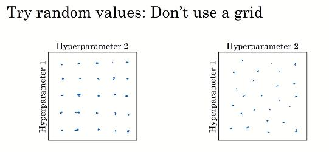
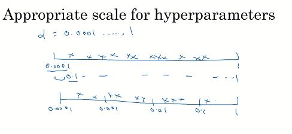
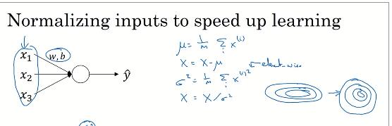
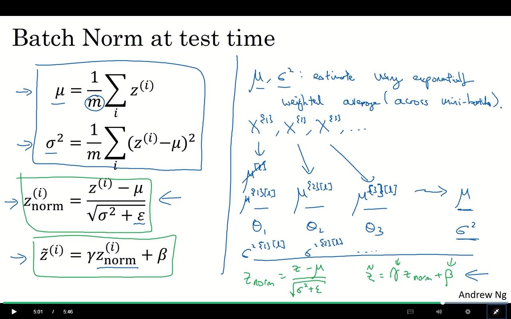

超参数调优

对于众多超参，需要找到一个普遍的方法来进行调优。

比如对2个超参的调优，可以适用5x5的组合中，找到最好的一组。

也可以在这个矩形范围内，随机选择25个。



这样做的好处是，针对任意一个参数，实际上尝试了25个，而不是5个。

进行粗抽样以后，可以在更小的范围内，进行二次取样。

## 适用合适的尺度

- 对于$\alpha=0.00000001$

  可以在对数尺度上进行均匀随机。

  

  比如在py中:

  ```python
  r=-4*np.random.rand()	#[-4,0]
  alpha=10^r
  ```

- 指数加权平均$\beta$

  $\beta=0.9........0.9999$

  考虑计算，$1-\beta$，这就和上面的$\alpha$一样了。

  这样计算主要是因为，当$\beta$越靠近1的时候，对于改变就越敏感。

## 对于超参模型的处理方式

- babysitting（panda模式。。。。2333）

  一次运行时间过长，没有训练时间，需要时刻关注模型，使用不同的方式，随时调整参数。

- Caviar模式，鱼子酱模式

  一次运行时间短，有的是手段调参。

具体是哪个，看需求。比如在视觉识别和在线广告，很可能就是babtsitting了。

## 批量归一化（batch norm BN算法）

可以让超参变得简单，让神经网络有更好的鲁棒性。

比如对于单层，做如下处理：
$$
\mu=\frac{1}{m}\sum x^{(i)}\\
X=X-\mu\\
\sigma^2=\frac{1}{m}\sum x^{(i)}\\
X=X/\sigma^2
$$


对任意一层，进行归一化的操作，叫做**batch norm**

假设有一些神经网络的中间值：$z^{(1)}....z^{(m)}$(准确来说是：$z^{[l](i)}​$,第l层，第i个。)

则对这一层，计算平均值、方差。（注意在算方差的时候加上个$\epsilon​$）

当然，不是对于所有参数都希望这么干的：
$$
\tilde{z}^{(i)}=\gamma z^{(i)}_{norm}+\beta
$$
$\gamma$和$\beta$可以在训练中得到。

如果，$\gamma=\sqrt{\sigma^2+\epsilon}，\beta=\mu$。那么就相当于消除了归一化。

使用其他的值，可以让这里变成任何参数。

可以设置$\gamma$和$\beta$可以控制$z^{[l][i]}$在任何想要的范围内。

## 增加批量归一化

对于每一层都使用$\beta^{[l]},\gamma^{[l]}$,来进行归一化处理，注意这里的$\beta$与加权中的不一样。

???  可能也需要求出$d\beta^{[l]},令\ \beta=\beta-\alpha d\beta^{[l]}$。

在框架中，并不一定得自己实现。

比如在TF中，可以使用`tf.nn,batch_norm...`来实现。

当然，如果使用BN的时候，可以直接考虑把$b^{[l]}​$给省略掉，因为其实际上，没有任何作用。

### 为何有用？

1. 减少前面层次的影响，让前面层次更均匀

   给每一个隐藏层，赋予了权重。

   给予了每一层独立学习的能力，减少受到前面层的影响。

   首先，输入集的变化，就算只是分布变化，也需要重新训练模型。就算真实的函数，没有变化，但深度学习到的也只是其中的一部分。

   通过协变量来影响，那么我们迫切地需要训练那么一个集合，不怎么会受到这些影响。

   协变量的影响，比如两个有相似的趋势（输入、输出），那么不可避免地造成了后面层次也会随之改变。

   这样不但让每一层都有独立学习的能力，同时也减少前面的影响。

2. 轻微的正则化效果

   有点类似于dropout，通过不那么准确的均值方差计算，对每一层了增加了一些噪声。

### 实现细节

因为BN算法是针对mini-batch的，所以对其而已，最小单位就是一个mini-batch。

但对于测试的时候，可能没有那么大的mini-batch数据。

那么此时可以通过加权平均来进行估算。



## softmax 回归

分类多个类目的方法，比如我们需要分类，狗、猫、鸟。

将目标标记为0,1,2,3,...0为都不是。

这样就有一个输出为$C$的神经网络。（$n^{[l]}=C$）。

$n^{[l]\{i\}}$表示第i个元素所代表是这个的可能性。

当然，$\sum n^{[l]}=1$。

这里使用的激活函数为：
$$
t_i=e^{z^{[l]}}_i\\
a^{[l]}_i=\frac{t_i}{\sum t_i}
$$
如果C=2，那么这个会简化成为logistic函数。

#### 此时的loss function

$$
\ell(\hat{y},y)=-\sum_{i=1}^{C} y_ilog\hat{y_i}
$$

> 对比原来的代价函数：
> $$
> \ell(\hat{y},y)\ =\ -(y\log\hat{y}+(1-y)\log(1-\hat{y}))
> $$

再次注意$\sum y_i=1,\sum \hat{y_i}=1$。

此时，的反向传播：
$$
dz^{[l]}=\hat{y}-y
$$

# TF框架的编程

tf中的参数 

一般来说，tf使用如下步骤

1. 创建张量、变量，
2. 创建这些变量之间的操作
3. 初始化张量
4. 创建session
5. 运行session。

使用`init = tf.global_variables_initializer() `来对这些变量进行初始化操作。

### 基本操作与理念

比如：

```python
a = tf.constant(2)
b = tf.constant(10)
c = tf.multiply(a,b)
print(c)
```

这个并不会运行出结果。

这里返回的是一个没有shape属性的变量。

只有run session后才会有结果：

```python
sess = tf.Session()
print(sess.run(c))
```

然后是占位符（当然也可是视为变量）。

```python
# Change the value of x in the feed_dict

x = tf.placeholder(tf.int64, name = 'x')
print(sess.run(2 * x, feed_dict = {x: 3}))
sess.close()
```

这里创建了一个`int64`的变量。在后续操作中，使用`feed_dict`来进行赋值。应该是按照字典的形式来的。

```
tf.placeholder(
    dtype,
    shape=None,
    name=None
)
```

这里session也可以使用常见的python方式来书写：

```python
with tf.Session() as sess:
	# Run session and call the output "result"
    result = sess.run(sigmoid,feed_dict={x: z})
```

### 实际例子

定义一个初始化（3,1）常量：

```python
X = tf.constant(np.random.randn(3,1), name = "X")
```

初始化一个占位符，并在后续操作中使用`feed_dict`进行赋值。

```python
x = tf.placeholder(tf.float32, name = "x")
with tf.Session() as sess:
	# Run session and call the output "result"
    result = sess.run(sigmoid,feed_dict={x: z})
```

### 一些深度学习的函数：

比如简单的cost function:
$$
\ell(\hat{y},y)\ =\ -(y\log\hat{y}+(1-y)\log(1-\hat{y}))
$$

```python
tf.nn.sigmoid_cross_entropy_with_logits(logits = ...,  labels = ...)
```

一个简单的常规定义cost的函数：

```python
def cost(logits, labels):
    # Create the placeholders for "logits" (z) and "labels" (y) (approx. 2 lines)
    z = tf.placeholder(tf.float32, name = "z")
    y = tf.placeholder(tf.float32, name = "y")
    # Use the loss function (approx. 1 line)
    cost = tf.nn.sigmoid_cross_entropy_with_logits(logits = z,  labels = y)
    
    # Create a session (approx. 1 line). See method 1 above.
    with tf.Session() as sess:
        # Run the session (approx. 1 line).
        cost = sess.run(cost,feed_dict={z: logits, y: labels})
    return cost

logits = sigmoid(np.array([0.2,0.4,0.7,0.9]))
cost = cost(logits, np.array([0,0,1,1]))
print ("cost = " + str(cost))
```

虽然我个人觉得吧，这个函数写的实在是有点糟糕。

理论上应该把，`cost_init`和`cost_caculate`给分开。或者把`sess.run`这一行给拆出去。

### one-hot编码

> <https://blog.csdn.net/google19890102/article/details/44039761>
>
> One-Hot编码，又称为一位有效编码，主要是采用$N$位状态寄存器来对$N$个状态进行编码，每个状态都由他独立的寄存器位，并且在任意时候只有一位有效。

### 其他函数使用

创建不定维度的占位符：

```python
tf.placeholder(tf.float32, shape=[None, 12345]，name= 'X')
```

#### `tf.reduce_mean`

tf.reduce_mean 函数用于计算张量tensor沿着指定的数轴（tensor的某一维度）上的的平均值，主要用作降维或者计算tensor（图像）的平均值。

> <https://blog.csdn.net/dcrmg/article/details/79797826>

```python
reduce_mean(input_tensor,
                axis=None,
                keep_dims=False,
                name=None,
                reduction_indices=None)
```

#### `tf.nn.softmax_cross_entropy_with_logits`

> <https://www.tensorflow.org/api_docs/python/tf/nn/softmax_cross_entropy_with_logits>
>
> 测量离散分类任务中的概率误差，其中类是互斥的（每个条目恰好在一个类中）。

```python
tf.nn.softmax_cross_entropy_with_logits(
    _sentinel=None,
    labels=None,
    logits=None,
    dim=-1,
    name=None
)
```

#### `GDO = tf.train.GradientDescentOptimizer`

> <https://www.tensorflow.org/api_docs/python/tf/train/GradientDescentOptimizer>
>
> 构造一个新的梯度下降优化器。

```python
__init__(
    learning_rate,
    use_locking=False,
    name='GradientDescent'
)
```

### `GDO.minimize`

```python
minimize(
    loss,
    global_step=None,
    var_list=None,
    gate_gradients=GATE_OP,
    aggregation_method=None,
    colocate_gradients_with_ops=False,
    name=None,
    grad_loss=None
)
```

添加操作以`loss`通过更新最小化`var_list`。