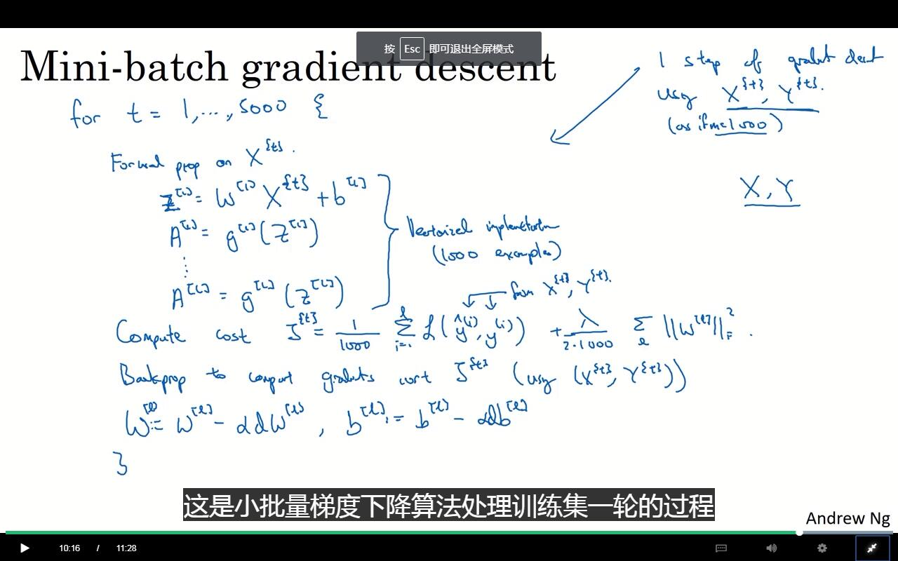

虽然这是一个很好的算法，但运算速度还是不够快。

## 小批量梯度下降

矢量化运算，将分开的向量，合并到一个超大的矩阵。这样在一定程度上可以加快速度。

但如果整个m过大的话，那么每次运算就会变得很慢很慢，那么是不是有一些在运算完整个模型以前就可以有那么一些成效的方法呢？

$m=5,000,000$

先将训练集拆分为小的训练集：称为(mini-batch)，比如一个微训练集m为1000。

那么
$$
X=[X^{[1]}X^{[2]}...X^{[t=5000]}]
$$
看起来这个过程并不怎么难理解。

**这么来说，可以通过小批量梯度下降，来进行任务分发！并行！**

但这个只是正向的。。。哦，逆向好像不太需要那么多运算量哦。

> **那么问题来了，使用小批量梯度下降，是否会与直接运行整个有所不同？**
>
> 并不会，只是计算J，这还是一个原子操作。

