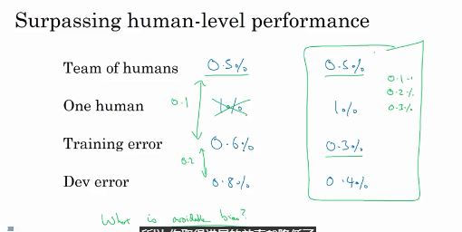

# 深度学习策略

## 正交化

建立机器学习系统的挑战之一是，有太多的可以尝试和改变的东西。太多的超参数可以调整，通过调整什么，来实现预期效果的过程，叫做正交化。

在设计的时候，确保每个操作，只对有限的参数进行调整。

针对不同的性能指标，使用不同的选项。

本章的主要目标是，诊断模型的瓶颈是什么，以及如何去调整参数等。

### 单一量化评估指标

如果有一个单一的量化评估指标，可以让你知道新方法比上一次更好还是更快，那么进程会有极大的加快。

> 精准率(precision)和召回率(recall)。
>
> > <https://blog.argcv.com/articles/1036.c>
> >
> > <https://www.zhihu.com/question/19645541/answer/91694636>
> >
> > <https://blog.csdn.net/qq_29462849/article/details/81053135>
> >
> > 最后这个理论一些。
>
> **准确率(accuracy)**:对于给定的测试数据集，分类器正确分类的样本数与总样本数之比。$ACC=\frac{TP+TN}{TP+TN+FP+FN}$。
>
> 首先需要定义四种分类情况。TP,FN,FP,TN.
>
> |          ↓预测→实际           | 正例，相关(Relevant)                    | 负例，无关(NonRelevant)                 |
> | :---------------------------: | --------------------------------------- | --------------------------------------- |
> |   正例，被检索到(Retrieved)   | true positives(TP)     (正类预测为正类) | false positives(FP)    (负类预测为正类) |
> | 负例，未检索到(Not Retrieved) | false negatives(FN)   (正类预测为负类)  | true negatives(TN)   (负类预测为负类)   |
>
> TRUE/FALSE：代表结果是否分对了。
>
> Positive/Negative：代表实际上是否正确。
>
> **精准率(precision)**: 
>
> ​	其公式为$P=\frac{TP}{TP+FP}$
>
> ​	提取出的正确信息条数 / 提取出的信息条数	
>
> **召回率(recall)**: 
>
> ​	其公式为$R=\frac{TP}{TP+FN}$,
>
> ​	 提取出的正确信息条数 / 样本中的信息条数
>
> **F-Measure(F-Score)**:
>
> ​	即是precision和recall的加权调和平均。
>
> ​	$F_1 = \frac{2}{\frac{1}{P}+\frac{1}{R}}$。

### 建立满足指标(satisficing matrics)和优化指标(optimizing matrics)

如果需要关注多种指标，比如正确率与运行时间。

<!--那么可以就像最优化算法中所表述的，必须满足的指标，使用指数函数加权，优化指标使用线性加权。-->

比如对于一个唤醒器：希望有如下条件
$$
\begin{align}
max\ \ \ \ &accary\\
s.t.\ \ \ &fasle\ positive\ time\ <\ 1\ time/24h 
\end{align}
$$
<!--不就是最优化算法的内容么？-->

写出其对应的条件，有助于我们优化与加快其计算速度。

### 设置开发集、测试集

dev sets:有时候也被称为交叉验证集。

​	主要用于开发环境中，反复测试，保持创新，以提高在开发集上的表现能力。

然后在测试集中评估他。

首先需要保证的是，开发集和测试集需要保证来自于同样的分布。

一般而言，全部打散，然后随机取就好了。

### 什么时候改变dev/test set

比如有个神奇的例子：一个分猫器，并将猫推送给用户。

有两个算法：

- 算法A: 3% error
- 算法B: 5% error

但在检查的时候发现，算法A会推色图，这个是不能容忍的。

但算法B，虽然差了点，但没有色图。

此时就是，**评价指标不能对模型进行正确的评价的时候。**

此时就应该修改指标，甚至同时也需要修改测试、开发集合。

参考方法：给色图加一个巨大的权重。

#### 这也是一种正交化的思想

1. 确定一个指标，以衡量分类器在目标上的性能。
2. 然后再思考如何实现这个目标。

这里也说了另外一种例子，可能实际应用场景中，缺少了某些信息。所以也不一定表现得很好。

比如高质量图片的开发测试集VS低质量图片的实际场景。

<!--这也就是需要加噪声？-->

### 人性化表现

首先，存在一个理论上限值。机器学习会逼近这个上限，但不会超过它。

这个理论上限叫做贝叶斯错误/贝叶斯最优误差。

一般会以很快的速度逼近人类，然后上升速度就会下降了。

一方面是，人类的判断基本和极限值差不多。另一方面，只要比人差，那么就有方法进行改进。

### 偏差与方差的判断，需要基于人的判断能力

### 人类表现

如何界定人类表现能力？

> 比如判断一个X光片。
>
> 1. 一般人：3%错误率
> 2. 一般医生：1%
> 3. 资深医生：0.7%
> 4. 一组资深医生：0.5%

如上述问题所示，此时选择哪个？

这里我们是需要一个可以用于替代**贝叶斯错误/贝叶斯最优误差**的东西，因此应该选择4。

可避免误差与方差。

那如图所示，左边这种，应该考虑优化欠拟合的问题。右边那种考虑优化过拟合问题。

**这个主要用于判断是需要优化方差还是偏差的问题。**

### 超过人类表现的情况

如果碰到这样的情况，就很难判断是应该优化偏差还是方差了。

比如一旦超过0.5%，就没有啥很好的办法了。

已有的例子：

- 广告推荐
- 商品推荐
- 物流、行程预测
- 贷款坏账预测

但这些都是从结构化数据中得到的。不是从自然识别中得到的例子。

以及系统可以获取、检索比人类更多的信息。

其他一些例子：

- 一些语言识别。一些图像识别
- 一些医学相关任务。

### 总结准则：

1. 首先需要很好低拟合测试集。

2. 将结果推展到开发集、测试集。

3. 降低可避免骗差：

   - 更大的模型
   - 更好的优化器
   - 更好的算法

4. 方差：

   - 更多的数据

   - 正则化

     L2，dropout，数据集扩增

   - 更好的构架、算法。

### 为了提高通过率：

1. 三个指标，F

2. 范围缩小，尽可能准确、不超过10s，10mb内存，98%，9,9mb

3. 准确度是满足指标，另外两个是优化指标。【错误】，那么就应该是反过来？

4. 一千万照片，950w训练，25w开发，25w测试。

5. 有了市民额外的照片，此时不应该将其添加到训练集中。（因为这里只是针对摄像头，专门的设备。）【错误】**应该选择False**

   > After setting up your train/dev/test sets, the City Council comes across another 1,000,000 images, called the “citizens’ data”. Apparently the citizens of Peacetopia are so scared of birds that they volunteered to take pictures of the sky and label them, thus contributing these additional 1,000,000 images. These images are different from the distribution of images the City Council had originally given you, but you think it could help your algorithm.
   >
   > You should not add the citizens’ data to the training set, because this will cause the training and dev/test set distributions to become different, thus hurting dev and test set performance. True/False?
   >
   > 哦，不是造成性能影响，而是因为目标不一致。

6. 原因：分布不同、不再反应目标。

7. 4%/4.5%,训练更大的网络，降低4%。是否同意

   是，因为这个中，bias>variance【错误】

   实际上是没有足够的信息。

8. 选择哪个，最好的准确度

9. 学习算法会优于人类，但不会优于贝叶斯

10. 0.1/2.0/2.1,减少正则、更大的模型

11. 训练集错误很高。更大的开发集与不合适的开发集【错误】

    正确为，更大的开发集，以及对开发集过拟合了。

12. 0.1/0.05/0.05，贝叶斯小于0.05，难以衡量。

13. 竞争对手，重新考虑指标。

14. 新的鸟类。数据增强，数据合成【错误】

    应该是放入数据集，重新组合。吧。。

    > 选这个？
    >
    > 使用您拥有的数据来定义新的评估指标（使用新的开发/测试集），同时考虑新物种，并使用它来推动团队的进一步发展。

15. 1亿只猫

    两周训练时间是个限制、更好的电脑、可以少训练点，比如1kw

#### Andrej采访

ImageNet。

关于人类基准的研究，可以很好地帮助研究的表现。

教学并开放。AWSL，竟然是教学最新的知识，甚至就是昨天的新知识！

> <https://www.youtube.com/watch?v=u6aEYuemt0M>
>
> 有个视频，16年的。
>
> <https://cs.stanford.edu/people/karpathy/>
>
> 有个博客
>
> <https://www.jianshu.com/p/182baeb82c71>
>
> 他的课程：
>
> CS231n课程：面向视觉识别的卷积神经网络
>
> <https://www.youtube.com/channel/UCPk8m_r6fkUSYmvgCBwq-sw>
>
> 这个是16年的课
>
> 他的youtub
>
> 这个课程有中文字幕诶！
>
> <http://cs231n.stanford.edu/>
>
> 官网
>
> <https://www.youtube.com/playlist?list=PL3FW7Lu3i5JvHM8ljYj-zLfQRF3EO8sYv>
>
> 这个是17年的课。
>
> 可以作为一个后续观看的对象使用。

- 提到了神经卷积的特征提取能力。

- 监督学习与无监督学习，监督学习很有效，但无监督学习却没啥进展。

- OpenAI，他觉得，一开始把各个东西都拆分开来，然后一个个实现，实现以后再拼合到一起，并不一定是正确的做法。对于他个人而言，更倾向于实现的时候搞定这个。