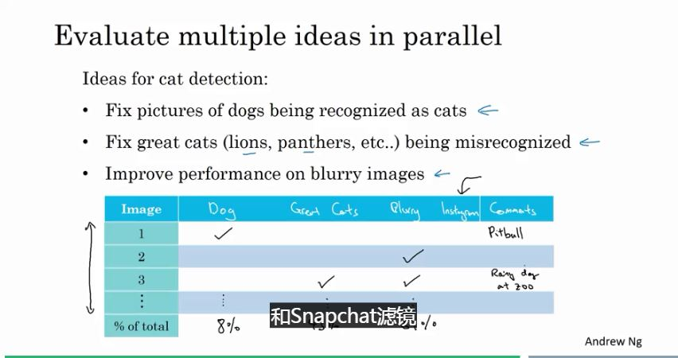
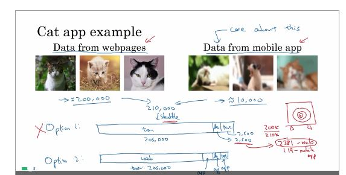
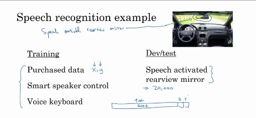

### 进行错误分析

比如在cat分类器的分类错误中，如果发现有很多狗识别成了猫，那就需要考虑增加关于狗的数据。

当然，这里也可以估算下，通过增加狗的识别性能，可以提升多少cat分类器。

如果有多个思路的时候，可以手动画个表，然后比对下，应该先实现拿些。。

比如像这样，然后计算下可以提高多少。

### 清理错误标签的数据

有的数据被标记错了。叫做**错误标记**。

首先，深度学习，对于这种不怎么偏离统计意义上的**随机错误(random errors)**，并不是那么敏感，一般而言不用特别在意。

但对于**系统错误(system errors)**就不那么好了。比如一直把白狗标记为猫，那就很糟糕了。

同样也可以在上面的表格中增加这种参数。

### 快速构建第一个模型，然后迭代

反正对于研究、开发来说都很有用就是了。

### 在不同的分布中进行训练测试

比如目标为右边的移动端app，那么就需要考虑关于开发集、测试集中关于数据来源的问题。

不能直接打散放的原因在于，随机会导致开发集中的目标很少，同时这也会导致开发迭代走向了错误的道路。

<!--为什么不考虑对这个进行加权呢？-->

### 不同分布数据中偏差与方差分析法

如果对于类似上述描述中的分猫器，训练集为清晰的图，开发集为不清晰的。

那么这里有两个变量，这时候就很难判断是偏差还是方差了。

这时候需要设置一个新的集合，`trainning-dev set`让他有与训练集相同的分布，但不是拿来做训练的。

这样就可以判断出训练的能力，比如偏差还是方差就可以很容易判断出来了。

<!--惊人的想法！-->

human--【偏差】--训练误差--【方差】--`trainning-dev set`--【数据集问题】--dev set

### 数据不匹配问题

- 试着找到两者间的本质区别。
- 构造更相似的数据集，找到更多的相似数据。

比如人工构造数据。

但注意，不要使用同样的噪音。构造的过程中也需要符合随机法。

以及，人工合成的也只是所有数据中的一部分，甚至可能只是很小的以及子集。注意避免过拟合。

### 迁移学习

比如使用从分猫器中学到的部分知识，在分鸟器上做。

简单的做法就是，去掉最后一层或者几层，并随机重新赋值。然后再来做迭代。

<!--这个是基于一种可能性的认识，只有在最后一层才会有完整的判断？-->

这样的训练集被称为预初始化训练集，后面的迭代叫做微调。

<!--阿里等客户端上的深度学习，是不是大致就是这个技术啊？-->

### 多任务的迁移学习

也和上面的迁移学习类似，多加几层。

注意，这种同时学习多个任务的方式，可以学习存在部分数据缺失的图像。

如果模型太小不会有效果，但如果模型比较大，那么多任务的深度学习，其他数据对单个任务会有很大的促进作用。

这里应该使用普通的logic loss函数，而不是softmax回归。softmax只能将单个标签分配给单个示例。

###  端到端学习(N to N (end-to-end))

##### 语言识别的例子

比如有一个语言识别的例子：

输入是语音X，输出是该音频的文本输出Y（transcript）。

以前的做法是：首先提取一组特定的音频特征(MFCC)，得到feature。

然后提取出音素(phoneme)。

然后组成单词(word).

而NtoN就直接省去了中间的管道(pipeline）步骤，直接得出结论。

但这里有问题，这玩意需要很多很多的数据才行。

比如之前的管道方式只需要3000h，但用end-to-end得需要10wh。

##### 人脸识别的例子

比如在旋转门哪里识别人脸，并开门。

得到的数据是一张图片 image X。然后需要建立到人的识别信息 identity Y。

这里不是直接对图片进行处理。

当前最好的方式是，首先用一个软件，检测人脸。然后放大裁剪，使得脸到正中间，然后再去学习。

再细化点，第二步的具体实现是，输入两个照片，然后判断是不是一个人。

原因：

- 两个子问题都比较简单。
- 同时有更多的数据可以对分别的两个子问题进行判断。
- 如果使用一步走的话，符合条件的数据就很少了。

##### 机器翻译

传统的方式：

英语-》文本分析-》抽取特征值===。。。。。====》法语。

这个里面end-to-end的效果就很好，因为有很多(X,Y)的数据。

##### 通过一个X光片，判断孩童的年龄

图片=》骨头=》骨头长度=》年龄。

这个就很简单，但直接end-to-end，这就很难了，因为这些数据就很少了。

### 那该怎么做，什么时候用什么？

优点：

- 真正让数据起到主导作用。

  这样可以更好的反应数据之间的内在逻辑，而不是人的先见要素。

  比如对于音素这玩意，可能只是一个语言学家的虚拟形式。

- 人们需要手动造出来的实用手工工具活少了。

缺点：

- 需要极大量的(X,Y)数据。

- 排除了一些潜在的实用手工工具。这是一种将人工知识导入DL的方法啊。

  当然，如果用的不好的话，也会对模型产生负面影响。

需要考虑的问题：

- 是否有足够的(X,Y)数据，或者是分步的数据。

  比如自动驾驶：

  图片=【DL】=》识别障碍物==【可以用运动规划】=》规划路线===【指令规划】==》正确的指令

- 需要考虑你需要的是什么(X,Y)数据。

## 作业：

1. 选建一个模型，看看有什么错

2. 在多目标学习任务中，使用softmax作为输出层。(选错，用logic)

3. 有错误时，应该优先检查：错误的500张图

4. 如果例子中带有问号，是否可以识别:可以

5. 10w摄像头的图，90w网络图，应该如何设置？90w+2w作为训练，剩下的是开发测试【错误，90w+8w，与2w。。。】

6. 对于train 8.8，训练开发，9.1，开发14.3，测试14.8：偏差大、数据不匹配

7. 训练数据比开发/测试容易：信息不足

8. 手动检查后：整体开发集错误：14，标记错误4，模糊8，雨滴2，其他1，应该先检查8%：错误，取决于容易程度，以及有多大帮助

9. 使用雨刮降低2%：最多提高2%

10. 引入有雾的图：需要更多的有雾的图。

    > So long as the synthesized fog looks realistic to the human eye, you can be confident that the synthesized data is accurately capturing the distribution of real foggy images (or a subset of it), since human vision is very accurate for the problem you’re solving.

11. 应该先处理标记错误问题：更正测试集的、不更正训练集

12. 需要识别黄色灯，但黄灯比较少见：使用迁移学习，预先训练

13. 识别音频：都没啥用

14. 分步不是端到端

15. 数据足够多的时候，端到端有效
