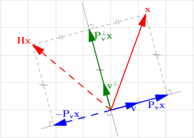

# 矩阵论部分

<!--我明明矩阵部分最差，但为啥感觉矩阵最有意思？-->

## 正交矩阵：

$$
A^T\ A\ =\ A\ A^T \ =\ I 
$$

意味着：
$$
A^{-1}\ = \ A^T
$$
那么一个正交矩阵是什么样的呢？

我们把它弄成向量。

如果$x^Ty=0$，那么这两个向量就相互正交了。于是，如果找出那么一组，相互正交的标准向量，那么不就构造出了一组**标准正交基**了么？

这就是标准正交矩阵的构造方法。这种方法可以用在很多地方。比如用在傅里叶变换中，wwww。

## 实对称矩阵的正交分解

$$
A = Q\Lambda Q^⊤
$$

任何实对称矩阵，都可以分解成正交矩阵Q、$\Lambda$对角矩阵，组成的形式。

## QR分解

主要源于**QR分解**，把实数矩阵分解为
$$
A=QR
$$
Q为正交矩阵，R为上三角矩阵。

对于**稀疏矩阵**而言，可以使用**Givens 旋转**：

给出 *a* 和 *b*，找到 *c* = cos θ 和 *s* = sin θ 使得
$$
{\displaystyle {\begin{bmatrix}c&-s\\s&c\end{bmatrix}}{\begin{bmatrix}a\\b\end{bmatrix}}={\begin{bmatrix}r\\0\end{bmatrix}}.}
$$
以下略。。。

## 心心念的 豪斯霍尔德变换（Householder transformation）

对于一般方法，可以使用**householder变换**。

- 如果有一个单位向量 $v$ ,那么久可以得到一个householder矩阵：

  $v^*$表示为其共轭转置。

$$
H\ = \ I\ -\ 2vv^*
$$

- 豪斯霍尔德矩阵{\displaystyle H}有如下性质:

  - 它是[对称矩阵](https://zh.wikipedia.org/wiki/%E5%B0%8D%E7%A8%B1%E7%9F%A9%E9%99%A3)，即$ {\displaystyle H^{T}=H}$
  - 它是[正交矩阵](https://zh.wikipedia.org/wiki/%E6%AD%A3%E4%BA%A4%E7%9F%A9%E9%98%B5)，即 ${\displaystyle H^{T}=H^{-1}}$
  - 它是[埃尔米特矩阵](https://zh.wikipedia.org/wiki/%E5%9F%83%E5%B0%94%E7%B1%B3%E7%89%B9%E7%9F%A9%E9%98%B5)，即$ {\displaystyle H^{*}\ =H}$
  - 它是[对合](https://zh.wikipedia.org/wiki/%E5%B0%8D%E5%90%88)的，即 ${\displaystyle H^{2}=I\ }$

- ${\displaystyle H}$实际上按上面描述的那样反射了[点](https://zh.wikipedia.org/wiki/%E7%82%B9) ${\displaystyle X}$用它的[位置向量](https://zh.wikipedia.org/wiki/%E4%BD%8D%E7%BD%AE%E5%90%91%E9%87%8F)$ {\displaystyle x}$ 来识别)，因为
  $$
  Hx=x-2vv^{*}x=x-2\langle v,x\rangle v,
  $$
  这里的$ {\displaystyle \langle ,\rangle }$ 表示[内积](https://zh.wikipedia.org/wiki/%E5%85%A7%E7%A9%8D)。注意 ${\displaystyle \langle v,x\rangle }$ 等于从 *X* 到超平面的距离。

- householder变换可以将向量的某些元素置零，同时保持该向量的[范数](https://zh.wikipedia.org/wiki/%E8%8C%83%E6%95%B0)不变。
  $$
  {\mathbf  {H}}={\mathbf  {I}}-{\frac  {2}{\langle {\mathbf  {v}},{\mathbf  {v}}\rangle }}{\mathbf  {vv}}^{H}
  $$
  这样，反复对一个矩阵的各个列向量逐一进行householder变换，就能得到一个QR分解。

## 奇异值分解（SVD）

$$
A=UDV^T
$$

$A$为$m\times n$, $U$为$m\times m $,  $D$为 $m\times m$，$V$为$n\times n$.

 $U​$、$V​$ 为正交矩阵。$D​$为对角矩阵。(不一定是方阵)

# 主成分分析(PCA)

用于压缩点，将m维==》l维，l<=m。

由$f(x)=c$,$x$为原始点(m维)，$c$为对应的编码向量(l维)。

$g(c) = Dc$，为了使解唯一，设定D中的列向量为单位范数。

PCA将其限制为D的列向量彼此正交。

**理论思路：**

编码器为$f$（一个函数），则解码器为$g$(就是$D$)。

那么可以做一个目标，找出一个g，使2范数最小。
$$
c^* = \underset{c}{argmin}{∥x - g(c)∥}_2^2
\\=(x - g(c))^T(x - g(c))
$$
经过运算，可以简化为：
$$
c^*\ =\ \underset{c}{argmin}\  -2x^TDc + c^Tc
$$
对其求向量微分。
$$
∇c(-2x^TDc + c^Tc) = 0
\\-2D^Tx + 2c = 0
\\ c = D^Tx
$$
**操作方法：**

我们需要挑选编码矩阵D。

定义重构操作：
$$
r(x) = g(f(x)) = DD^Tx:
$$
那么就是求一个矩阵D:
$$
D^*= \underset{D}{argmin}
\sqrt{\underset{i,j}{\sum} (x^{(i)}_j - r(x^{(i)})_j)^2} subject to D^TD = I_l:
$$
<!--看着复杂，实际上感觉就是废话-->

<!--中间将其转化为F范数，然后求Tr-->

这个优化问题可以通过特征分解来求解。具体来讲，最优的$d$ 是$X^TX​$ 最大特
征值对应的特征向量。

<!--好吧，这句话最关键，也是最看不懂的地方。。。怎么就可以用特征分解来求解了，这里的特征分解又该怎么搞？shit！-->