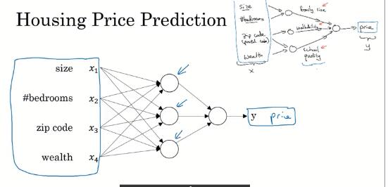
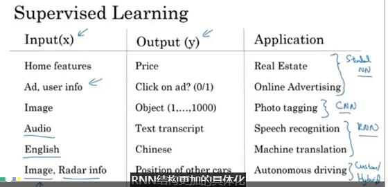
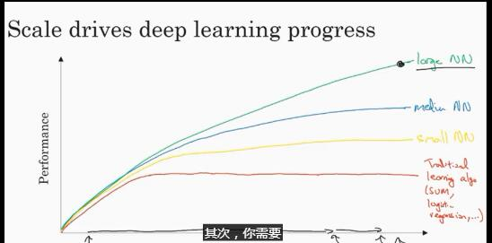

coursera的DeepLearning 笔记

有中文字幕。wwww

# 目的

1. 如何建立神经网络，并识别猫~www

2. 实践，建立一个神经网络

3. 如何构建机器学习工具

   开发集，以及一些实践工作中的经验之谈。

4. CNN，卷积神经网络

5. RNN，序列模型，用于处理自然语言

# 什么是神经网络

房价预估模型

房屋大小与房价的关系。

首先是可以使用线性方程进行拟合。

当然这个就是一个最简单的神经网络。


这个模型为:

```
【size x】---》{神经元 neuron}---》【price 价格】
```

这样构建出来的神经元模型，叫做ReLU方程，全称为，Rectified Linerar Unite，线性整流函数。

神经网络实际是有许多许多这样的神经元组成的。

然后进行复杂化。

如果有其他因素也会影响房价的话。

比如有，卧室、邮编、街区等这些可以得出，家庭质量、便捷度、周边学校质量，然后再由这些东西得出价格。


好看点：



左边蓝色的叫做输入层（input layer），蓝色箭头指的这个叫做隐藏层（hidden layer）。

## 监督学习

监督学习的例子：

- 在线广告
- 图像识别
- 语音识别
- 机器翻译
- 自动驾驶

很多都是，通过神经网络，在特定问题下，巧妙地家里x对应y的函数映射关系，并通过监督学习拟合数据，并成为某个复杂系统的一部分。



数据来源分为：

- 结构化数据

  每个数据都有很清晰的定义

- 非结构化数据

  类似图片、音频、文本。人类很容易理解这些，但是机器却是非常困难。通过机器学习，机器可以很好的识别这些玩意。

  ## 深度学习为啥突然就好使（出名）了

1. 随着社会发展，人类越来越多的行为被电子化和信息化了。

   在电子设备中窜早了无数无数的数据。

2. 这些已经超出传统预测方式的数据量

   

3. 如果要完成大型网络的构建，需要以下条件：

   1. 足够多的数据（规模）。

   2. 小型号的训练集中，常规学习方式会有较好的性能。

   3. 计算能力的提高

   4. 算法上面的创新，可以使我们在有效的计算时间内计算出足够多的数据。

      比如10分钟可以试验一个想法与一个月是完全不同的。

# 一些神经网络的先驱

- 杰弗里·欣顿(Geoffrey·Hinton)

  > https://zh.wikipedia.org/zh-hans/%E5%8F%8D%E5%90%91%E4%BC%A0%E6%92%AD%E7%AE%97%E6%B3%95
  >
  > 反向传播算法（BP 算法）
  >
  > 反向传播也可以指[蒙特卡洛树搜索](https://zh.wikipedia.org/wiki/%E8%92%99%E7%89%B9%E5%8D%A1%E6%B4%9B%E6%A0%91%E6%90%9C%E7%B4%A2)中向上传播的搜索树的方式
  >
  > 在某种理想中，人的思维是一个特征向量，环境是不同的基，然后可以由特征向量的到一个矩阵？wwww
  >
  > 玻尔兹曼机0.0

# 神经网络编程基础（技巧性）

- 如何不显示使用for循环下实现对于样本的训练。
- 前向传播
- 反向传播

**example：**

输入：一个图像

输出：0、1，判断是否是一只猫

**analysis：**

如果是64x64那么就会有3个64x64的红绿蓝通道。

那么可以把这3x64x64的数据扩展为一个x向量。

那么就有n_x=12288的一个我维度。

**符号约定：**
$$
(x,y), x∈R^{n_x}, y∈{0,1}\\
m个训练集{(x^m,y^m)}\\
m_{test}\ \ \#为实例m的集合
这样可以写出一个X的m×n_x矩阵。
y为一个m的向量。
$$
这些符号可以在回归算法中使用。

**逻辑回归：**

sigmoid(z)函数，sigmoid(z) = 1/(1+e^(-z))

把一般的线性函数，代入sigmoid函数，即z=wx+b。

## **代价函数：**

**损失函数 loss function：**

这是一个评判训练值与标准值相差多少的函数。

比如平方差：L(y^,y)=1/2*(y^-y)^2, 方差是一个好的选择，但会让梯度下降法不好运行，因为其本身就存在很多凸凹性，容易使梯度下降陷入局部误差。

为了有一个好的凸性，所以需要另外选取一个函数：
$$
\ell(\hat{y},y)\ =\ -(y\log\hat{y}+(1-y)\log(1-\hat{y}))
$$
<!--一个非常巧妙的函数，有很好的近似性质-->

**代价函数 cost function：**
$$
J(w,b)\ =\ \frac{1}{m}\sum_{i=1}^{m}\ell(\hat{y}^{(i)},y^{i})
$$
明显我们的aim就是，find w，b令min J(w,b)。

## 梯度下降法 Gradient Descent

这种l实际上是是一个凹函数，所以有比较好的梯度下降收敛方式。

对于单个w而言。
$$
\begin{align}
Repeat\ \ &\{\\
&\ \ w:=\ w - \alpha\frac{dJ(w)}{dw}   \\
&\}
\end{align}
$$
α是一个认为设定的变动范围的参数。

对b也是一样的。只是加上d以后就要用偏导而已。

<!--但是这里求偏导不是已经有点麻烦了咩？？咩咩咩？-->

## 计算图 computational graph

> https://zhuanlan.zhihu.com/p/33290129
>
> 计算图是计算代数中的一个基础处理方法，我们可以通过一个有向图来表示一个给定的数学表达式，并可以根据图的特点快速方便对表达式中的变量进行求导。而神经网络的本质就是一个多层复合函数, 因此也可以通过一个图来表示其表达式。


使用计算图，可以正向传播结果，同时也能很快捷的进行逻辑回归。说是这个是实现求导的最自然的方式。

<!--这个也是trensflow所使用的方式之一，同时也是什么正向传播、反向传播的实现方式。-->

## 如何反向求出计算图的导数


what ever~很酷的想法不是么？

并且这么做对于computer来说就很简单了耶~~~

<!--但这个里面如果有环不就gg了?但会出现环咩?理论上不应该出现。-->

使用dvar命名这种求导变量，比如dJ、da、du。

<!--很好的利用了链式法则啊，wwww-->

