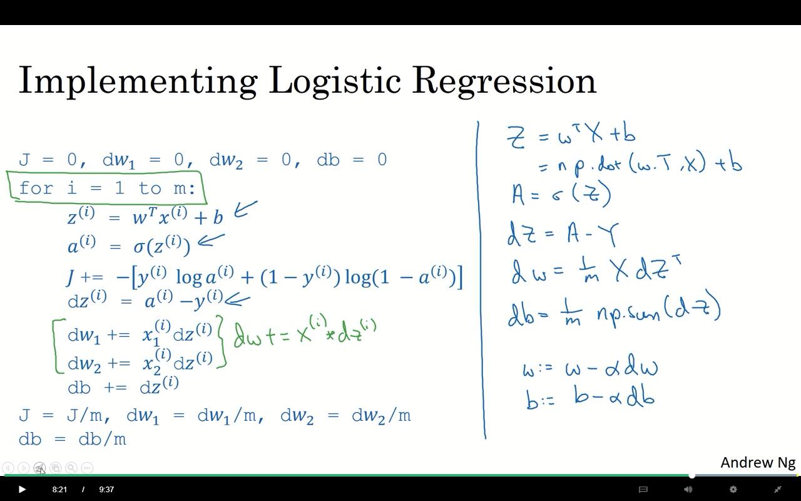
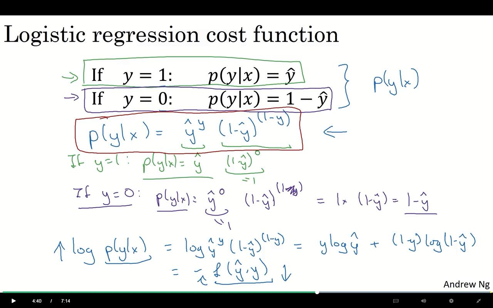

coursera的DeepLearning 笔记

有中文字幕。wwww

# 目的

1. 如何建立神经网络，并识别猫~www

2. 实践，建立一个神经网络

3. 如何构建机器学习工具

   开发集，以及一些实践工作中的经验之谈。

4. CNN，卷积神经网络

5. RNN，序列模型，用于处理自然语言

# 什么是神经网络

房价预估模型

房屋大小与房价的关系。

首先是可以使用线性方程进行拟合。

当然这个就是一个最简单的神经网络。


这个模型为:

```
【size x】---》{神经元 neuron}---》【price 价格】
```

这样构建出来的神经元模型，叫做ReLU方程，全称为，Rectified Linerar Unite，线性整流函数。

神经网络实际是有许多许多这样的神经元组成的。

然后进行复杂化。

如果有其他因素也会影响房价的话。

比如有，卧室、邮编、街区等这些可以得出，家庭质量、便捷度、周边学校质量，然后再由这些东西得出价格。


好看点：


左边蓝色的叫做输入层（input layer），蓝色箭头指的这个叫做隐藏层（hidden layer）。

## 监督学习

监督学习的例子：

- 在线广告
- 图像识别
- 语音识别
- 机器翻译
- 自动驾驶

很多都是，通过神经网络，在特定问题下，巧妙地家里x对应y的函数映射关系，并通过监督学习拟合数据，并成为某个复杂系统的一部分。


数据来源分为：

- 结构化数据

  每个数据都有很清晰的定义

- 非结构化数据

  类似图片、音频、文本。人类很容易理解这些，但是机器却是非常困难。通过机器学习，机器可以很好的识别这些玩意。

  ## 深度学习为啥突然就好使（出名）了

1. 随着社会发展，人类越来越多的行为被电子化和信息化了。

   在电子设备中窜早了无数无数的数据。

2. 这些已经超出传统预测方式的数据量

   

3. 如果要完成大型网络的构建，需要以下条件：

   1. 足够多的数据（规模）。

   2. 小型号的训练集中，常规学习方式会有较好的性能。

   3. 计算能力的提高

   4. 算法上面的创新，可以使我们在有效的计算时间内计算出足够多的数据。

      比如10分钟可以试验一个想法与一个月是完全不同的。

# 一些神经网络的先驱

- 杰弗里·欣顿(Geoffrey·Hinton)

  > https://zh.wikipedia.org/zh-hans/%E5%8F%8D%E5%90%91%E4%BC%A0%E6%92%AD%E7%AE%97%E6%B3%95
  >
  > 反向传播算法（BP 算法）
  >
  > 反向传播也可以指[蒙特卡洛树搜索](https://zh.wikipedia.org/wiki/%E8%92%99%E7%89%B9%E5%8D%A1%E6%B4%9B%E6%A0%91%E6%90%9C%E7%B4%A2)中向上传播的搜索树的方式
  >
  > 在某种理想中，人的思维是一个特征向量，环境是不同的基，然后可以由特征向量的到一个矩阵？wwww
  >
  > 玻尔兹曼机0.0

# 神经网络编程基础（技巧性）

- 如何不显示使用for循环下实现对于样本的训练。
- 前向传播
- 反向传播

**example：**

输入：一个图像

输出：0、1，判断是否是一只猫

**analysis：**

如果是64x64那么就会有3个64x64的红绿蓝通道。

那么可以把这3x64x64的数据扩展为一个x向量。

那么就有n_x=12288的一个我维度。

**符号约定：**
$$
(x,y), x∈R^{n_x}, y∈{0,1}\\
m个训练集{(x^m,y^m)}\\
m_{test}\ \ \#为实例m的集合
这样可以写出一个X的m×n_x矩阵。
y为一个m的向量。
$$
这些符号可以在回归算法中使用。

**逻辑回归：**

sigmoid(z)函数，
$$
\sigma(z) = \frac{1}{1+e^{-z}}
$$
此函数用于归一化处理，将线性函数归一于0~1.

把一般的线性函数，代入sigmoid函数，即z=wx+b。

## **代价函数：**

**损失函数 loss function：**

这是一个评判训练值与标准值相差多少的函数。

比如平方差：L(y^,y)=1/2*(y^-y)^2, 方差是一个好的选择，但会让梯度下降法不好运行，因为其本身就存在很多凸凹性，容易使梯度下降陷入局部误差。

为了有一个好的凸性，所以需要另外选取一个函数：
$$
\ell(\hat{y},y)\ =\ -(y\log\hat{y}+(1-y)\log(1-\hat{y}))
$$
<!--一个非常巧妙的函数，有很好的近似性质-->

**代价函数 cost function：**
$$
J(w,b)\ =\ \frac{1}{m}\sum_{i=1}^{m}\ell(\hat{y}^{(i)},y^{i})
$$
明显我们的aim就是，find w，b令min J(w,b)。

## 梯度下降法 Gradient Descent

这种l实际上是是一个凹函数，所以有比较好的梯度下降收敛方式。

对于单个w而言。
$$
\begin{align}
Repeat\ \ &\{\\
&\ \ w:=\ w - \alpha\frac{dJ(w)}{dw}   \\
&\}
\end{align}
$$
α是一个认为设定的变动范围的参数。

对b也是一样的。只是加上d以后就要用偏导而已。

<!--但是这里求偏导不是已经有点麻烦了咩？？咩咩咩？-->

## 计算图 computational graph

> https://zhuanlan.zhihu.com/p/33290129
>
> 计算图是计算代数中的一个基础处理方法，我们可以通过一个有向图来表示一个给定的数学表达式，并可以根据图的特点快速方便对表达式中的变量进行求导。而神经网络的本质就是一个多层复合函数, 因此也可以通过一个图来表示其表达式。


使用计算图，可以正向传播结果，同时也能很快捷的进行逻辑回归。说是这个是实现求导的最自然的方式。

<!--这个也是trensflow所使用的方式之一，同时也是什么正向传播、反向传播的实现方式。-->

## 如何反向求出计算图的导数


what ever~很酷的想法不是么？

并且这么做对于computer来说就很简单了耶~~~

<!--但这个里面如果有环不就gg了?但会出现环咩?理论上不应该出现。-->

使用dvar命名方式，代表最终输出变量对于各种中间量的导数，比如dv、da、du。

<!--很好的利用了链式法则啊，wwww-->

## 使用计算图对逻辑回归进行梯度下降


是一个二维向量。

首先需要计算da，对于a的导数。

通过关于导数的定义，直接求导即可得到。
$$
da\ = \ -\frac{y}{a}+\frac{1-y}{1-a}
$$

$$
dz\ = \ a-y
$$

然后在计算出dw_1、dw_2、db。。。然后在用梯度下降来继续。

形式代码：

```
J = 0; dw_1 = 0; dw_2 = 0; db = 0
for i = 1 to m:
	z^i = w^T*x^i+b
	a^i = σ(z^i)
	J   += -[y^i*log(a^i)+(1-y^i)log(1-a^i)]
	dz^i = a^i-y^i
	dw1 += x_2^i*dz^i
	dw2 += x_2^i*dz^i
	db += d^i
J /= m

```

## 向量化

实现向量化能力，可以提升速度。

主要是使用numpy之类的库里面，对其进行计算。

比如使用

```
import numpy as np
a = np.random.rand(100000)
b = np.random.rand(100000)
np.dot(a,b)
```

PS：有关矩阵乘法的优化：<!--信科的人就是这么矫情-->

文中说有将近300倍的性能差距。

比较的是两个，一个是for循环相乘，另外一个是用numpy.dot。

一部分可以在python等编程语言上进行比较。

```python
for i in rang(10000):
	c += a[i] * b[i]
```

**这部分纯粹自己猜想：**

1. a[i]这里可以尝试优化，不确定python每次指都是要从a[0]开始寻找
2. a[i]*b[i]的结果会存在一个临时变量里面，然后在于c进行相加。这里是否可以再减少一次读取的操作？

但这些的优化程度都不是很高。 

看到的其他说法：

> https://www.zhihu.com/question/67652386

1. python属于解释性语言，读取源码，解释运行，嘛~还是挺多的。

   以上解决方式是JIT，就是先编译，再运行。

2. 然后就是关于a[i]的寻找问题

   python对数字不限长，哦，这就肯定要损失不少速度了。

   > 为了迁就初学者，它去掉了“变量声明”以及“数据类型”——于是它的用户再也用不着、也没法写 int xxx了。随便什么数据，咱想存就存，乌拉！
   >
   > <!--有趣的乌拉~-->

   

另一部分是关于算法部分

> https://blog.csdn.net/hanghangde/article/details/50085999
>
> 好吧，这个链接红字后面的就是废话。
>
> 但给了关于strassen算法的链接：
>
> https://blog.csdn.net/lttree/article/details/41313543
>
> 大致上就是分而治之，分成7次小矩阵之间的乘法。
>
> 具体来说将n^3=n^log2{8}变为了n^log2{7}。。。
>
> https://www.zhihu.com/question/67310504
>
> 这里也有一些从程序角度来看的东西。
>
> 当然，里面又鼓吹了一波TensorFlow。

还有y一个关于与MATLAB之间的品行比较

> https://www.zhihu.com/question/38576974/answer/78418308

总而言之，加快运算速度还是要从两个方面来进行：

1. 语言层面，注意底层实现，存取运算优化。
2. 算法层面，就是数学的事了。

但上面两个嘛~程度不同，1的研究是一直可进行的，但基本是越做越难做，越做越不实用，但优化速度基本线性（对，就是线性，相对于算法层面的指数性，懂？）。但算法这事，如果一旦有突破就是指数型的了。比如：n^log2{8}变为了n^log2{7}。在n越大的情况下，这些结果会越夸张。上述，就算是相差:n^log2{0.9}吧。。。。。好吧，找不到能算的东西，反正肯定会很大就是了。

再做一点点对这节的补充。咩~他就只是体现在使用vector然后使用numpy、TensorFlow的层面上。

实际上还有挺多的空间的~

<!--又回想起某些有很多近似于0元素的矩阵求逆的问题了，wwww-->

## 逻辑回归下的向量化优化

<!--0.0？2分钟的时候我只看到了，你把训练数据变成了一个矩阵，然后，就实际上是想求矩阵的逆？好吧，矩阵论万岁。。。wwwww-->



这里两节讲述了，怎么简化这些for循环。

1. # 在dw_1、dw_2的这里，是用矩阵的乘法，代替循环。

2. 对于外面的这个for循环

   由于整个运算实际上还是归于线性计算，所以，可以使用矩阵来进行表示。这样就表示实现了一次循环。

   ```
   z = np.dot(w.T,X) + b   #w.t表示转置
   A = σ(Z)
   dz = A-Y
   dw = (1/m)*x*dz.T
   db = (1/m)*np.sum(dz)
   
   w:=w-αdw
   b:=b-αdb
   
   ```

   

## 在python中进行广播

<!--依然是矩阵在python中的计算-->

```
#对于矩阵A,3x4
A = np.array([[..,..,..,..,..],
             [..,..,..,..,..],
             [..,..,..,..,..]])
# 对列求和,得到一个1x4的矩阵
cal = A.sum(axis=0)
# 计算百分比
percentage = 100*A/(cal.reshape(1,4))
```

在MATLAB中这个叫做bsxfun。。。0.0

> http://www.runoob.com/numpy/numpy-broadcast.html

广播(Broadcast)是 numpy 对不同形状(shape)的数组进行数值计算的方式， 对数组的算术运算通常在相应的元素上进行。

如果两个数组 a 和 b 形状相同，即满足 **a.shape == b.shape**，那么 a*b 的结果就是 a 与 b 数组对应位相乘。这要求维数相同，且各维度的长度相同。

.......

<!--这玩意出现的原因吧，实际上可能是因为在进行算术运算的时候，如果使用一般的方式，那么则会产生巨大的for循环开销，为了避免这种for循环开销，则进行一定程度的上的优化，于是就有了广播？虽然依然感觉有点智障啊，这个需求。-->

<!--或者说，这个广播吧，实际上是用来计算某些简单的算子？-->

> https://docs.scipy.org/doc/numpy/user/basics.broadcasting.html
>
> 广播提供了一种矢量化数组操作的方法，以便在C而不是Python中进行循环。它可以在不制作不必要的数据副本的情况下实现这一点，并且通常可以实现高效 然而，有些情况下广播是一个坏主意，因为它会导致内存使用效率低下，从而减慢计算速度。

在基本点。

> https://www.zhihu.com/search?type=content&q=numpy%20broadcast
>
> 直接的乘除法，实际上是对两个矩阵（数组），在不适用for循环下，进行元素一对一之间的操作。
>
> PS：这样可以内化到C中，加快运算速度。这个不是矩阵乘法，要记得分开。
>
> 例如：
>
> ```
> arr = np.array([[1., 2., 3.], [4., 5., 6.]])
> arr
> array([[ 1.,  2.,  3.],
>        [ 4.,  5.,  6.]])
> arr * arr
> array([[  1.,   4.,   9.],
>        [ 16.,  25.,  36.]])
> arr - arr
> array([[ 0.,  0.,  0.],
>        [ 0.,  0.,  0.]])
> ```

好吧，这样产生的广播，就好理解了。


然后他建议使用确定的行列方式，而不是省略形式。

```
# 不要用
a = np.random.randn(5)
# 使用
a = np.random.randn(5,1)
```

## 关于代价函数的来历


$$
\ell(\hat{y},y)\ =\ -(y\log\hat{y}+(1-y)\log(1-\hat{y}))
$$
这里来源于对于一个概率公式的拟合：



简而言之，对于标准结果y_hat，可以使用蓝色的那个公式进行拟合，这个结果至少在，y是1、0的时候很好用。

两边求log以后就出来了。

这里使用了最大似然估计？

