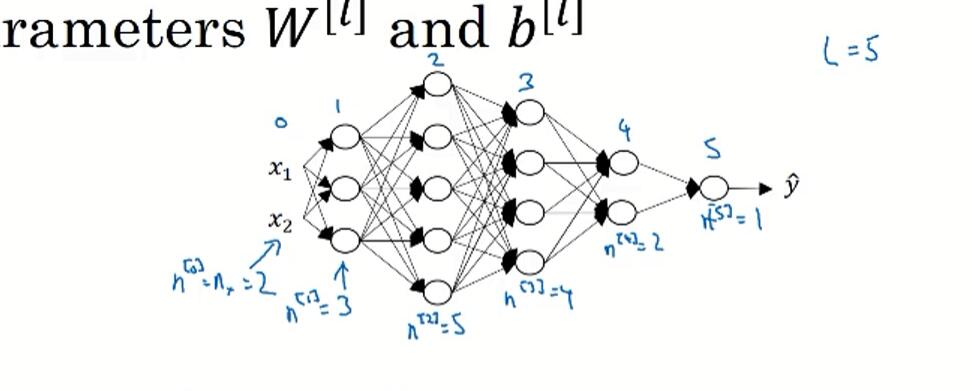
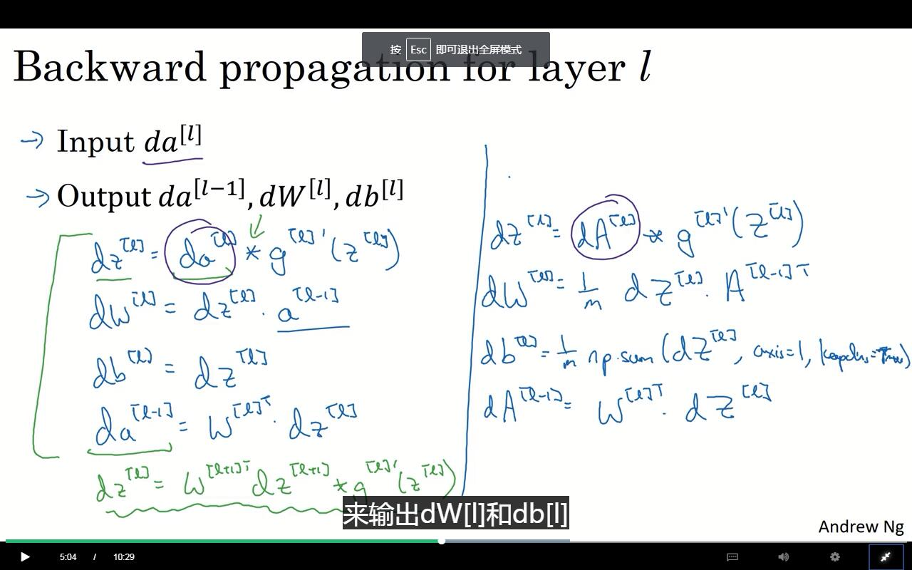

# 前情回顾

逻辑回归的实现形式。

现在使用一种新的表示方法：


使用 [1]、[2]表示深度学习各层的次序。

突然想到之前的习题，通过对实验组的99%拟合，得到了对测试组的67%的结果。从某个角度来说，只比瞎猜强一点，强17%，并且很可能是与图片颜色占比有关。

# 神经网络的分层

input layer：神经网络的输入层

hidden layer：神经网络的隐藏层

output layer：神经网络的输出层

```
a[0] = X	#（输入层）对于下一层的激活值
a[1] = balabala
a[2] = Y_hat
```

神经网络的层数与输入层无关，所以最少一层。（没有隐藏层，只有中间层）


将其向量化。

# 关于激活层的激活函数（activation function）

sigmoid是一个熟悉的方程。有良好的可导性，平滑性以及0~1区间的渐进性
$$
\sigma(z) =a= \frac{1}{1+e^{-z}}\\
\sigma'(z)=a(1-a)
$$
新的函数，tanh函数。
$$
a = tanh(z)=\frac{e^z-e^{-z}}{e^z+e^{-z}}\\
a'=1-(tanh(z))^2=1-a^2
$$
实际上也就是个σ函数，只是做了个上下平移，使其经过零点，然后稍微拉伸了下。使其范围扩大到-1\~1。这个更适合你做一个中心化方程。从某个角度来说，tanh函数优超于σ函数，除非需要取值为0\~1。

同时这两个的导数也有很好的性质。对，特别完美的性质。


ReLU函数，线性整流函数，嘛~反正就那样。
$$
a = max(0,z)
$$
Leaky ReLU
$$
a=max(0.01z,z)
$$
一般来说，老师比较喜欢使用ReLU，因为比较容易让反向传播过程中不会很快地到达0。

# 为什么一定要激活函数

如果没有激活函数，那么实际上就只是在做线性变换，多少层都没有意义了。

激活函数，就是将线性变换与非线性变换的一种整合。

> https://zhuanlan.zhihu.com/p/32714733
>
> 其实非线性化的作用还有这一点：保持每一层的输出具有“梯度”，只有有了“梯度”我们才能应用反向传播算法、梯度下降算法来优化代价函数（正如我们在前文看到的那样），从而训练出更深的神经网络。

延伸下就是说，线性-非线性-线性-非线性...的一步步拟合。

线性用于拉伸、旋转、平移等操作。非线性。哦，你懂得。

# 梯度下降

对于两层模型：


有如下的导数形式：
$$
\begin{align}
da^{[2]}&=a^{[2]}-y \\
dW^{[2]}&=dz^{[2]}{a^{[1]}}^T \\
db^{[2]}&=dz^{[2]} \\
dz^{[1]}&={W^{[2]}}^Tdz^{[2]}*g^{[1]'}(z^{[1]}) \\
dW^{[1]}&=dz^{[1]}x^{T} \\
db^{[1]}&=da^{[1]}
\end{align}
$$
不是这样问题不就来了？每一步向前传播，都需要对函数进行求导。但求导本来就不是一个好做的东西啊？那么随着模型的复杂，这怎么做啊？

# 初始化问题

一开始都是讲w、b初始化0。

毫无疑问，这玩意的效率不会高。

同时，同一层的两个，$w^{[1]}_1​$与$w^{[1]}_2​$，都初始化为0的时候，同时使用的是相同的方法，那么每次迭代都会得到相同的$w^{[1]}_1+\alpha dw^{[1]}_1​$与$w^{[1]}_2+\alpha dw^{[1]}_2​$ (如果这里这两个dw是相同的，那么就gg了，永远也得不到想要的结果了。)

**所以初始化的时候需要使用随机初始值。**

同时因为，sigmoid函数在0点时的斜率高，也即时在0出会有较好的迭代效率，所以尽量使用尽量小的初始值，可以加快迭代。

# 编程

X是你的输入，表示了x点的位置。

Y是这些输入的标签，代表了X的的记过。

### 首先来看简单的逻辑回归

使用sklearn的内置函数，在数据集上训练

```
# Train the logistic regression classifier
clf = sklearn.linear_model.LogisticRegressionCV();
clf.fit(X.T, Y.T)
# 展示结果：
# Plot the decision boundary for logistic regression
plot_decision_boundary(lambda x: clf.predict(x), X, Y)
```

但因为数据集不是线性可分（也就是说逻辑回归就是个线性），所以准确率只有47%（？？？0.0不是应该比50强一点么。。。emm）

### 即将使用的模型


对于任意输入$x^{(i)}$:
$$z^{[1] (i)} =  W^{[1]} x^{(i)} + b^{[1]}\tag{1}$$ 
$$a^{[1] (i)} = \tanh(z^{[1] (i)})\tag{2}$$
$$z^{[2] (i)} = W^{[2]} a^{[1] (i)} + b^{[2]}\tag{3}$$
$$\hat{y}^{(i)} = a^{[2] (i)} = \sigma(z^{ [2] (i)})\tag{4}$$
$$y^{(i)}_{prediction} = \begin{cases} 1 & \mbox{if } a^{[2](i)} > 0.5 \\ 0 & \mbox{otherwise } \end{cases}\tag{5}$$

cost 函数： 
$$J = - \frac{1}{m} \sum\limits_{i = 0}^{m} \large\left(\small y^{(i)}\log\left(a^{[2] (i)}\right) + (1-y^{(i)})\log\left(1- a^{[2] (i)}\right)  \large  \right) \small \tag{6}$$

#### 样例

输入层是(5,3)的，输出为(2,3),层次为4 ，就是包括输入、输出，中间有两个。

##### 初始化

别忘了用随机初始化w。

<!--使用固定seed，真犯规啊-->

## 如何制作自己的网络

对于一个模型而言，很难事先预知能有多深，所以一般先从逻辑回归，一层层深入(?0.0)。

描述神经网络的一些符号：

$L\ =\ 4$	使用大写的L，表示4层网络。#layers

$n^{[l]}$		表示$l$层的单元数量。# units in layer $l$

$a^{[l]}$		表示$l$层的激活函数。#activation function

## 多层函数中的前向函数

这个倒是简单，只需要简单的一层层，线性、非线性地套起来就好了。

PS：$X\ = \ a^{[0]}$。

## 注意维度



有如图所示的神经网络。

$Z^{[1]}\ =\ W^{[1]}X\ +\ b^{[1]}​$

$Z^{[1]}$是一个(3,1)，$X$是一个(2,1)。那么$W$就应该是一个(3,2)矩阵。

先看需要多大的（$n^{[\ l\ ]}​$）,然后看输入，W就出来了。

$W^{[\ l\ ]}\ is\ (n^{[\ l\ ]},n^{[\ l-1\ ]})​$.

但如果加上维度的话，那么Z就会变为一个(3,m)的矩阵，然而这个对W没有影响。

<!--没必要把自己绕进入，简单记忆即可-->

## 为什么需要多层次

一方面，多层次可以从不同的方面对数据进行层层解析，比如，第一层进行除燥，第二层进行特征值，等等。

另一方面，如果只使用一层的话，那么就需要在这层中，把所有的情况都列举出来，这显然是不现实的。

## 向前向后

对于$L​$层，有$W^{[\ l \ ]}​$,$b^{[\ l\ ]}​$。

对于向前传播：输入$a^{[\ l-1\ ]}​$,输出$a^{[\ l\ ]}​$。

$Z^{[l]}\ =\ W^{[l]}a^{[l-1]}\ +\ b^{[l]}​$，cache $Z^{[l]}​$。

$a^{[\ l\ ]}=g^{[\ l\ ]}(z^{[\ l\ ]})​$。

对于像后传播:输入$d a^{[l]}​$,输出$d a^{[l-1]}​$。

<!--半水不水好多课了，我特么就是想知道da怎么算！shit！-->

<!--[○･｀Д´･ ○]，向前传播有啥好讲的啊！然而我还不敢跳Orz。。。-->

<!--同样的，比如很多CNN之类的卷积网络，也需要搞定求导的问题。-->

对于向后传播：

输入$d a^{[l]}$,输出$d a^{[l-1]}$、$d W^{[l]}$、$d b^{[l]}$。

<!--一层链式法则，换个写法估计就好懂了-->

**因为**：$a^{[\ l\ ]}=g^{[\ l\ ]}(z^{[\ l\ ]})$

所以：
$$
\frac{dy}{d z^{[l]}}\  =\ \frac{dy}{d a^{[l]}} \ *\ \frac{d g^{[l]}}{d z^{[l]}}
$$


即：$d z^{[l]}\ =\ d a^{[l]}\ *\ g^{[l]'}(z^{[l]})$。

**因为**：$z^{[l]}\ =\ w^{[l]}a^{[l-1]}\ +\ b^{[l]}\\$

所以：
$$
\frac{dy}{dw} = \frac{dy}{dz^{[l]}}*a^{[l-1]}
$$
即$d W^{[l]} = d z^{[l]}\ · \ a^{[l-1]}​$

<!--简单的链式法则，注意这里，z、a可大可小，但W的维度是固定的-->

所以：
$$
d b^{[l]}\ =\ dz^{[l]}
$$
所以：
$$
da^{[l-1]}\ = \ W^{[l]\ T}·dz^{[l]}
$$
那么难点就变为求$g'$了，然而这玩意吧，简单就是了，在设定的时候求一下就好了。

<!--同理，代价函数也可以这么搞。-->

嫌懒的话，直接用这个：



那么，深度学习又愉快地变成了拼积木，然后自动化啦~~

<!--总的来说，线性部分很简单，简单的链式求导就可以了，对于非线性部分，在设定的时候，只选取有限的(效果好的)，并且可以简单的求出其导数的非线性函数即可。-->

## 参数与超参数（hyperparameters）

除了常规参数，还有些其他参数，比如学习率$\alpha$、迭代次数、隐藏层的数量L、隐藏层的隐藏数数量、激活函数的选择。

这些会影响W、b的参数，称之为超参数。

实际上这些值还没有一个比较好的方式来描述，都是多少的时候比较好，所以就多试试。

同时在长时间的改变以后，这些超参数可能也会改变，之前的最优不一定是当前的最优。