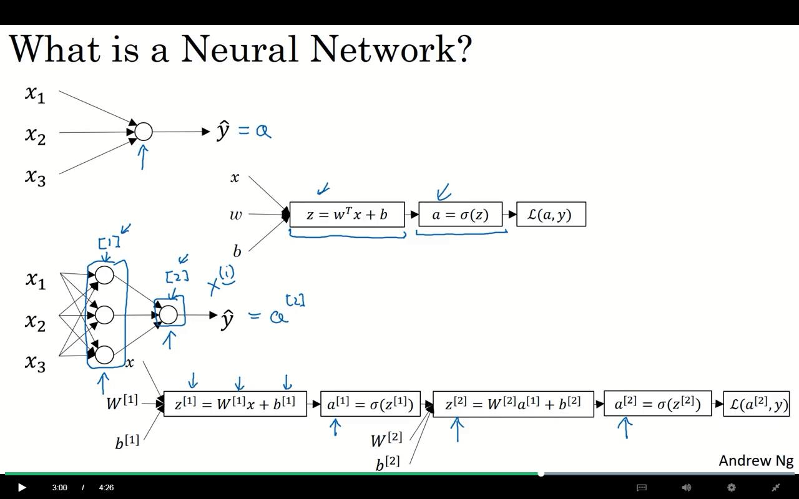
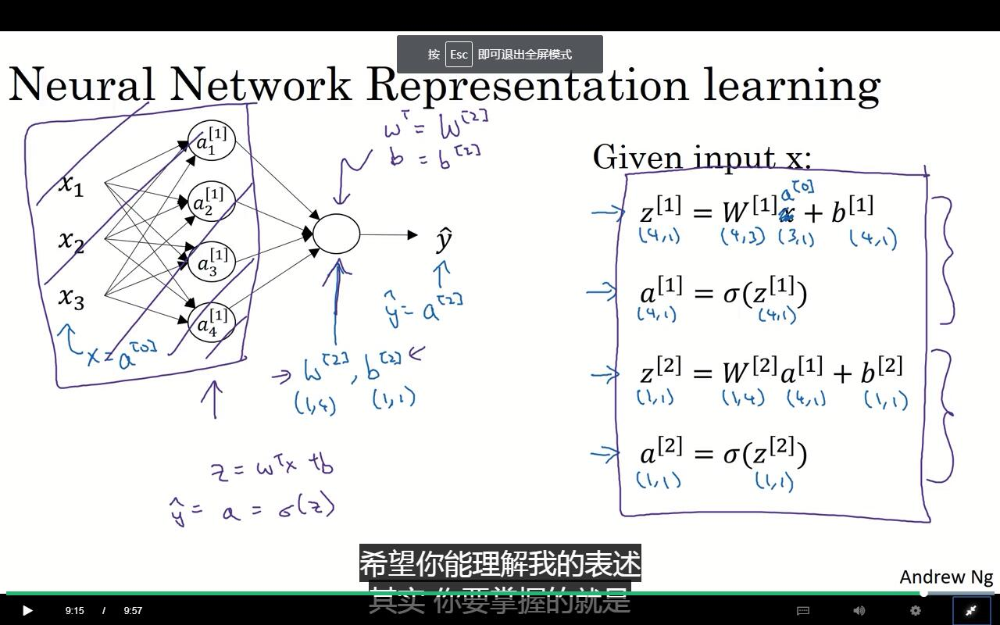
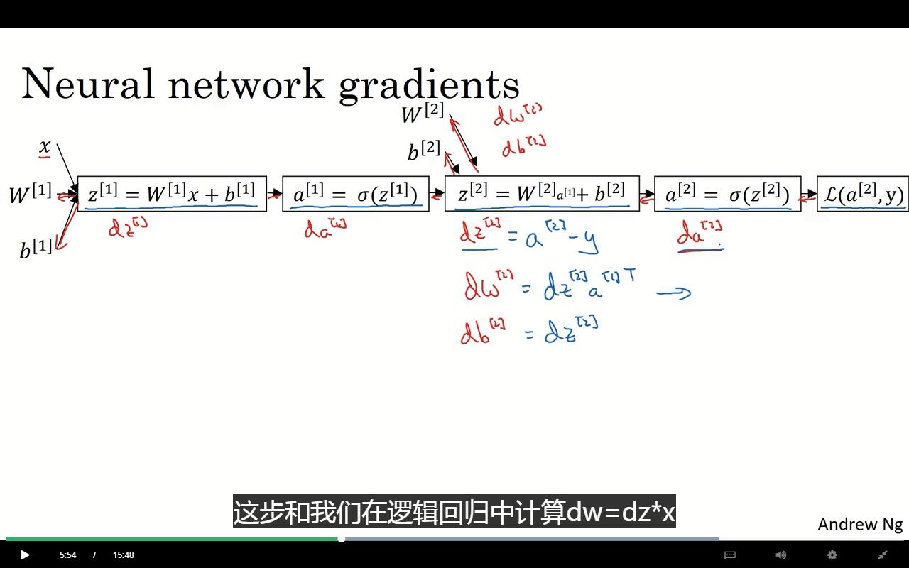

# 前情回顾

逻辑回归的实现形式。

现在使用一种新的表示方法：



使用 [1]、[2]表示深度学习各层的次序。

突然想到之前的习题，通过对实验组的99%拟合，得到了对测试组的67%的结果。从某个角度来说，只比瞎猜强一点，强17%，并且很可能是与图片颜色占比有关。

# 神经网络的分层

input layer：神经网络的输入层

hidden layer：神经网络的隐藏层

output layer：神经网络的输出层

```
a[0] = X	#（输入层）对于下一层的激活值
a[1] = balabala
a[2] = Y_hat
```

神经网络的层数与输入层无关，所以最少一层。（没有隐藏层，只有中间层）



将其向量化。

# 关于激活层的激活函数（activation function）

sigmoid是一个熟悉的方程。有良好的可导性，平滑性以及0~1区间的渐进性
$$
\sigma(z) =a= \frac{1}{1+e^{-z}}\\
\sigma'(z)=a(1-a)
$$
新的函数，tanh函数。
$$
a = tanh(z)=\frac{e^z-e^{-z}}{e^z+e^{-z}}\\
a'=1-(tanh(z))^2=1-a^2
$$
实际上也就是个σ函数，只是做了个上下平移，使其经过零点，然后稍微拉伸了下。使其范围扩大到-1\~1。这个更适合你做一个中心化方程。从某个角度来说，tanh函数优超于σ函数，除非需要取值为0\~1。

同时这两个的导数也有很好的性质。对，特别完美的性质。


ReLU函数，线性整流函数，嘛~反正就那样。
$$
a = max(0,z)
$$
Leaky ReLU
$$
a=max(0.01z,z)
$$
一般来说，老师比较喜欢使用ReLU，因为比较容易让反向传播过程中不会很快地到达0。

# 为什么一定要激活函数

如果没有激活函数，那么实际上就只是在做线性变换，多少层都没有意义了。

激活函数，就是将线性变换与非线性变换的一种整合。

> https://zhuanlan.zhihu.com/p/32714733
>
> 其实非线性化的作用还有这一点：保持每一层的输出具有“梯度”，只有有了“梯度”我们才能应用反向传播算法、梯度下降算法来优化代价函数（正如我们在前文看到的那样），从而训练出更深的神经网络。

延伸下就是说，线性-非线性-线性-非线性...的一步步拟合。

线性用于拉伸、旋转、平移等操作。非线性。哦，你懂得。

# 梯度下降

对于两层模型：



有如下的导数形式：
$$
\begin{align}
da^{[2]}&=a^{[2]}-y \\
dW^{[2]}&=dz^{[2]}{a^{[1]}}^T \\
db^{[2]}&=dz^{[2]} \\
dz^{[1]}&={W^{[2]}}^Tdz^{[2]}*g^{[1]'}(z^{[1]}) \\
dW^{[1]}&=dz^{[1]}x^{T} \\
db^{[1]}&=da^{[1]}
\end{align}
$$
不是这样问题不就来了？每一步向前传播，都需要对函数进行求导。但求导本来就不是一个好做的东西啊？那么随着模型的复杂，这怎么做啊？

# 初始化问题

一开始都是讲w、b初始化0。

毫无疑问，这玩意的效率不会高。

同时，同一层的两个，$w^{[1]}_1$与$w^{[1]}_2$，都初始化为0的时候，同时使用的是相同的方法，那么每次迭代都会得到相同的$w^{[1]}_1+\alpha dw^{[1]}_1$与$w^{[1]}_2+\alpha dw^{[1]}_2$ (如果这里这两个dw是相同的，那么就gg了，永远也得不到想要的结果了。)

**所以初始化的时候需要使用随机初始值。**

同时因为，sigmoid函数在0点时的斜率高，也即时在0出会有较好的迭代效率，所以尽量使用尽量小的初始值，可以加快迭代。

# 编程

X是你的输入，表示了x点的位置。

Y是这些输入的标签，代表了X的的记过。

### 首先来看简单的逻辑回归

使用sklearn的内置函数，在数据集上训练

```
# Train the logistic regression classifier
clf = sklearn.linear_model.LogisticRegressionCV();
clf.fit(X.T, Y.T)
# 展示结果：
# Plot the decision boundary for logistic regression
plot_decision_boundary(lambda x: clf.predict(x), X, Y)
```

但因为数据集不是线性可分（也就是说逻辑回归就是个线性），所以准确率只有47%（？？？0.0不是应该比50强一点么。。。emm）

### 即将使用的模型


对于任意输入$x^{(i)}$:
$$z^{[1] (i)} =  W^{[1]} x^{(i)} + b^{[1]}\tag{1}$$ 
$$a^{[1] (i)} = \tanh(z^{[1] (i)})\tag{2}$$
$$z^{[2] (i)} = W^{[2]} a^{[1] (i)} + b^{[2]}\tag{3}$$
$$\hat{y}^{(i)} = a^{[2] (i)} = \sigma(z^{ [2] (i)})\tag{4}$$
$$y^{(i)}_{prediction} = \begin{cases} 1 & \mbox{if } a^{[2](i)} > 0.5 \\ 0 & \mbox{otherwise } \end{cases}\tag{5}$$

cost 函数： 
$$J = - \frac{1}{m} \sum\limits_{i = 0}^{m} \large\left(\small y^{(i)}\log\left(a^{[2] (i)}\right) + (1-y^{(i)})\log\left(1- a^{[2] (i)}\right)  \large  \right) \small \tag{6}$$

#### 样例

输入层是(5,3)的，输出为(2,3),层次为4 ，就是包括输入、输出，中间有两个。

##### 初始化

别忘了用随机初始化w。

<!--使用固定seed，真犯规啊-->

