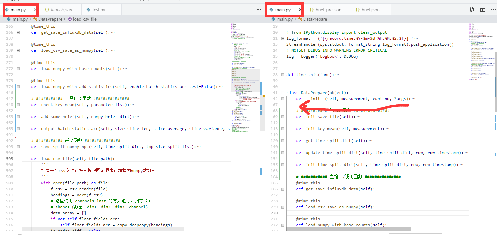
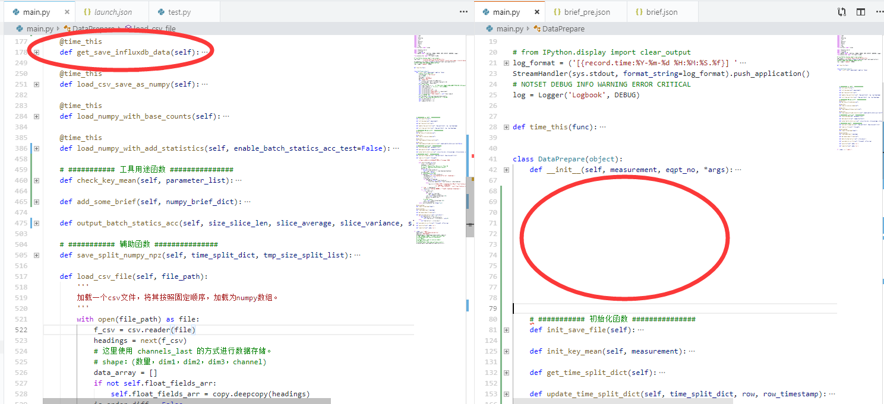

vscode有个挺有意思的功能。

这是同一个文件。

如果我在右边的哪个窗口中，在60+行增加空行的时候，左边窗口依然保持在当前代码块，不会导致在前面增加了代码就使左边的窗口内容整体向下移动，影响阅读。

据猜测，这个可以这么实现：

左边窗口保存当前视图内容的开始行seed。比如这里是166.

如果每次文件存在修改（增加减少行数add_line）。

如果在seed前，就左边展示内容就seed+add_line的内容。

如果在seed后，就展示seed后的内容。

虽然是个小小的优化，但体验非常好。love it。