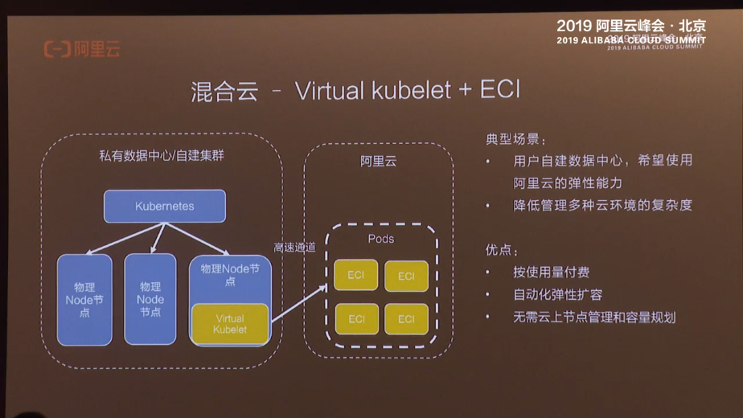
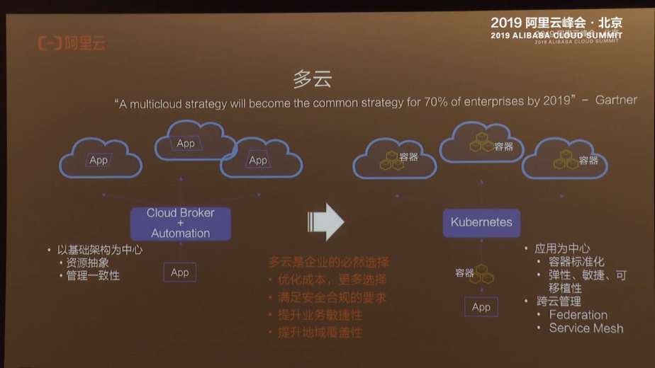
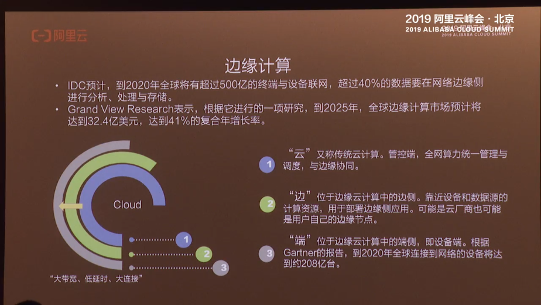
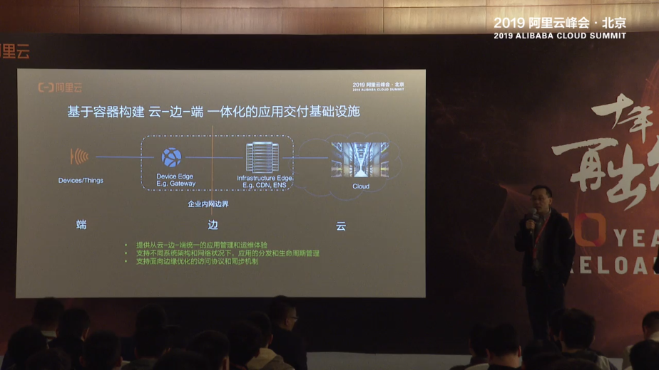
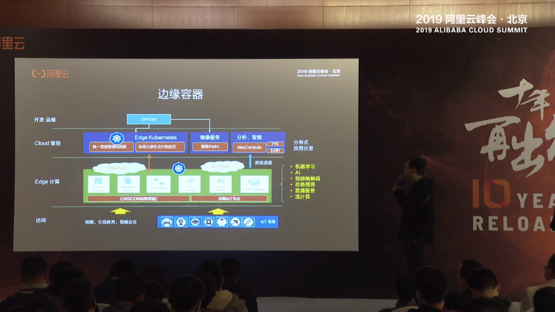
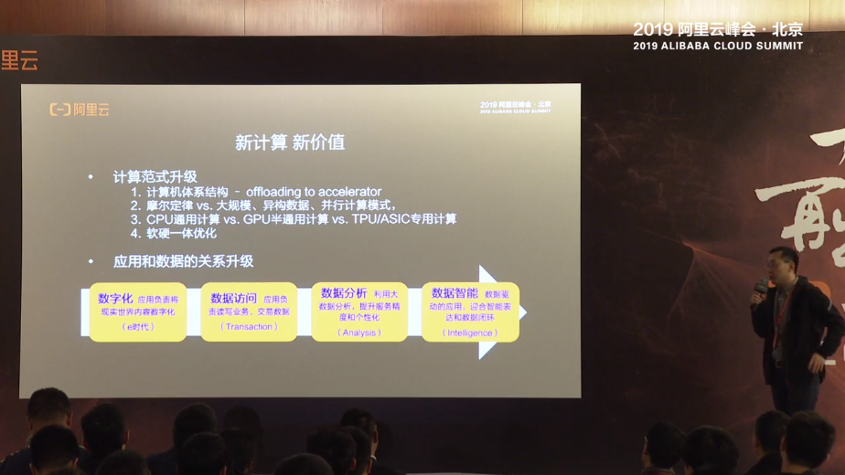
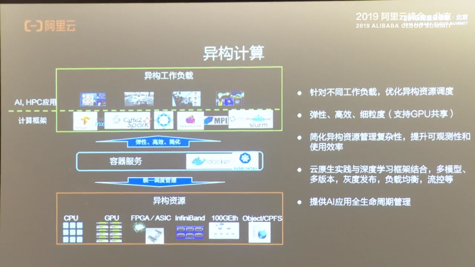
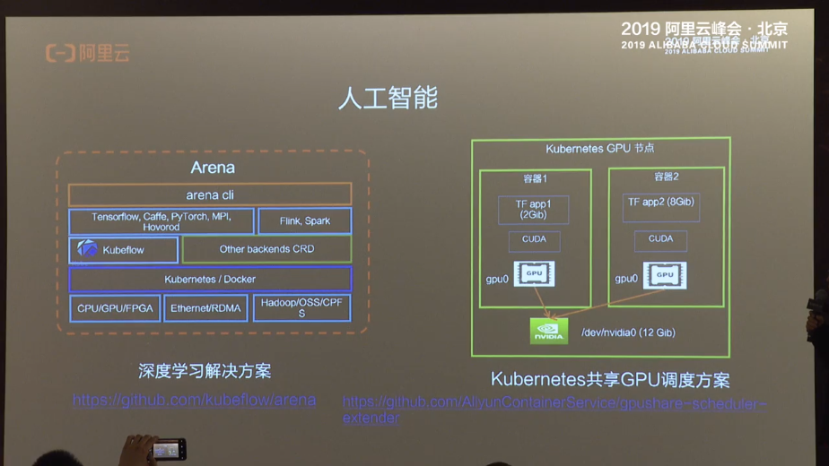
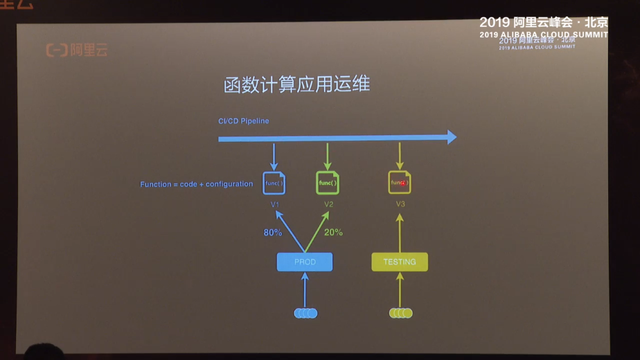
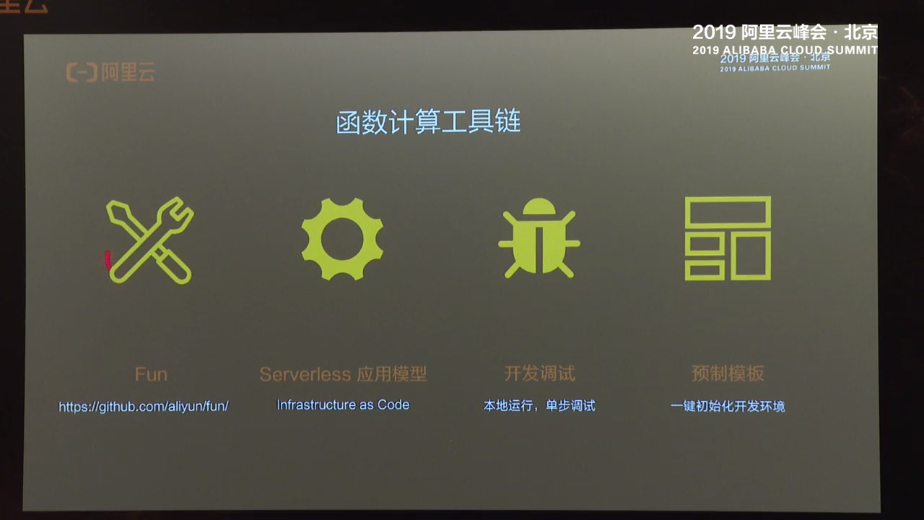

## 云的弹性

#### 停机回收模式

深度学习等用完回收

#### 突发流量

弹性资源池模式

#### 日志分析、模型分析

定时弹性模式

#### 短时离线任务

竞价势力弹性模型

## 混合云

主要在内部，可以随时使用安全容器向阿里云进行资源启动。

## 多云诉求

使用k8s进行容器标准化。

对云的管理等方法进行抽象。

## 边缘计算

如何做到对于边缘设备的利用。

管控段集合全网的算力，统一调度。

推出了边缘容器的服务。

将一些任务下发到边缘，比如AI计算、流计算、消息转发，等等。

## 阿里云的容器镜像服务的企业版

在广范围内进行容器的同步、加密、访问控制等企业级策略。

## 新型态

### windows容器。

如何利用者60%的windows的应用。使用window容器，不再重写.net下直接在windows上使用。

### serverless k8s

不需要关心node，不需要关系资源，只需要跑就是了。

定时任务、CICD、任务学习、压测、数据流。

## 新计算

### 计算范式的升级

一体机？0.0

## 异构计算

通过容器的标准化，屏蔽底层的个股中乱七八糟的东西。

## arena

可以屏蔽一些k8s的复杂配置。挺好好的思路。

## 想法：通过Jupyter来搞文档。

查看啥的，都可以写在Jupyter里面，直接run一下就能看到结果。

# Serverless

计算、存储、api、分析、中间件。

让用户执行任意代码，同时不需要维护服务器，实时弹性，请求粒度、秒次计量，高可用。

函数式发布。

通过别名来搞的。

> https://github.com/aliyun/fun

## 数据流式处理

数据分片保存等

## 无状态

无状态不是存储在一个特定的机器上。而是将状态存储在共享的机器上，特定机器down了，可以重启起来。