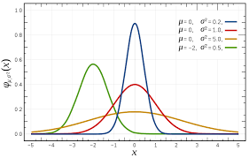
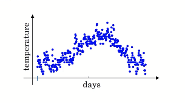
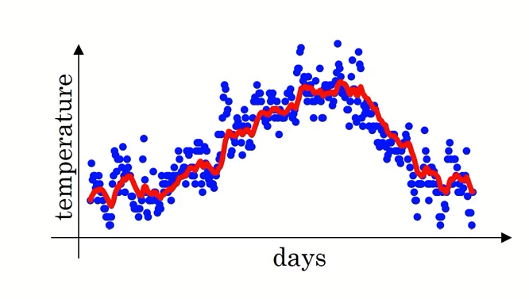
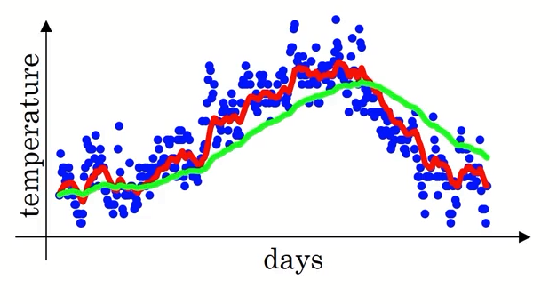

> 思考来源于，以下回答中，一粒沙与李想的辩论
>
> 面对传教应该如何拒绝？ - 旺旺的回答 - 知乎
> https://www.zhihu.com/question/19719224/answer/604149269

> 李想：
>
> 我永远也不会去相信一个“因为自己信了就嘲笑不信的人好玩”的宗教。
>
> 一粒沙：
>
> 您如果觉得我的动机不良，就当认为基督徒的行为应当是良善的？对吗？
>
> 李想：
>
> 当然不对。我认为你的“动机不良”，即你作为基督教的代表来到我的面前，向我展现了基督教的行为，而我认为这个行为代表你“动机不良”。
>
> 没有任何逻辑可以从我觉得你动机不良 推导出 我认为基督徒的行为应当是良善的。
>
> 或者，如果你未能理解，我可以这么给你讲解：在你来到我面前之前，我对基督教一无所知。从你的行为中，我发现**至少有一位**基督徒的行为“动机不良”。而我根据这个“动机不良”的行为，得到了一个论断，“**如果**这个宗教的信徒都是这样，那么我绝对不会去相信这个宗教”
>
> 这才是符合逻辑的推断。
>
> 一粒沙：
>
> 那么如果我承认我动机不良，是不是意味着您认为我是一个良善的基督徒，从而您就愿意相信这个宗教呢？
>
> 李想：
>
> 而现在，你又向我展现了你作为一位基督徒的行为。
>
> 你以一个奇怪的逻辑，试图引导我“认为基督徒的行为应当是良善的”，或者至少试图诱使我说出“认为基督徒的行为应当是良善的”一类的言论。这是非常可怕的行为。对于大多数逻辑缺乏的人来说，这个逻辑陷阱很容易陷进去。而可以想见的是，一旦陷入这个逻辑陷阱，你就有充分的理由来劝说这个人信你所信仰的宗教。
>
> 这，是非常非常可怕的行为。我永远也不会加入一个“以语言陷阱诱使他人加入的宗教”，无论这个诱使行为是恶意的还是无意的。
>
> 如果你承认你动机不良，那么我能推断出的是，你是在“有意识的作恶”，这甚至于比无意识的作恶更加恐怖。我不知道什么样的逻辑能够从有意识的作恶中推断出你是一个良善的“人”（注意，基督徒是包含于人这个概念中的）。
>
> 更加地，即使你的前提正确，即你是一个良善的基督徒，我也无法想象有任何的逻辑能够形成因为你的良善，我就应当愿意相信这个宗教这个说法。我有我的道德观念，我的道德观念促使我行良善理性之事。只要是良善理性之事我都愿意予以支持，但是我无法因为我的良善理性就要求所有人信仰我的道德观念。
>
> 不由得让我想起一句话。无论在圣经中还是我后来十分喜爱阅读的但丁《神曲》中，都明确强调了如果不信主，就会进入地狱。即便我因为我的道德观念而行良善理性之事，甚至于即便我从出生至死亡都一直良善理性，都会因为不信主而下地狱。甚至古代伟大的人物，仅仅因为他们出生时尚未有基督教的传教而未能信仰主，都要在地狱之中。
>
> 
>
> 
>
> [月华散](https://www.zhihu.com/people/6a93f58a10ce3f199fdcb7e9bd956359)：
>
> 我也觉得好玩哈哈，但是这是被答主的幽默引起的善意的评价，其实更准确的说是答主很秀。。这样，你应该不会有攻击我的意向吧？
> 而我不信基督。
> 所以你所认为的“一粒沙”的动机应当是你基于他基督教的身份和你对信基督教者的印象做出的判断。
> 你火太大啦。
>
> 李想：
>
> 关于“好玩”更多的还是看如何描述吧。
>
> 一方面是“你很好玩”这句话本身，这直接就先限定了这是对答主这个人的描述，而且使用的词不是666，太秀了，而是非常不常见的好玩。也许是我对好玩这个词有一定的偏见，但是我觉得跟老外说interesting的感觉一样，都类似于呵呵，甚至于你很好玩这种表达还有一种悲天悯人，再不拯救你你就下地狱了而你还不自知的语气在里面。
>
> 另一方面，这位楼主更是直截了当地接了一句自己曾经不信，现在信了。这意味着楼主的思路已经定性了：我觉得你好玩，是因为你不信，而且总有一天你会信的。而非如你所解“答主的语言很幽默，很好玩，很有趣”。

为方便讨论，先假定两个对象，**传道者**与**无信者**，当然这里只是抽象的对象，实际上可能可以是其他的对象，但就先这么说吧。

开始布道前：

存在一个无信者，对于**道的全体**完全没有任何认知。这时候，无信者存在一个以朴素观点得出的一个**先验估计**，当然这个估计在后续的迭代中，所占的权重很轻。

传道者对于道的全体有比较全面的认知，假设传道者知道（就当是事实吧，反正抽象了以后无所谓），**道的全体**的分布，要优于无信者所知道的**朴素观点**的**先验估计**，无论是平均值$\mu​$或者方差。

> 这里从网上随便找个正太分布的图。
>
> 假设X轴代表**人的道德水平**，Y代表群体中处于**这个道德水平的人数**。
>
> 这里我们假设**绿色是无信者**这个群体，**蓝色是布道者**这个群体。
>
> 这里我们假定布道者群体绝对优超于无信者。

布道时：

传道者的任何行为都会对无信者对道的估计进行修正，并且权重还会很大。无信者依据传道者的行为修正对于道的全体的估计。传道者的任何行为（可能是偏离道的本意很多，也可能仅仅是无信者不接受），都会令无信者对道有一个占权重极大的**首次修正**，按照马尔可夫过程中的修正可以知道，无论首次修正是好是坏，都需要更多的数据才能修回正常值。（取决于新数据所占的权重$\beta$）（假设已经加了修正参数，类似这玩意的$\frac{V_t}{1-\beta^t}$修正）

> 马尔科夫过程。
>
> 这里我实际上应该用**指数加权平均(指数加权滑动平均)**，但用马尔科夫过程应该作为一种抉择方案。哈哈哈~
>
> <!--本来就是给我自己看的，我理解就行了？哈哈哈-->
>
> 首先我们来看指数加权平均的一个案例。
>
> 图片来源于吴恩达的深度学习，第二课，第二周的Exponentially weighted averages。
>
> 这玩意本身也值得一看。
>
> 
>
> 这是一个，一年间的温度分布图。
>
> 我们可以使用一种简单的认知，来画一个曲线（当然大部分人也使用这样的方式来进行认知。）
>
> 迭代公式如下，这里，$V_i$为我们计算出来的第i天的温度，$\theta_i$为第i天的温度：
> $$
> V_0=0\\
> V_1=0.9V_0+0.1\theta_1\\
> ....\\
> v_i=0.9V_{i-1}+0.1\theta_i
> $$
>
> > 稍微用认知来解释(映射)下，对于$V_0$的时候，是完全没有接触的时候，我们一般使用默认的观点对待，比如当做是0。
> >
> > 每当接受到新的知识的时候$\theta_i$的时候，我们会修正之前的认知$V_{i-1}$，最简单的方法，就是将新的知识，加入一部分到之前的认知中($0.1\theta$)。
>
> 这样可以画出来这样的一个图：
>
> 
>
> 当然，在这个模型中，我们对新知识的接受程度为10%，这里也可以说主要接受10天的温度信息。
>
> 这个图看不来啥。我们将这个比例调整到2%。
>
> 
>
> 这样我们可以画出绿色的那条线。
>
> 可以很明显地看出，有两个问题，
>
> 一个是前端明显值偏小，因为我们选取的初始值为0，所以较难修正到理论趋势上。
>
> 二是尾部，尾部处较高，并且难以调整到实际值。这里可以理解为此模型比较顽固。
>
> 当然这里用马尔科夫来说，也行，反正对于第二天而言，升温降温就是个概率二择问题，wwww。
>
> PS：对于此函数的起始信息，会比较低的问题，可以做一个**偏差修正**，$\frac{V_t}{1-\beta^t}$。这样可以在初始的时候效果比较好。

抉择：

对于传道者，就必须展现出良好的行为，给无信者一个良好的**首次修正**。

对于无信者，理应加大对于先验估计的权重，减少对于首次修正的权重。（因为先验估计正确的概率很大，已经有更多事例的验证了，虽然可能大多是无关的）（当然这也导致了科普非常难以进行。）

布道，continue：

对于传道者来看，肯定期望无信者能够对道有个正确的认知，对于其标志就是‘无信者说出了，“认为基督徒的行为应当是良善的”’或者之类的行为。

这里因为需要加快无信者对道的修正速度，所以会使用一些具有赌博性质的手段，增加传道的道的分布，比如语言陷阱（没被识破与被识破），如果被识破了，那么无信者对道的修正就会加一个极大的负值。

抉择，once more：

传道者使用手段，需要考虑成败的概率以及成败收益，看人下菜。最大化收益。

有一种哲学意义上的思想认为，理论上不应存在使用手段的期望收益大于不使用手段的收益，因为如果存在的话，在更大的层面会导致一些不符合常理的行为或者谬论，比如**无套利原则**，当然这个原则本身就有其局限意义，做眼的本身是宏观，不是局部，同时也是只是一种思想，无法证明，无法证伪。虽然很多事实，如果使用无成本手段能够有收益，那么就总能费尽心思地构造出一个套利出来，而这个套利可以。

所以从长期来看，最好还是不下手段吧。

对于无信者来说，希望可以明确地认知道的全体的话，就要更加理智地识破这些手段了。

PS：**飞面神教**关于举证倒置的意义深刻，就是无信者对于传道者手段，无法证明无法证伪即事实，一种反制手段，人为构造出一个理智上非常无法接受的玩意，但却符合传道者手段。

PS2：**无套利原则**

理解的时候需要搞清构造的方法，即是，如果存在**无成本获利行为**，那么只需要反复重复这个行为，那么就能获得无限的利益，甚至可以构造出一个不符合能量守恒的过程。

当然，这里的无成本需要做一些扩张解释，这个成本需要把所有可能的成本都给算上，包括时间成本、人力成本、知识成本、‘无价值’资源成本(比如太阳光)。

这里举三个例子。可以感受下。

##### 例子1

假设，我们可以无成本地通过某种手段"无成本"赚钱，比如把货物从A地运送到B地，可以获取1w圆。那么只要我们无限地重复这个过程，那么是不是年入百亿不是梦，只要运得够快，都是钱。

当然，这个例子非常之简陋，恩，对，很简陋。因为运输过程，需要消耗时间，需要消耗油钱。

对，这些实际上也是成本，我们在这里分析的时候，都需要把这些一切的一切都给折算进去。（一般来说是折算成为一个货币单位（当然称之为价值单位也没毛病））

##### 例子2

那么聪明的小伙伴是不是会发现一个华点了，如果我们把这些都给折算进去，如果还是可以获利呢？

对，但不完全，因为可能你还没有计算完，比如对未来的期望、对方货太多，降价的风险这些，也要算进去。

恩，都算进去以后，基本就可以视为经济学游戏了，详细了解的话，参考下期权定价？

> 当然经济学上的描述是，如果存在套利的方法，那么别人也会知道这个方法，人人都来做，那么这个方法的收益最终会回复到平均水平。
>
> 再说一嘴，经济学上的平均水平指自然增长率（粗略的理解为通货膨胀或者无风险利率，都没问题）。

##### 例子3

这时候我们可以举一个没法证明以及没法证伪的玩意了，假设存在一个神，这个神只有一个功能，就是，每天都会给他的信徒一片面包，同时也不需要他的信徒做什么特殊的行为。

那么那么，我们只需要大量畜牧神的信徒，我们就可以得到足量的面包，那么只要时间够长，那么我们就能凑够足够的面包，把它们压在一起，就是一个太阳(....(´-ι_-｀))。足够多的太阳塞一起，就是一个黑洞了啊！（泥垢了(ﾟ皿ﾟﾒ)）

看上去这个例子不足够烧脑，但如果你把这玩意放到某些传销、邪教的头上，哦，是不是就不是那么好理解了？

当然也不是不能理解，把视野放大一层，什么问题都没了。局限在传销中，就相当于头两个例子一样，只取部分的成本，(选择性)忽略掉不那么好发现的成本。那么会得到套利的假象，但如果放大一层，看到国家总体层面，就很简单可以发现，哦，抢的是最底层韭菜的钱。

你甚至可以把无套利原则等价于能量守恒，只是表述不太一样，做了不一样的包装而已。

**注意：**上面关于**无套利的游戏过程**，以及脱离无套利的初始目的很远很远了，已经非常脱离实际了。

一方面，实际中，我们考虑的、面对的都是局部。也只需要关心局部即可。（所以群众的愚蠢性是必然的）

另一方面，上述游戏，对无套利这一定理做了非常非常多的**扩张解释**。从不知道第几行开始，就已经与原意偏差甚远，请与经济学意义上的**无套利原则**做区分。

最后，无套利这个根上与能量守恒相似，无法证明无法证伪。

所有关于能量守恒的例子都只能证明是守恒的。但也要知道能量守恒崩溃只需要一个反例。

**一杠**

虽然几百年来都没有找到，只要找到一个，能量守恒就瞬间崩溃。

**二杠**

但是如果崩溃了，那么就能够“巧妙地”构造出一些理智无法接受的、自相矛盾的谬论。

**三杠**

当然，如果真的发现了，那么我们应该考虑上述思考过程是否有问题。可能理智体系有问题？也可能逻辑推理有问题？

当然，基本上差不多绝大多数根本上 都是发现错了。这里都说到这个份上了，就不能说绝对了，因为此时我们已经考虑了那个发生概率无限趋于0，但却无法证明它就是0的情况。

**四杠**

但是和别人说的时候，不能指望对方可以理解，也可以心平气和地思考这种无意义的玩意，沟通的时候还是简单地说：能量守恒这是定理，毋庸置疑（ξ( ✿＞◡❛)）。

