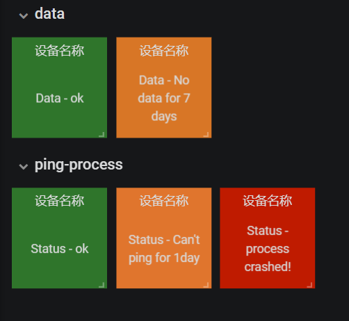

这是除了无数据的灰色外，全部可能出现的5种情况

注意里面的颜色问题，ok

展示出来的绿色OK可能配置上是warning，展示的warning配置上也可能是OK

关于此panel的文档：

https://grafana.com/plugins/vonage-status-panel

简而言之，就是在metrics中配置sql查询语句，然后在option中的metric display type中设定查询方式，再threshold。

注意需要有display setting中的alias选项。

display alias、display value就是选择在什么情况下显示这个玩意。

后端已经把是否超时，写到表里面了。因此前端只需要select这个0、1、-1即可。

后端在115上，monitor_on_server.