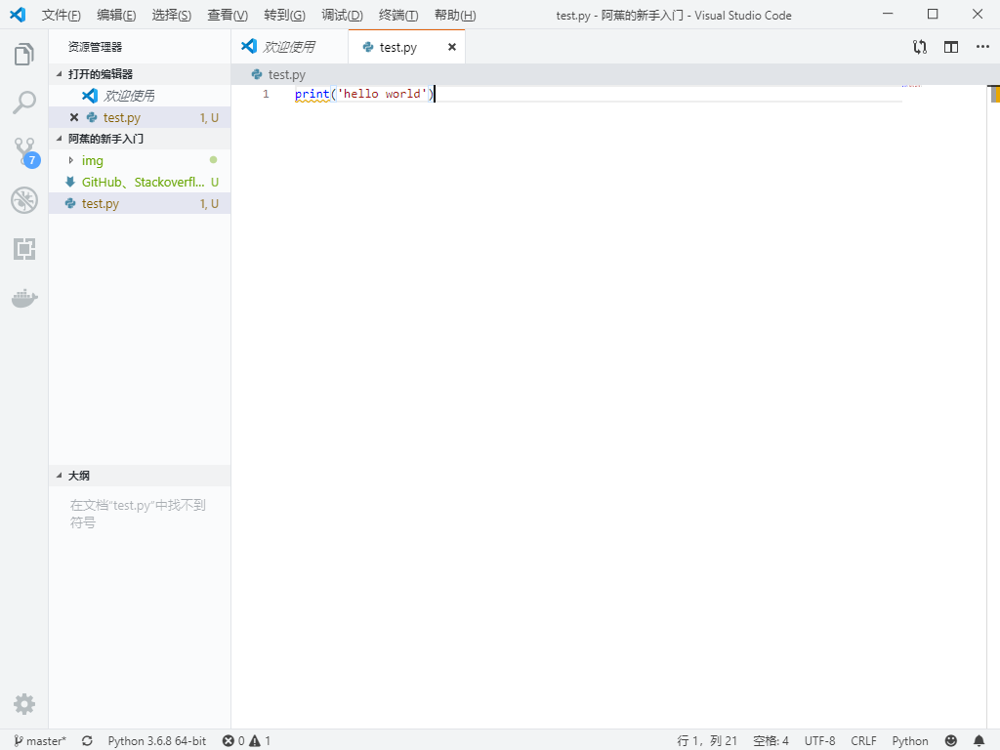

[TOC]

> 本文阅读方式，下载一个Typora，然后打开。

> 编程不要想着，啊，我全部看懂了再动手。
> 因为你看不完，也不需要看懂(黑箱)。
> just do it！边做边学。

# 路线

1. **谷歌**：....**面向谷歌编程**，真的不是说笑的。
2. **Visual Studio Code**：一个好的编辑器。
3. **Stackoverflow**：蹦出什么问题，去哪问。
4. **Github**：如何发现新的项目。
5. **Jupyter**：一个好用的python工具。

> 每个功能，我都说，这个为啥要这么做，为啥会让我爽。
>
> 当然主要还是以python为主。

# **Visual Studio Code**

> 为啥要使用`VS code`呢？因为作为宇宙第一好用的编辑器，具有庞大的插件集合，微软背书，数以万计的人，在为他做贡献，说真的，暂时不可能有比这个更好用的了。

## 安装

下载，自己谷歌，安装。简单的一匹。pass

对了，作为宇宙第一的编辑器，自然支持中文。至于怎么切换，依然，自己谷歌。

## 基本功能


就简单的说下吧。你可以通过VScode打开任何一个`.py`文件。这时候会提示你安装python插件，嗯，装就是了。

如果没提示，你也可以通过左上角的那个`扩展`—python来进行安装。

左下角设置。

右下角的框框是，终端，当然，在windows中一般就是cmd了。当然，你也可以切换。

## 怎么hello world

> 无论怎么说，只要一个程序，可以跑出hello world，那么就进入了这个语言的大门了。
>
> hello world永远是最重要的一环。
>
> 因为，只有输出了hello world，证明你可以验证自己的操作是否正确。
>
> 写程序的过程与写程序的结果之间有了反馈，后面就能开心编写了。

任意文件夹——右键——`Open with VScode`。


> 讲道理，这里本来就有很多的新手教程。
>
> 但我这为了效率，还是直接奔向hello world

新建文件——ctrl+s，保存为一个py为后缀的文件（比如`test.py`）。



输入：

```python
print('hello world')
```

按下F5：


ok，vscode教程结束。剩下请参考[VS code自己的说明](https://code.visualstudio.com/docs#vscode)，以及各大网站的教程。

**请记住，官方文档，除了语言问题，永远都是最好的教程。**

# Stackoverflow

> 作为宇宙最大的问答网站，质量抵得上当年的百度知道。本来指望百度能打，谁让他自甘堕落。百度垃圾。
>
> 各问题站可信度评价：官方文档 > Stackoverflow > 私人博客站 > 简书 > CSDN

你把你的问题，换成英语，然后以`Stackoverflow+英语问题`的形式，放到谷歌，一般都会有比较好的结果。

比如，如何在python中输出hello world，翻译后就是：

```
Stackoverflow python how to print hello world
```


总之，try it。

> 有时候也会嘲笑自己是面向Stackoverflow编程，因为大部分代码都是从这改的。任何代码不知道怎么写，只要可以在一句话简单描述出来，都能在这里找到。

# Github

> git可以保存一个**文件夹**~~(实际上不是，但就这么理解吧)~~历史提交、历史修改。具有完善的不同**文件夹**之间同步的方式。可以让你在A地改完以后，B地也能看到。
>
> 然后把git保存在~~最大同性交友~~GitHub上，可以让你的代码全球人都能看到，并得到可能的指点~~不可能~~。

Github两个主要功能。一个是上传下载：git push、git clone。另外一个是发现大家的新的想法。

## 如何上传下载

> 这部分可以先略过，虽然git是Github的重要基石，但Github的主要价值不是这个。

个人推荐搞一个**GitHub desktop**+**Tortoise git**作为自己使用的主力。

怎么安装，自己谷歌。`Tortoise git`有中文。

当然，这个不算是这里的重点功能。

## 发现

首先注册一个自己的GitHub账号吧。这里需要用邮箱注册哦。

然后请点击**Explore**


然后你会看到各种各样的新鲜玩意：


**感兴趣么？想知道怎么用的么？想知道怎么实现的么？**

**点进去。**

> 最近很多中文项目啦，帮大忙了。~~哈时候倒挂谷歌英翻中就好了~~。

# Jupyter Notebook 朱庇特

一个好用的python工具，可以以模块的方式进行运行，比较新人学习以及适合测试代码。

同时VSCode的python插件，已经天生支持Jupyter，只需要按照提示，装好python插件以及对应得pip包即可。

## 使用

新建一个文件，修改后缀，以`.ipynb`结尾，然后使用VSCode打开，它会自动建立对应的模块。


Jupyter Notebook有两种模块，默认是下面的那种代码块，代码块可以运行其中代码。

另外一种是markdown块，主要用于记笔记。

Jupyter Notebook也比较适合教学。

> 知乎上一个回答。可以看看。
>
> https://zhuanlan.zhihu.com/p/85445777
>
> VS Code Python 全新发布！Jupyter Notebook 原生支持终于来了！